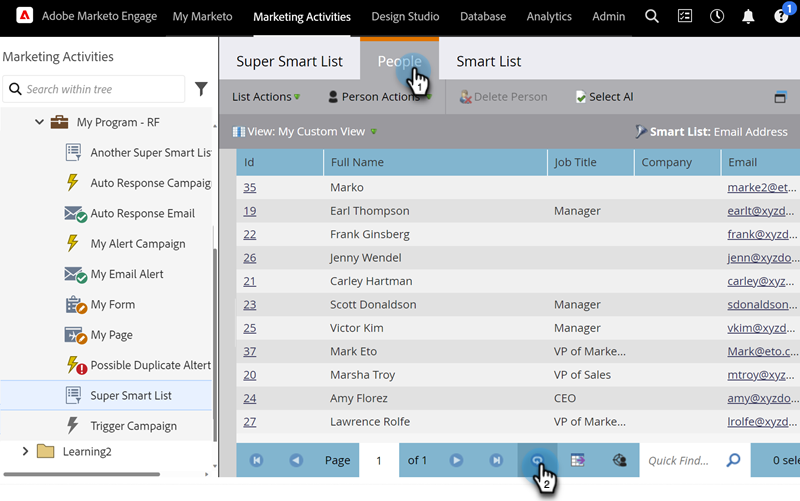
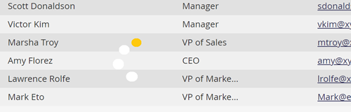

# Liste oder Smart-Liste aktualisieren {#refresh-a-list-or-smart-list}

Wenn Sie eine Smart-Liste ausgeführt haben und einige Minuten vergangen sind, können die Ergebnisse jetzt anders sein - aktualisieren Sie, um es herauszufinden.

## Ergebnisse aktualisieren {#refresh-results}

1. Um Daten auf der Registerkarte **[!UICONTROL Personen]** einer Smart-Liste zu aktualisieren, klicken Sie auf das Aktualisierungssymbol.

   

1. Die intelligente Liste wird erneut ausgeführt und zeigt Ihnen einen aktuelleren Ergebnissatz an.

   

>[!TIP]
>
>Wenn Sie eine Smart-Liste ausführen und später darauf zurückkommen, sehen Sie möglicherweise das Wort &quot;Info&quot;vor der Personenanzahl in der rechten unteren Ecke. Dies zeigt an, dass die Zahl ungefähre Werte aufweist. Klicken Sie auf die Zahl selbst, um sie zu aktualisieren und eine aktualisierte, genaue Anzahl zu erhalten.

>[!MORELIKETHIS]
>
>[Personen aus einer Liste oder Smart-Liste nach Excel exportieren](/help/marketo/product-docs/core-marketo-concepts/smart-lists-and-static-lists/managing-people-in-smart-lists/export-people-to-excel-from-a-list-or-smart-list.md){target="_blank"}
