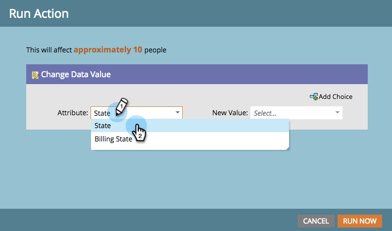

# Ausführen eines einzelnen Flussschritts aus einer intelligenten Liste {#run-a-single-flow-step-from-a-smart-list}

Wenn Sie einen einmaligen Flussschritt ausführen möchten, können Sie in einer Smart-Liste einen einzelnen Flussschritt verwenden, anstatt eine gesamte Smart-Kampagne zu erstellen.

>[!PREREQUISITES]
>
>[Erstellen einer Smart-Liste](/help/marketo/product-docs/core-marketo-concepts/smart-lists-and-static-lists/creating-a-smart-list/create-a-smart-list.md){target="_blank"}

1. Navigieren Sie **[!UICONTROL Marketing-Aktivitäten]**.

   

1. Wählen Sie eine Liste oder Smart-Liste mit Personen aus und wechseln Sie dann zur Registerkarte **[!UICONTROL Personen]**.

   

   >[!TIP]
   >
   >Sowohl statische Listen als auch Smart Lists verfügen über diese Funktion.

1. Klicken Sie **[!UICONTROL Alle auswählen]**. Sie können auch **Strg/Befehl** verwenden und auf einige Datensätze klicken, um sie manuell auszuwählen.

   

   >[!NOTE]
   >
   >Wenn sich die Ergebnisse über mehrere Seiten erstrecken, werden durch Klicken auf **[!UICONTROL Alle auswählen]** alle Personen auf allen Seiten ausgewählt.

1. Wählen **[!UICONTROL unter]** den gewünschten Flussschritt aus. In diesem Beispiel verwenden wir [Datenwert ändern](/help/marketo/product-docs/core-marketo-concepts/smart-campaigns/flow-actions/change-data-value.md){target="_blank"}.

   

1. Suchen Sie ein „Attribut **[!UICONTROL und wählen Sie es]**. In diesem Beispiel nehmen wir alle Personen, die den Bundesstaat „Kalifornien“ haben, und ändern ihn in „CA“.

   

1. Einen neuen Wert eingeben. Klicken Sie **[!UICONTROL Jetzt ausführen]**.

   

1. Wenn Sie Datenwerte für eine große Anzahl von Personen ändern, müssen Sie die Änderung möglicherweise bestätigen, indem Sie die Zahl eingeben. Klicken Sie **[!UICONTROL Los]**.

   

Tolle Arbeit! Der Status des Schritts für den einzelnen Fluss wird oben rechts angezeigt.

Wenn sie abgeschlossen ist, aktualisieren Sie die Liste und Sie sehen die aktualisierten Informationen.
