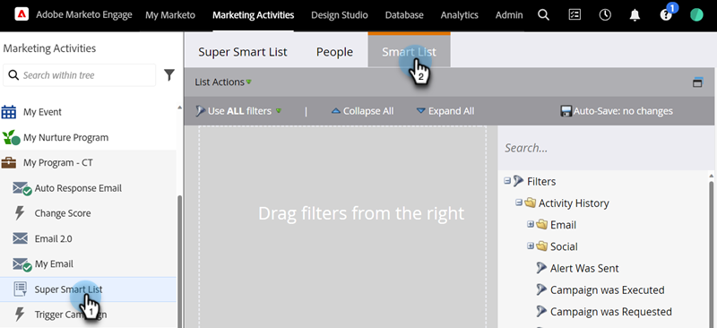
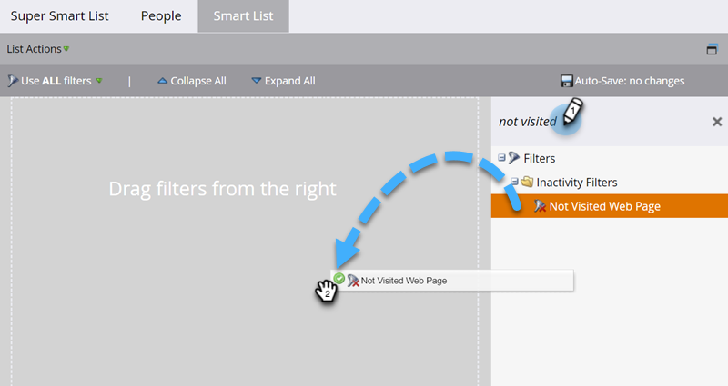

# Verwenden von Inaktivitätsfiltern in einer Smart-Liste {#use-inactivity-filters-in-a-smart-list}

Wussten Sie, dass Sie in einer Smart List nach Personen suchen können _die_ etwas getan haben? Checken Sie diese Inaktivitätsfilter aus.

1. Navigieren Sie **[!UICONTROL Marketing-Aktivitäten]**.

   

1. Wählen Sie die Smart-Liste aus, die Sie bearbeiten möchten, und klicken Sie dann auf die Registerkarte **[!UICONTROL Smart-Liste]**.

   

1. Suchen Sie den gewünschten Inaktivitätsfilter und ziehen Sie ihn in die Arbeitsfläche. Suchen wir beispielsweise nach Personen, die keine Ihrer Seiten besucht haben.

   

   >[!TIP]
   >
   >Der Ordner „Inaktivitätsfilter **[!UICONTROL enthält viele]**. Suchen Sie nach „Nicht“ und überprüfen Sie sie.

1. Wählen Sie den Operator **[!UICONTROL ist beliebig]**. Dadurch werden alle Personen gefunden, die in den letzten 30 Tagen keine Seite besucht haben.

   
