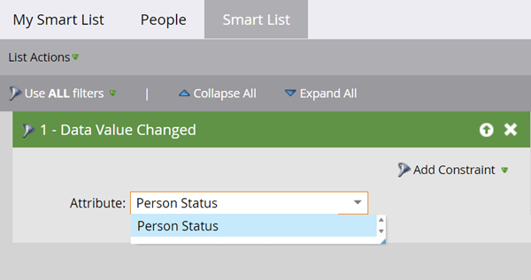

# Verwenden des Filters „Datenwert geändert“ in einer Smart-Liste {#use-the-data-value-changed-filter-in-a-smart-list}

Die Werte in Ihrer Marketo-Datenbank ändern sich ständig und werden aktualisiert. Anstatt nach einem bestimmten Wert zu suchen, sollten Sie manchmal nach Personen suchen, deren Wert sich geändert hat. So geht&#39;s.

>[!PREREQUISITES]
>
>[Erstellen einer Smart-Liste](/help/marketo/product-docs/core-marketo-concepts/smart-lists-and-static-lists/creating-a-smart-list/create-a-smart-list.md){target="_blank"}

1. Navigieren Sie zum Bereich **[!UICONTROL Marketing]** Aktivitäten.

   

1. Wählen Sie die Smart-Liste aus und klicken Sie auf **[!UICONTROL Registerkarte]** Smart-Liste“.

   

1. Suchen Sie den Filter **[!UICONTROL Datenwert geändert]** und ziehen Sie ihn auf die Arbeitsfläche.

   

1. Legen Sie **[!UICONTROL Attribut]** auf das Feld fest, bei dem Sie nach Datenwertänderungen suchen möchten.

   

Dieser Filter sucht nach allen Personen, die eine Änderung (eine beliebige Änderung) an ihrem Status vorgenommen haben. Wenn Sie noch raffinierter werden möchten, versuchen Sie [eine Einschränkung zu einem Smart-Listen-Filter hinzufügen](/help/marketo/product-docs/core-marketo-concepts/smart-lists-and-static-lists/using-smart-lists/add-a-constraint-to-a-smart-list-filter.md){target="_blank"}.
