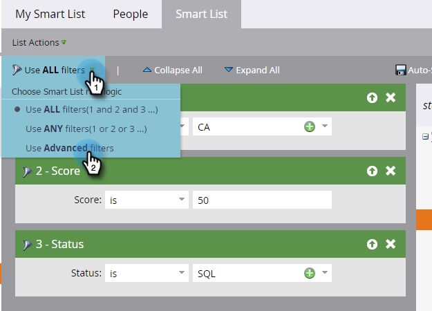
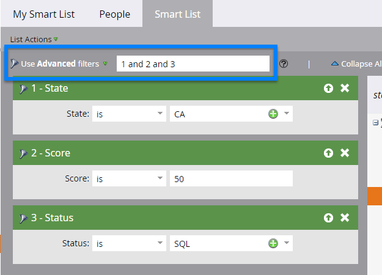

# Verwenden der erweiterten Smart-List-Regellogik {#using-advanced-smart-list-rule-logic}

Sie können genau die Personen finden, die Sie benötigen, indem Sie die Regellogik für intelligente Listen auf mehrere Filter in einer Smart-Liste anwenden. So geht es.

>[!PREREQUISITES]
>
>* [Filter suchen und zu einer Smart-Liste hinzufügen](/help/marketo/product-docs/core-marketo-concepts/smart-lists-and-static-lists/creating-a-smart-list/find-and-add-filters-to-a-smart-list.md){target="_blank"}
>* [Definieren von Smart-List-Filtern](/help/marketo/product-docs/core-marketo-concepts/smart-lists-and-static-lists/creating-a-smart-list/define-smart-list-filters.md){target="_blank"}

>[!NOTE]
>
>Erweiterte Filterlogik ist nur verfügbar, wenn Ihre Smart-Liste mindestens drei Filter enthält.

## Hinzufügen einer Logik zu einer Smart-Liste {#add-logic-to-a-smart-list}

Standardmäßig findet Ihre Smart-Liste die Personen, die mit den Filtern **[!UICONTROL ALL]** übereinstimmen (Filter 1 _und_ 2 _und_ 3). Sie können die Regellogik ändern, um Personen zu finden, die mit **[!UICONTROL ANY]** der definierten Filter übereinstimmen (Filter 1 _oder_ 2 _oder_ 3), oder erweiterte Filter (Filter 1 _und_ 2 _oder_ 3) verwenden.

In diesem Beispiel möchten Sie Personen in Kalifornien finden, die einen Wert von mindestens 50 Punkten _oder_ mit dem Status &quot;Sales Qualified&quot;aufweisen.__

1. Wählen Sie **[!UICONTROL Erweiterte Filter verwenden]** aus der Dropdown-Liste aus.

   

   >[!NOTE]
   >
   >Die Verwendung von **[!UICONTROL Erweitert]** -Filtern verringert die Notwendigkeit, Smart-Listen mit dem Mitglied des Smart-List-Filters zu erstellen. Dies trägt zur Leistungsoptimierung bei.

1. Im Textfeld **[!UICONTROL Erweiterte Filter]** wird &quot;und&quot;als Standardwert für alle Filter angezeigt.

   

1. Geben Sie ein Paar Klammern um &quot;2 und 3&quot;ein.

   

   >[!CAUTION]
   >
   >Sie müssen beim Eingeben der Regellogik &quot;und&quot;vor &quot;oder&quot;verwenden.

1. Ändern Sie das &quot;und&quot;zwischen &quot;2 und 3&quot;in &quot;oder&quot;.

   

## Verwenden Sie beim Mischen von &quot;Und&quot;und &quot;Oder&quot;Klammern {#use-parentheses-when-mixing-and-and-or}

Das Mischen der Logik &quot;und&quot;und &quot;Oder&quot;erfordert Klammern, um Ihre Absicht klar zu machen.

## Verwenden Sie verschachtelte Klammern für vier oder mehr Filter, falls erforderlich {#use-nested-parentheses-for-four-or-more-filters-if-needed}

Abhängig von Ihrer Absicht müssen Sie möglicherweise verschachtelte Klammern hinzufügen, wenn Sie vier oder mehr Filter verwenden.

>[!TIP]
>
>Wenn Sie eine ungültige Regel eingeben, wird unter der Regel eine rote Linie angezeigt. Scrollen Sie über den Text, um die zugehörige Fehlermeldung anzuzeigen.
