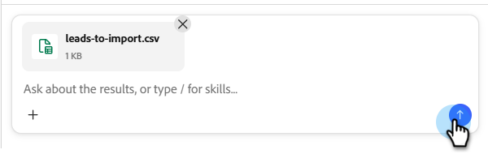
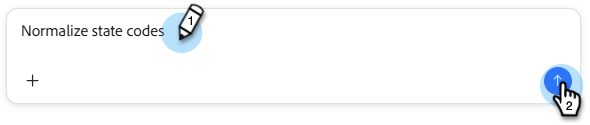

# Leads importieren {#import-leads}

Importieren und deduplizieren Sie Lead-Listen mit Unterstützung für die Feldzuordnung in Ihre Marketo Engage-Datenbank.

## Informationen zur Verwendung {#how-to-use}

1. Klicken Sie in My Marketo auf die Kachel **Mitarbeiter für Marketo Engage**.

   

1. Geben Sie „Lead-Liste importieren und Daten normalisieren“ ein (oder wählen Sie diese aus, wenn sie als Beispielaufforderung aufgeführt ist) und klicken Sie auf das Nach-oben-Symbol.

   

1. Sie werden aufgefordert, die CSV-Datei hochzuladen, und die bevorstehenden Schritte werden angezeigt.

   

1. Klicken Sie auf das Symbol **+** und wählen Sie **Datei hochladen**. Suchen Sie Ihre CSV-Datei und laden Sie sie hoch.

   

1. Klicken Sie auf das Nach-oben-Symbol.

   

1. Klicken Sie **Überprüfen**, um Ihre Liste in der mittleren Konsole anzuzeigen.

   

1. Überprüfen Sie die verfügbaren Geschäftsregeln, um Ihre Liste zu bereinigen. Geben Sie die gewünschte ein und klicken Sie auf den Nach-oben-Pfeil.

   

   Die Ergebnisse werden in der mittleren Konsole angezeigt.

   

   Geben Sie bei Bedarf zusätzliche Geschäftsregeln ein.

1. Um die zugeordneten Felder anzuzeigen, klicken Sie auf die Registerkarte **Zuordnungen**.

1. Wenn Felder falsch zugeordnet wurden, korrigieren Sie diese hier, indem Sie das Feld **Zielgruppe** ändern.

   

1. Wenn Sie bereit sind, Ihre Liste zu importieren, klicken Sie auf die Registerkarte **In Marketo importieren**.

1. Wählen Sie den Zielordner aus und geben Sie einen Namen ein. Markieren Sie jedes Einverständnisfeld und klicken Sie auf **Import starten**.

   

   Wenn der Import abgeschlossen ist, wird eine Überprüfungszusammenfassung mit Leads, verarbeiteten Zeilen, fehlgeschlagenen Zeilen und allen Warnungen angezeigt.
