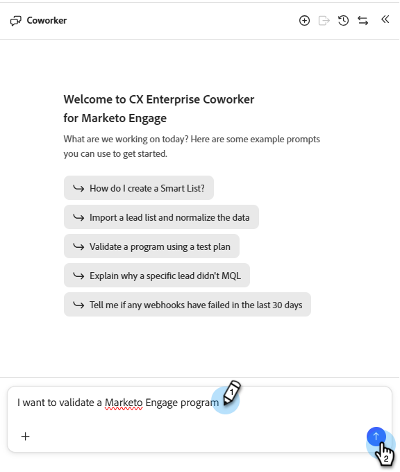

# Programme validieren {#validate-programs}

Prüfen Sie Ihre Programme auf Best Practices für alle Komponenten, wie E-Mails, Landingpages, Kampagnen und mehr.

## Informationen zur Verwendung {#how-to-use}

1. Klicken Sie in „Mein Marketo&quot; auf die Kachel **CX Enterprise Coworker für Marketo Engage** .

   

1. Geben Sie im Eingabeaufforderungsfenster „Ich möchte ein Marketo Engage-Programm validieren“ ein.

   

1. Wählen Sie das Programm, das Sie validieren möchten, im rechten Bereich aus.

   {width="800" zoomable="yes"}

   Eine Zusammenfassung des ausgewählten Programms wird in der Mitte angezeigt.

1. Geben Sie im Eingabeaufforderungsfenster „Programm validieren“ ein und klicken Sie auf **Senden**.

   CX Enterprise Coworker für Marketo Engage bietet eine Qualitätssicherung für das ausgewählte Programm, die Ihnen zeigt, was bestanden wurde und was fehlgeschlagen ist.

   
