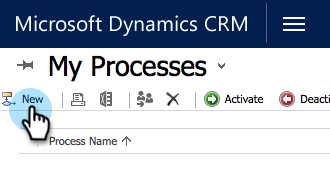

# Erstellen eines benutzerdefinierten [!DNL Dynamics]-Synchronisierungsfilters {#create-a-custom-dynamics-sync-filter}

Mit Marketo können Sie einen Synchronisierungsfilter einrichten und nur einen Teil Ihrer Datensätze synchronisieren.

## Überblick {#overview}

So richten Sie einen [!DNL Dynamics] Synchronisierungsfilter ein:

1. Erstellen Sie in Ihrem Dynamics CRM für ein beliebiges Objekt (Lead, Kontakt, Konto, Opportunity und andere benutzerdefinierte Entitäten) ein benutzerdefiniertes Feld mit zwei Optionen (boolesch) namens &quot;`new_synctomkto`&quot;.
1. Weisen Sie diesem Feld einen Wert für Ja/Nein zu.

Sie müssen diese Änderungen in Dynamics CRM vornehmen, nicht in Ihrer Datenbank oder in Marketo.

>[!CAUTION]
>
>Wenn Sie das Feld nicht zuweisen und es leer/NULL lassen, wird es synchronisiert, aber nicht aktualisiert. Datensätze in Dynamics CRM mit einem Feldwert von leer/NULL zeigen diesen Feldwert in Marketo als „false“ an.

Marketo sucht während der automatischen Hintergrundsynchronisierung nach diesem Feld und bestimmt basierend auf dieser Logik, welche Datensätze synchronisiert werden sollen:

| Feldwert | Mit Marketo synchronisieren? |
|---|---|
| Feld existiert nicht | Ja |
| Feld ist leer | Ja |
| Feld hat Wert Ja | Ja |
| Feld hat keinen Wert | Nein |

>[!CAUTION]
>
>Die einzige Möglichkeit, Marketo anzuweisen, einen Datensatz zu überspringen, besteht darin, den Feldwert explizit auf &quot;**&quot;**. Marketo synchronisiert Datensätze weiterhin über , selbst wenn die Feldwerte leer sind.

>[!PREREQUISITES]
>
>Installieren Sie die neueste Version des Marketo-Plug-ins (3.0.0.1 oder höher). Wechseln Sie zu Marketo [!UICONTROL Admin] > [!DNL Microsoft Dynamics] > [!UICONTROL Marketo-Lösung herunterladen].

## SyncToMkto-Feld erstellen {#create-synctomkto-field}

1. Melden Sie sich bei Ihrem Dynamics CRM an. Klicken Sie **Einstellungen** und dann auf **Anpassungen**.

   

1. Klicken Sie **[!UICONTROL System anpassen]**.

   

1. Klicken Sie  neben **[!UICONTROL Entitäten]**.

   

1. Klicken Sie  neben **[!UICONTROL Lead]** und wählen Sie **[!UICONTROL Felder]**. Klicken Sie dann auf **[!UICONTROL Neu]**.

   

1. Geben Sie **SyncToMkto** in das Feld **[!UICONTROL Anzeigename]** ein und wählen Sie **[!UICONTROL Zwei Optionen]** als **[!UICONTROL Datentyp]**. Klicken Sie dann auf **[!UICONTROL Speichern und schließen]**.

   

   >[!NOTE]
   >
   >Wählen Sie einen beliebigen Anzeigenamen für dieses Feld, aber das Feld Name muss genau sein **new_synctomkto**. Sie müssen **Neu** als Standardpräfix verwenden. Wenn Sie den Standardwert geändert haben, gehen Sie hier zu [Standardpräfix für die benutzerdefinierten Feldnamen zurücksetzen](/help/marketo/product-docs/crm-sync/microsoft-dynamics-sync/create-a-custom-dynamics-sync-filter/set-a-default-custom-field-prefix.md){target="_blank"}. Sie können sie nach der Erstellung der neuen Felder wieder ändern.

   >[!NOTE]
   >
   >Wenn Sie einen asynchronen Workflow eingerichtet haben, erhält der Datensatz den standardmäßigen SyncToMkto-Wert, den Sie im Feld eingerichtet haben, und erhält den richtigen Wert einige Sekunden später, wenn der Workflow abgeschlossen ist. Wenn der Standardwert auf Ja festgelegt ist, werden diese Datensätze in Marketo erstellt und sind dann veraltet. Verwenden Sie **Nein** als Standardwert, um dies zu vermeiden.

1. Wiederholen Sie diesen Vorgang und erstellen Sie das **SyncToMkto**-Feld für alle anderen Entitäten, für die Sie die Synchronisierung einschränken möchten, z. B. Kontakte, Konten, Opportunities und benutzerdefinierte Entitäten.

## Filter in Marketo auswählen {#select-the-filter-in-marketo}

Selbst wenn Sie bereits die erste Synchronisierung durchgeführt haben, wechseln Sie zu und wählen Sie die Felder aus, die mit Marketo synchronisiert werden sollen.

1. Wechseln Sie zu Admin und wählen Sie **[!UICONTROL Microsoft Dynamics]**.

   

1. Klicken Sie **[!UICONTROL Bearbeiten]** auf Details zur Feldsynchronisierung.

   

1. Scrollen Sie nach unten zum Feld und überprüfen Sie es. Der tatsächliche Name muss new_synctomito lauten, der Anzeigename kann jedoch beliebig sein. Klicken Sie auf **[!UICONTROL Speichern]**.

   

Gut. Jetzt haben Sie den Synchronisierungsfilter für Marketo aktiviert.

## Erstellen eines [!DNL Dynamics] Workflows, um Synchronisierungsfilterwerte automatisch zuzuweisen {#create-a-dynamics-workflow-to-assign-sync-filter-values-automatically}

Sie können den SyncToMoto-Feldern für Ihre Datensätze immer manuell einen Wert zuweisen. Aber warum nutzt man nicht die Vorteile eines [!DNL Dynamics] Workflows und weist dem SyncToMkto-Feld automatisch einen Wert zu, wenn ein Datensatz erstellt oder aktualisiert wird?

>[!NOTE]
>
>Das kann man nicht auf der Datenbankebene machen. Dies muss im CRM manuell oder mithilfe eines Workflows geschehen.
>
>Ein [!DNL Dynamics]-Workflow funktioniert nur bei neuen Datensätzen, die in Zukunft erstellt werden, nicht bei historischen Daten. Verwenden Sie eine Batch-Aktualisierung, um vorhandene Datensätze zu überschreiben.

1. Wechseln Sie zu Ihrem Dynamics CRM. Klicken Sie **Einstellungen** und dann **Prozesse**.

   

1. Klicken Sie auf **[!UICONTROL Neu]**.

   

1. Geben Sie einen Namen für den Workflow ein und wählen Sie **[!UICONTROL Workflow]** als [!UICONTROL Kategorie] und **[!UICONTROL Lead]** als [!UICONTROL Entität]. Klicken Sie dann auf **OK**.

   

1. Erstellen Sie Regeln, um dem Feld **SyncToMkto** je nach Vorlieben Ihrer Organisation einen Wert „true“ oder „false“ zuzuweisen. Klicken Sie **[!UICONTROL Speichern und schließen]**.

   

   >[!NOTE]
   >
   >Definieren Sie eine Standardaktion, nachdem Sie auf **[!UICONTROL Schritt hinzufügen]** geklickt haben, um eine Prüfbedingung hinzuzufügen. Dadurch werden die Datensätze festgelegt, mit denen Sie keine Synchronisierung durchführen **Nein**. Andernfalls werden sie synchronisiert.

1. Wählen Sie den Workflow aus und klicken Sie auf **[!UICONTROL Aktivieren]**.

   

   >[!TIP]
   >
   >Siehe [Benutzerdefinierte Synchronisierungsfilterregeln für eine E-Mail](/help/marketo/product-docs/crm-sync/microsoft-dynamics-sync/create-a-custom-dynamics-sync-filter/custom-sync-filter-rules-for-an-email-address.md){target="_blank"}, um Regeln einzurichten, mit denen nur Datensätze für Personen mit E-Mail-Adressen synchronisiert werden.

## Filterdetails synchronisieren {#sync-filter-details}

Im Folgenden finden Sie einige Implementierungsdetails, die Sie kennen sollten:

* Starten eines Synchronisierungsvorgangs

  Wenn der **SyncToMkto**-Wert von **Nein** auf **Ja** wechselt, wird [!DNL Dynamics] Marketo sofort aufgefordert, mit der Synchronisierung dieses Datensatzes zu beginnen. Wenn der Datensatz bereits vorhanden ist, wird er von Marketo aktualisiert. Andernfalls erstellt Marketo den Datensatz.

* Synchronisierungsvorgang anhalten

  Wenn ein Datensatz den SyncToMkto-Wert von Ja auf Nein ändert, wird Marketo benachrichtigt, dass es diesen Datensatz nicht mehr synchronisiert. Der Datensatz wird jedoch nicht gelöscht, sondern erhält keine Aktualisierungen mehr und ist nicht mehr aktuell.

>[!MORELIKETHIS]
>
>* [Microsoft Dynamics-Synchronisierungsfilter: Qualifizieren](/help/marketo/product-docs/crm-sync/microsoft-dynamics-sync/create-a-custom-dynamics-sync-filter/microsoft-dynamics-sync-filter-qualify.md){target="_blank"}
>* [Microsoft Dynamics-Synchronisierungsfilter: Zusammenführen](/help/marketo/product-docs/crm-sync/microsoft-dynamics-sync/create-a-custom-dynamics-sync-filter/microsoft-dynamics-sync-filter-merge.md){target="_blank"}
>* [Benutzerdefinierte Synchronisierungsfilterregeln für eine E-Mail-Adresse](/help/marketo/product-docs/crm-sync/microsoft-dynamics-sync/create-a-custom-dynamics-sync-filter/custom-sync-filter-rules-for-an-email-address.md){target="_blank"}
