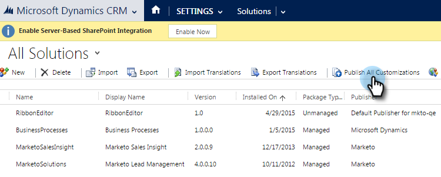

# Festlegen eines Standardpräfixes für benutzerdefinierte Felder {#set-a-default-custom-field-prefix}

Ihr standardmäßiges [!DNL Microsoft Dynamics] für benutzerdefinierte Felder muss **neu** sein, damit proprietäre Felder von Marketo ordnungsgemäß synchronisiert werden können. So ändern Sie das Standard-Präfix.

1. Navigieren Sie zu [!UICONTROL Einstellungen] und wählen Sie **[!UICONTROL Anpassungen] aus**

   

1. Klicken Sie auf **[!UICONTROL Publisher]**.

   

1. Wählen Sie den Standardherausgeber aus der Liste aus.

   

1. Ändern Sie das Präfix in **Neu**. Klicken Sie **[!UICONTROL Speichern und schließen]**.

   

1. Gehen Sie zu [!UICONTROL Einstellungen] > [!UICONTROL Lösungen], um die Anpassungen zu veröffentlichen.

   

1. Klicken Sie **[!UICONTROL Alle Anpassungen veröffentlichen]**.

   

1. Erstellen Sie jetzt Ihre benutzerdefinierten Felder. Nachdem Sie sie abgeschlossen haben, setzen Sie das Präfix auf das ursprüngliche zurück.
