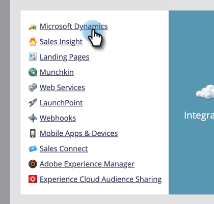
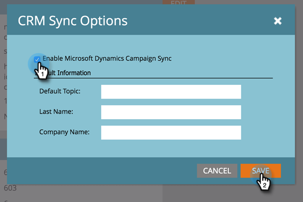

# Aktivieren von Kampagnensynchronisierung {#enable-campaign-sync}

Mit dieser Option kann Marketo Mitglieder zu [!DNL MS Dynamics] Campaign hinzufügen und daraus entfernen.

>[!PREREQUISITES]
>
>Aktualisieren Sie auf die neueste Version des [!DNL Dynamics]-Plug-ins für Marketo.

>[!NOTE]
>
>**Admin-Berechtigungen erforderlich**

1. Klicken Sie in **[!UICONTROL Meine Marketo]** auf **[!UICONTROL Admin]**.

   

1. Auf **[!UICONTROL Microsoft Dynamics]**.

   

1. Klicken **[!UICONTROL unter &quot;]** synchronisieren“ auf **[!UICONTROL Bearbeiten]**.

   

1. Aktivieren Sie das **[!UICONTROL Microsoft Dynamics Campaign Sync aktivieren]** und klicken Sie auf **[!UICONTROL Speichern]**.

   

Geben Sie der Synchronisierung etwas Zeit, um die Daten aus [!DNL Microsoft Dynamics] abzurufen.

>[!NOTE]
>
>Wenn Sie das Kontrollkästchen Kampagnensynchronisierung [!DNL Dynamics] zurücksetzen, werden alle zuvor synchronisierten Kampagnendaten und die Verknüpfungen mit den Marketing-Listen in [!DNL Dynamics] aktualisiert.
