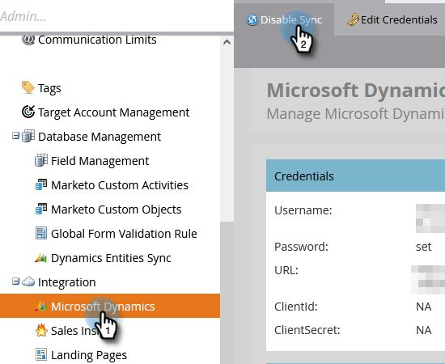

# Aktivieren der Synchronisierung für eine benutzerdefinierte Entität {#enable-sync-for-a-custom-entity}

Wenn benutzerdefinierte Entitätsdaten aus [!DNL Dynamics] in Marketo Engage verfügbar sein sollen, sehen Sie hier, wie Sie die Synchronisierung dafür aktivieren.

>[!PREREQUISITES]
>
>Um ein benutzerdefiniertes Objekt zu verwenden, muss es mit einem [Lead](/help/marketo/product-docs/crm-sync/microsoft-dynamics-sync/microsoft-dynamics-sync-details/microsoft-dynamics-sync-lead-sync.md){target="_blank"}-, [Kontakt](/help/marketo/product-docs/crm-sync/microsoft-dynamics-sync/microsoft-dynamics-sync-details/microsoft-dynamics-sync-contact-sync.md){target="_blank"}- oder [Konto](/help/marketo/product-docs/crm-sync/microsoft-dynamics-sync/microsoft-dynamics-sync-details/microsoft-dynamics-sync-account-sync.md){target="_blank"}-Objekt in Microsoft Dynamics verknüpft sein.

>[!NOTE]
>
>* Wenn Sie die Synchronisierung für eine benutzerdefinierte Entität aktivieren, führt Marketo eine Erstsynchronisierung durch, um alle Daten für das benutzerdefinierte Objekt einzubringen.
>* Mitglieder von Marketing-Listen und Marketing-Listen _derzeit nicht_.

>[!IMPORTANT]
>
>Der Marketo-Synchronisierungsbenutzer benötigt Lesezugriff auf das benutzerdefinierte Objekt, um es aufzulisten und eine Synchronisierung mit ihm durchzuführen.

1. Navigieren Sie zum Abschnitt **[!UICONTROL Admin]**.

   

1. Wählen Sie **[!UICONTROL Microsoft Dynamics]** aus und klicken Sie auf **[!UICONTROL Synchronisierung deaktivieren]**.

   

   >[!NOTE]
   >
   >Sie müssen die globale Synchronisierung vorübergehend deaktivieren, um eine benutzerdefinierte Entität zu aktivieren oder zu deaktivieren.

1. Klicken [!UICONTROL  unter &quot;]&quot; auf den Link **[!UICONTROL Synchronisierung von Dynamics]** Entitäten.

   

1. Klicken Sie auf den **[!UICONTROL Synchronisierungsschema]**-Link.

   

1. Wählen Sie die zu synchronisierende Entität aus und klicken Sie auf **[!UICONTROL Synchronisierung aktivieren]**.

   

1. Wählen Sie die Felder aus, die Sie synchronisieren oder als [Einschränkungen](/help/marketo/product-docs/core-marketo-concepts/smart-lists-and-static-lists/using-smart-lists/add-a-constraint-to-a-smart-list-filter.md) und/oder Trigger in Smart-Listen verwenden möchten. Klicken Sie abschließend auf **[!UICONTROL Synchronisierung aktivieren]**.

   

   >[!NOTE]
   >
   >Während des Synchronisierungsvorgangs werden Sie möglicherweise feststellen, dass das Element [!UICONTROL Dynamische Entitäten synchronisieren] aus der Navigationsstruktur verschwindet. Dieses Verhalten ist zu erwarten und wird nach Abschluss der Synchronisierung erneut angezeigt.

1. Die Entität weist jetzt ein grünes Häkchen auf.

   

1. Vergessen Sie nicht, die globale Synchronisierung erneut zu aktivieren!

   

   >[!NOTE]
   >
   >* Marketo unterstützt nur benutzerdefinierte Entitäten, die mit Standardelementen eine oder zwei Ebenen tief verknüpft sind.
   >
   >* Der benutzerdefinierte Objektbaum kann dasselbe Objekt mehrmals anzeigen, da es direkt mit einem der Hauptobjekte verbunden ist (z. B. Leads, Kontakte, Konten oder indirekte Verbindungen über ein Zwischenobjekt). Wählen Sie in solchen Fällen das Objekt aus, das dem Hauptobjekt am nächsten ist, und wählen Sie nur eines. Die mehrfache Auswahl desselben Objekts kann die Synchronisierung dieses benutzerdefinierten Objekts beeinträchtigen.
