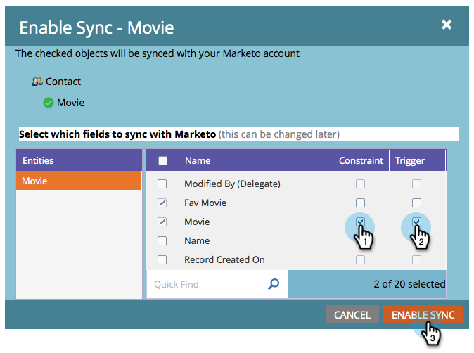

# Aktivieren der Synchronisierung für eine benutzerdefinierte Entität {#enable-sync-for-a-custom-entity}

Wenn Sie benutzerdefinierte Entitätsdaten aus Dynamics benötigen, um auf Marketo Engage verfügbar zu sein, finden Sie hier eine Möglichkeit, die Synchronisierung dafür zu aktivieren. **Administratorberechtigungen sind erforderlich**.

>[!PREREQUISITES]
>
>Um ein benutzerdefiniertes Objekt zu verwenden, muss es mit einem [Lead](/help/marketo/product-docs/crm-sync/microsoft-dynamics-sync/microsoft-dynamics-sync-details/microsoft-dynamics-sync-lead-sync.md){target="_blank"}-, [Kontakt](/help/marketo/product-docs/crm-sync/microsoft-dynamics-sync/microsoft-dynamics-sync-details/microsoft-dynamics-sync-contact-sync.md){target="_blank"}- oder [Konto](/help/marketo/product-docs/crm-sync/microsoft-dynamics-sync/microsoft-dynamics-sync-details/microsoft-dynamics-sync-account-sync.md){target="_blank"}-Objekt in Microsoft Dynamics verknüpft sein.

>[!NOTE]
>
>* Wenn Sie die Synchronisierung für eine benutzerdefinierte Entität aktivieren, führt Marketo eine erste Synchronisierung durch, um alle Daten für das benutzerdefinierte Objekt einzubringen.
>* Die Mitglieder der Marketing-Liste und der Marketing-Liste werden derzeit _nicht unterstützt_.

>[!IMPORTANT]
>
>Der Marketo Sync User benötigt Lesezugriff auf das benutzerdefinierte Objekt, um es aufzulisten und eine Synchronisierung durchzuführen.

1. Wechseln Sie zum Abschnitt **[!UICONTROL Admin]** .

   

1. Wählen Sie **[!UICONTROL Microsoft Dynamics]** und klicken Sie auf **[!UICONTROL Synchronisierung deaktivieren]**.

   

   >[!NOTE]
   >
   >Sie müssen die globale Synchronisierung vorübergehend deaktivieren, um eine benutzerdefinierte Entität zu aktivieren oder zu deaktivieren.

1. Klicken Sie unter &quot;Datenbankverwaltung&quot;auf **[!UICONTROL Synchronisation von Dynamics-Entitäten]**.

   

1. Klicken Sie auf **[!UICONTROL Schema synchronisieren]**.

   

1. Wählen Sie die Entität aus, die Sie synchronisieren möchten, und klicken Sie auf **[!UICONTROL Synchronisation aktivieren]**.

   

1. Wählen Sie die Felder aus, die Sie synchronisieren oder als [Begrenzungen](/help/marketo/product-docs/core-marketo-concepts/smart-lists-and-static-lists/using-smart-lists/add-a-constraint-to-a-smart-list-filter.md){target="_blank"} und/oder Trigger (für hinzugefügte Datensätze, _nicht_ aktualisiert) in Smart-Listen verwenden möchten. Klicken Sie abschließend auf **[!UICONTROL Synchronisierung aktivieren]**.

   

   >[!NOTE]
   >
   >Während des Synchronisierungsprozesses werden Sie möglicherweise feststellen, dass das Element &quot;[!UICONTROL Dynamische Entitäten synchronisieren]&quot; aus der Navigationsstruktur verschwindet. Dies ist das erwartete Verhalten und wird nach Abschluss der Synchronisierung wieder angezeigt.

1. Die Entität verfügt jetzt über ein grünes Häkchen.

   

1. Vergessen Sie nicht, die globale Synchronisierung erneut zu aktivieren!

   

   >[!NOTE]
   >
   >* Marketo unterstützt nur benutzerdefinierte Entitäten, die mit Standardentitäten verknüpft sind, die eine oder zwei Ebenen tief sind.
   >
   >* Die benutzerdefinierte Objektstruktur kann dasselbe Objekt mehrmals anzeigen, da sie direkt mit einem der Hauptobjekte verbunden ist (z. B. Leads, Kontakte oder Konten oder indirekte Verbindungen über ein Intermediarobjekt). Wählen Sie in diesem Fall das Objekt aus, das dem Hauptobjekt am nächsten liegt, und wählen Sie nur eines aus. Die mehrfache Auswahl desselben Objekts kann die Synchronisierung dieses benutzerdefinierten Objekts behindern.
