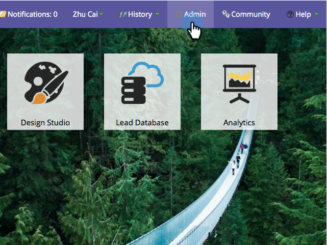

# Microsoft Dynamics Sync: Benutzerdefinierte Entitätssynchronisierung {#microsoft-dynamics-sync-custom-entity-sync}

Wenn Sie die anfängliche benutzerdefinierte Entitätssynchronisierung aktivieren müssen, um Daten aus Dynamics in Marketo verfügbar zu machen, hier erfahren Sie, wie Sie das machen.

>[!NOTE]
>
>**Administratorberechtigungen erforderlich**

>[!NOTE]
>
>**Voraussetzungen**
>
>Um ein benutzerdefiniertes Objekt zu verwenden, muss es mit einem [Interessenten](microsoft-dynamics-sync-lead-sync.md), [Kontakt](microsoft-dynamics-sync-contact-sync.md)oder Konto in Dynamics verknüpft sein.

>[!CAUTION]
>
>Vergewissern Sie sich, dass die anfängliche Synchronisierung abgeschlossen ist (Sie werden per E-Mail benachrichtigt), bevor Sie mit der Synchronisierung für benutzerdefinierte Entitäten beginnen.

1. Gehen Sie zum Abschnitt Admin.

   

1. Klicken Sie auf Synchronisierung **deaktivieren** , um die standardmäßige globale Synchronisierung vorübergehend zu deaktivieren.

   

1. Installieren Sie eine Version von Microsoft Dynamics, die die benutzerdefinierte Entitätssynchronisierung unterstützt (nach 2_0_0_2). Siehe [Marketo Plugin Releases für MIcrosoft Dynamics](../../../../product-docs/crm-sync/microsoft-dynamics-sync/marketo-plugin-releases-for-microsoft-dynamics.md).
1. Weisen Sie dem Synchronisierungsbenutzer Lesezugriff auf alle Entitäten zu, die synchronisiert werden sollen.
1. Klicken Sie unter Datenbankverwaltung auf den Link** Dynamics Entities Sync**.

   

1. Klicken Sie auf den Link **Schema** synchronisieren, um die Liste der verfügbaren benutzerdefinierten Entitäten zu übernehmen.

   

1. Wählen Sie nach der Synchronisierung der Liste die zu synchronisierenden und die zu verwendenden Felder als [Beschränkungen](../../../../product-docs/core-marketo-concepts/smart-lists-and-static-lists/using-smart-lists/add-a-constraint-to-a-smart-list-filter.md) und/oder Auslöser in intelligenten Listen aus. Klicken Sie abschließend auf **Synchronisierung** aktivieren.

   

1. Aktivieren Sie die globale Synchronisierung erneut.

   

   >[!NOTE]
   >
   >Marketo unterstützt nur benutzerdefinierte Entitäten, die mit standardmäßigen Entitäten in einer oder zwei Ebenen verknüpft sind.

   >[!NOTE]
   >
   >Entitätsnamen dürfen maximal** 33 Zeichen** enthalten.

Du bist gut!