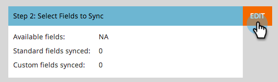

# Zu synchronisierende Felder vor dem Löschen in Dynamics bearbeiten {#editing-fields-to-sync-before-deleting-them-in-dynamics}

Manchmal können Sie Felder in Dynamics löschen. Marketo Engage behält die Feldliste als Referenz bei, auf der die Synchronisation basieren soll. Wenn ein Feld in Dynamics gelöscht wird, während die Synchronisierung aktiviert ist, kann es bei der Synchronisierung zu Fehlern kommen. Gehen Sie wie folgt vor, bevor Sie Felder löschen.

1. Klicken Sie in Marketo auf **[!UICONTROL Admin]**.

   

1. Klicken Sie unter &quot;Integration&quot;auf **[!UICONTROL Microsoft Dynamics]**.

   

1. Klicken Sie auf **[!UICONTROL Synchronisierung deaktivieren]**.

   

1. Melden Sie sich in einer neuen Registerkarte in Ihrem Browser bei Dynamics an und löschen Sie die gewünschten Felder.

1. Klicken Sie in Marketo unter &quot;Microsoft Dynamics&quot;neben &quot;Schritt 2: Zu synchronisierende Felder auswählen&quot;auf &quot;**[!UICONTROL Bearbeiten]**&quot;.

   

1. Überprüfen Sie die Felder und klicken Sie auf **[!UICONTROL Speichern]**.

   

>[!CAUTION]
>
>Wenn Sie auf **[!UICONTROL Speichern]** klicken, muss das aktualisierte Schema für die Synchronisierung gespeichert werden, selbst wenn keine Änderungen vorgenommen wurden.

>[!NOTE]
>
>Wenn die Synchronisierung vor dem Löschen eines Felds in Dynamics nicht angehalten wird, kann es zu Fehlern bei der Synchronisierung kommen. Ist dies der Fall, wird die Synchronisierung beendet. Vor der Wiederaufnahme muss der Marketo-Administrator die Meldung &quot;Zu synchronisierende Felder auswählen&quot;(siehe oben) lesen und auf **[!UICONTROL Speichern]** klicken, damit die Synchronisierung die Schemaänderungen akzeptiert.

Denken Sie daran, die Synchronisierung zu aktivieren, nachdem die Änderungen gespeichert wurden!
