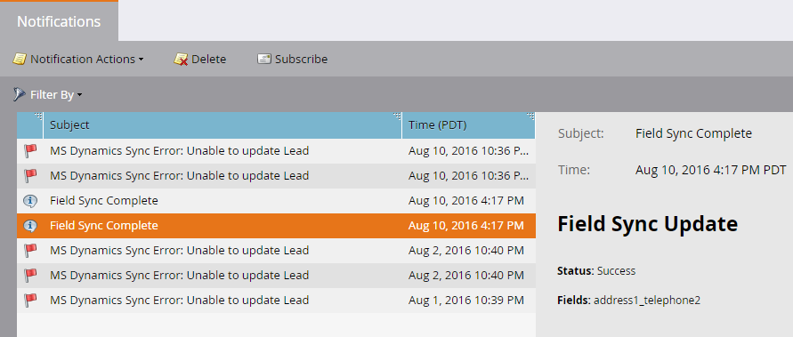

# Verwenden Sie die Schnellsynchronisierung mit Microsoft Dynamics für ein neues benutzerdefiniertes Feld {#use-quick-sync-with-microsoft-dynamics-for-a-new-custom-field}

Marketing oder Vertrieb möchten ein neues Feld erstellen. Oder vielleicht haben Sie eines bei Ihrer ersten Feldauswahl vergessen. Oder Ihre Bedürfnisse haben sich geändert. In jedem Fall können Sie die Schnellsynchronisierung verwenden, um bestimmte Felder neu zu synchronisieren.

Normalerweise verwenden Sie Quick Sync, um ein neues Feld hinzuzufügen und die Werte zu aktualisieren. Es gibt jedoch Fälle, in denen Sie ein vorhandenes Feld synchronisieren möchten. Sie können die Feldsynchronisierung auf der Grundlage eines aktualisierten oder erstellten Datumsbereichs einschränken. Weitere Informationen finden Sie unter [Erweiterte Synchronisierungsoptionen](#Advanced_Sync_Options) weiter unten.

Schnellsynchronisierung kann Null-Werte synchronisieren. Wenn Sie beispielsweise die Werte A und B verwenden und einen B-Wert in Dynamics auf null ändern, wird der Nullwert mit Marketo synchronisiert.

## Schnellsynchronisierung für alle Datensätze {#quick-sync-for-all-records}

Im Folgenden wird beschrieben, wie Sie die Schnellsynchronisierung verwenden, um neue Felder erneut zu synchronisieren.

1. Klicken Sie in Marketo auf **Admin**.

   

1. Klicken Sie auf **Microsoft Dynamics**.

   

1. Klicken Sie unter &quot;Details zur Feldsynchronisierung&quot;auf **Bearbeiten**.

   

1. Wählen Sie die zu synchronisierenden Felder aus und klicken Sie auf **Speichern**.

   

   >[!NOTE]
   >
   >Sie können Felder aus mehreren Entitäten auswählen.

1. Nach Abschluss der Synchronisierung erhalten Sie eine Benachrichtigung.

   

   >[!CAUTION]
   >
   >Die Synchronisierung wird parallel zu anderen Synchronisierungen ausgeführt. Je nach Größe der Datenbank kann es lange dauern, bis sie abgeschlossen ist. Wenn sich ein Feld in einer Warteschlange zur Synchronisierung befindet, können Sie die Auswahl nicht aufheben.

## Erweiterte Synchronisierungsoptionen {#advanced-sync-options}

Was ist, wenn Sie ein vorhandenes Feld synchronisieren möchten, dies jedoch nur für einen begrenzten Datensatz tun? So geht es.

1. Deaktivieren Sie das Kontrollkästchen für ein vorhandenes Feld. Klicken Sie auf **Speichern**.

   

1. Öffnen Sie das Popup erneut und wählen Sie das Feld erneut aus.

   

1. Klicken Sie auf **Erweiterte Synchronisierung**.

   

1. Wählen Sie **Aktualisiert** und wählen Sie einen Datumsbereich mithilfe der Datumsauswahl aus. Klicken Sie auf **Speichern**.

   

   Nur Datensätze, die zwischen dem 19.8.16 und dem 19.9.16 aktualisiert wurden, werden für das Feld schnell synchronisiert.

## Korrektur von nicht synchronisierten Feldern {#fixing-out-of-sync-fields}

In dem seltenen Fall, in dem ein Dynamikfeld und ein Marketo-Feld nicht synchron sind, gibt es eine schnelle und einfache Möglichkeit, sie neu zu synchronisieren.

1. Deaktivieren Sie das Feld und klicken Sie auf **Speichern**.

   

1. Wählen Sie das Feld erneut aus und klicken Sie auf **Speichern**. Das ist alles!

   

   Das sollte es reparieren!
