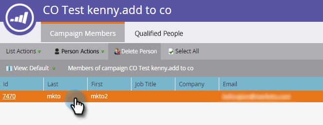
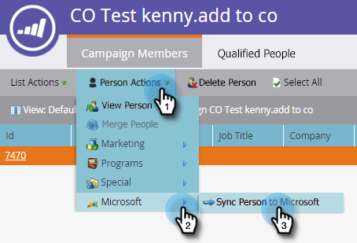
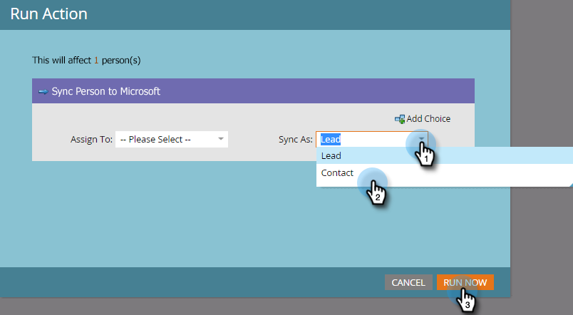
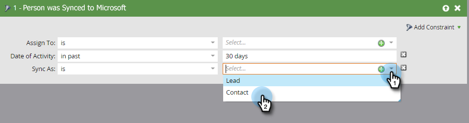

# Erstellen eines Kontakts in [!DNL Microsoft Dynamics] {#create-a-contact-in-microsoft-dynamics}

1. Wählen Sie die Nur-Marketo Engage-Person aus (Microsoft-Typ ist leer), die Sie als Kontakt in Dynamics erstellen möchten.

   

1. Klicken Sie auf **[!UICONTROL Personenaktionen]** und **[!DNL Microsoft]** und wählen Sie **[!UICONTROL Person mit Microsoft synchronisieren]**.

   

1. Klicken Sie auf **[!UICONTROL Synchronisieren als]** und wählen Sie **[!UICONTROL Kontakt]**. Klicken Sie **[!UICONTROL Jetzt ausführen]**.

   

   >[!NOTE]
   >
   >Bei Verwendung der Flussaktion [!UICONTROL Person mit Microsoft synchronisieren] (nur in einer Trigger-Kampagne) wird der Lead/Kontakt in Echtzeit in Dynamics erstellt.

1. Marketo qualifiziert diesen Lead-Datensatz in [!DNL Dynamics] in einen Kontakt, der mit keinem Konto in [!DNL Dynamics] verknüpft ist.

   

1. Jetzt können Sie **[!UICONTROL Kontakt]** auswählen, wenn Sie die Einschränkung Synchronisieren als in einem Smart-Kampagnenfilter verwenden.

   
