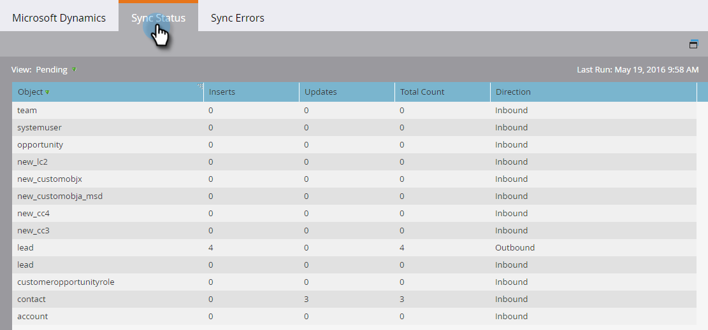
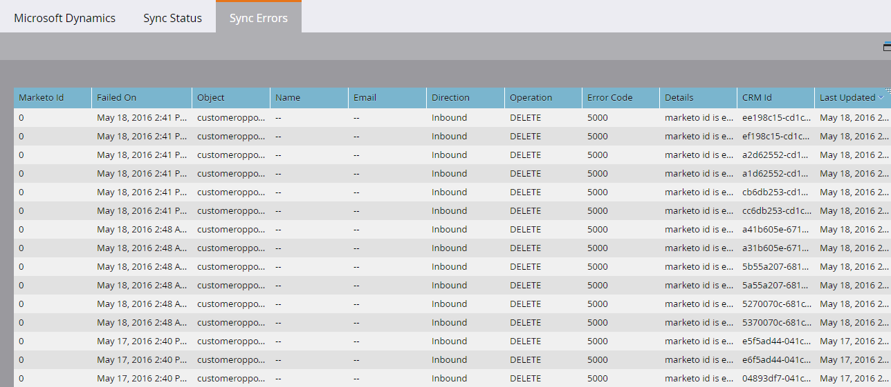

# Synchronisierungsstatus {#sync-status}

Auf den Registerkarten Synchronisierungsstatus und Synchronisierungsfehler können Sie den aktuellen Durchsatz und den Rückstand des Synchronisierungsprozesses im Auge behalten.

## Registerkarte &quot;Synchronisierungsstatus&quot; {#sync-status-tab}

1. Klicks **[!UICONTROL Admin]**, dann **[!UICONTROL Microsoft Dynamics]**.

   

1. Klicken Sie auf **[!UICONTROL Synchronisierungsstatus]** Registerkarte.

   

   Diese Tabelle zeigt den Rückstand der Einfügungen und Aktualisierungen, die noch nicht synchronisiert wurden, für jedes Objekt.

1. Doppelklicken Sie auf eine beliebige Zeile, um Opportunitätsinformationen anzuzeigen.

   

   Die Details des Synchronisierungsstatus werden nach Einfügungen und Aktualisierungen sowie ältesten Einfüge- und Aktualisierungsdatensätzen aufgeschlüsselt.

   

1. Klicken Sie auf **[!UICONTROL Ansicht]** und wählen Sie **[!UICONTROL Letzte Stunde]** , um Durchsatzinformationen anzuzeigen.

   

   Die Anzeige zeigt nun die Anzahl der in der letzten vollen Stunde synchronisierten Datensätze an (z. B. 1-2 Uhr).

   

   >[!NOTE]
   >
   >Wenn Sie sich die Ansicht &quot;Letzte Stunde&quot;ansehen, wird in den Spalten &quot;Einfügungen und Aktualisierungen&quot;die Option &quot;Nicht zutreffend&quot;angezeigt. Dies ist das erwartete Verhalten.

## Registerkarte &quot;Fehler synchronisieren&quot; {#sync-errors-tab}

Durchsuchen, Suchen oder Exportieren von Leads (und anderen Objekten), die nicht mit Details wie Vorgang, Richtung, Fehlercode und Fehlermeldung synchronisiert werden konnten.

>[!MORELIKETHIS]
>
>[Benachrichtigungstypen](/help/marketo/product-docs/core-marketo-concepts/miscellaneous/understanding-notifications/notification-types.md){target="_blank"}
