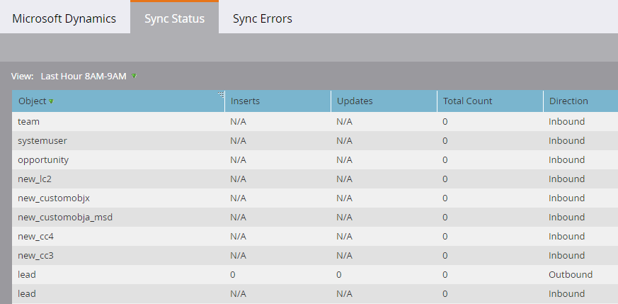

# Synchronisierungsstatus {#sync-status}

Sie können den aktuellen Durchsatz und den Rückstand des Synchronisierungsprozesses auf den Registerkarten [!UICONTROL Synchronisierungsstatus] und [!UICONTROL Synchronisierungsfehler] überwachen.

## [!UICONTROL Synchronisierungsstatus] Registerkarte {#sync-status-tab}

1. Klicken Sie **[!UICONTROL Admin]** und **[!UICONTROL Microsoft Dynamics]**.

   

1. Klicken Sie auf **[!UICONTROL Registerkarte]** Synchronisierungsstatus“.

   

   Diese Tabelle zeigt den Rückstand der Einfügungen und Aktualisierungen an, die noch nicht für jedes Objekt synchronisiert wurden.

1. Doppelklicken Sie auf eine beliebige Zeile, um Opportunity-Informationen anzuzeigen.

   

   Die Details zum Synchronisierungsstatus werden nach Einfügungen und Aktualisierungen sowie nach den ältesten Einfügungen und Aktualisierungen aufgeschlüsselt.

   

1. Klicken Sie auf **[!UICONTROL Ansicht]** und wählen Sie **[!UICONTROL Letzte Stunde]** aus, um Durchsatzinformationen anzuzeigen.

   

   Im Display wird nun die Anzahl der Datensätze angezeigt, die in der letzten vollen Stunde synchronisiert wurden (z. B. 1-14 Uhr).

   

   >[!NOTE]
   >
   >Wenn Sie die Ansicht [!UICONTROL Letzte Stunde] anzeigen, werden in den [!UICONTROL Einfüge] und [!UICONTROL Aktualisierungen] Spalten K. A. angezeigt. Dies ist das erwartete Verhalten.

## Registerkarte [!UICONTROL Synchronisierungsfehler] {#sync-errors-tab}

Durchsuchen, Suchen oder Exportieren von Leads (und anderen Objekten), die nicht mit Details wie Vorgang, Richtung, Fehlercode und Fehlermeldung synchronisiert werden konnten.

>[!MORELIKETHIS]
>
>[Benachrichtigungstypen](/help/marketo/product-docs/core-marketo-concepts/miscellaneous/understanding-notifications/notification-types.md){target="_blank"}
