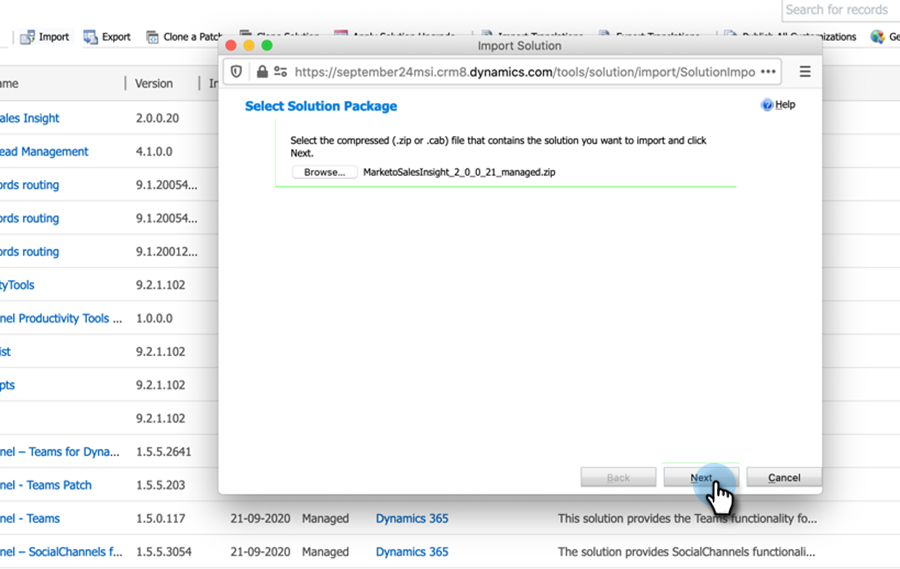

# Plug-in-Versionen für [!DNL Microsoft Dynamics] MSI {#plug-in-releases-for-microsoft-dynamics-msi}

Wenn Sie zum ersten Mal eine Synchronisierung mit [!DNL Microsoft Dynamics] durchführen, laden Sie die neueste Version der Plug-ins für Marketo Sales Insight (MSI) herunter und installieren Sie sie. Marketo aktualisiert diese Plug-ins regelmäßig, damit Sie zum Download der neuen Version an denselben Ort zurückkehren können.

Wenn Sie die native CRM-Synchronisierungslösung von Marketo für [!DNL Dynamics] verwenden, laden [das neueste Plug-in &#x200B;](/help/marketo/product-docs/marketo-sales-insight/msi-for-microsoft-dynamics/installing/download-the-marketo-sales-insight-solution-for-microsoft-dynamics.md){target="_blank"} Ihrer [!DNL Dynamics] Version herunter. Für diejenigen, die eine benutzerdefinierte Synchronisierung haben und Marketo Sales Insight erworben haben, ist das [Paket hier](https://mktg-cdn.marketo.com/community/MarketoSalesInsight_NonNative.zip){target="_blank"}.

>[!NOTE]
>
>Diese Versionen funktionieren sowohl für On-Premise- als auch für Online-Versionen von [!DNL Dynamics].

## Aktualisieren der MSI-Lösung {#upgrading-your-msi-solution}

1. Importieren Sie die neueste Version der Lösung _über die vorhandene Version_ Ihres [!DNL Dynamics] CRM, indem Sie die Schaltfläche **[!UICONTROL Importieren]** in [!DNL Dynamics].

   

>[!NOTE]
>
>Beispiel: Wenn Ihr [!DNL Dynamics] CRM Version 2.0.0.20 hat und die neueste Version 2.0.0.21 ist, würden Sie _over_ Version 2.0.0.20 importieren.

1. Klicken Sie auf **[!UICONTROL Weiter]**.

   

1. Wählen Sie **[!UICONTROL Phase für Upgrade]** und **[!UICONTROL Anpassungen beibehalten]** und klicken Sie dann auf **[!UICONTROL Importieren]**.

   

1. Klicken Sie auf **[!UICONTROL Weiter]**.

   

1. Nach einem erfolgreichen Import sehen Sie zwei MSI-Lösungen: MarketoSalesInsight und MarketoSalesInsight_Upgrade. Wählen Sie die ältere Lösung aus und klicken Sie auf Lösungsaktualisierung anwenden.

   

Und das war&#39;s! Nach dem Upgrade wird nur noch eine einzige MSI-Lösung angezeigt.

## Versionsaktualisierungen {#version-updates}

<table>
 <tbody>
  <tr>
   <th>Veröffentlichungsdatum</th>
   <th>Version</th>
   <th>Hinweise</th>
  </tr>
  <tr>
   <td>02/14/24</td>
   <td>2,00,31</td>
   <td>Änderungen an der Paginierung bei anonymer Web-Aktivität.
   

   Verschlüsseln von geheimen Schlüsselinformationen aus der Benutzeransicht. Das Kennwort muss nach dem Import des neuen Pakets geändert werden, damit die Verschlüsselung erfolgt.</td>
  </tr>
  <tr>
   <td>10/18/23</td>
   <td>2,00,30</td>
   <td>Konsolidierung des MSI-Fehlerprotokolls und Entfernen von Informationsbenachrichtigungen, die in der Marketo-Fehlerentität angezeigt werden.</td>
  </tr>
  <tr>
   <td>05/19/23</td>
   <td>2,00,29</td>
   <td>Fehlerkorrektur: Es wurden Web-Aktivitäten und Paginierungsprobleme „Interessante Momente“ im globalen Dashboard behoben.</td>
  </tr>
  <tr>
   <td>03/23/23</td>
   <td>2,00,28</td>
   <td>Es wurde ein <a href="https://mktg-cdn.marketo.com/community/MarketoSalesInsight_NonNative.zip">neues Paket</a> für MSI für nicht-native Verbindungen mit dem CRM erstellt.</td>
  </tr>
  <tr>
   <td>02/03/22</td>
   <td>2.0.0.27</td>
   <td>Konto-Layout für Einblicke: Interessante Momente, Bewertungsänderungen, Web-Aktivitäten, E-Mail-Aktivitäten.</td>
  </tr>
  <tr>
   <td>01/05/22</td>
   <td>2.0.0.26</td>
   <td>Score zur Programmakzeptanz für „E-Mail senden“.</td>
  </tr>
  <tr>
   <td>10/28/21</td>
   <td>2.0.0.25</td>
   <td>Metriken zur Bewertung der Produktakzeptanz, neues globales Dashboard (Web-Aktivität, E-Mail, Best Bets).</td>
  </tr>
  <tr>
   <td>02/10/21</td>
   <td>2.0.0.22</td>
   <td>Entfernen Sie für die MSI-Lösung aktivierte automatische Audits und Dokumentationsänderungen.</td>
  </tr>
  <tr>
   <td>10/01/20</td>
   <td>2.0.0.21</td>
   <td>Fehlerbehebung: Zuweisen des Zugriffs auf MSI-API-Konfigurationsfelder für Benutzende mit der Rolle Sales Insight.</td>
  </tr>
  <tr>
   <td>07/20/20</td>
   <td>2.0.0.20</td>
   <td>Fehlerbehebung: Es wird eine Validierungsmeldung für nicht synchronisierte Datensätze hinzugefügt.</td>
  </tr>
  <tr>
   <td>06/12/20</td>
   <td>2.0.0.19</td>
   <td>Fehlerbehebung: Ausblenden des MSI Secret Password auf der MSD-API-Konfiguration.</td>
  </tr>
  <tr>
   <td>05/26/20</td>
   <td>2.0.0.18</td>
   <td>Fehlerbehebung: Ändern der MSI-Rollen-ID-Validierung für die Anzeige von MSI-Schaltflächen.</td>
  </tr>
  <tr>
   <td>05/21/20</td>
   <td>2.0.0.17</td>
   <td>Fehlerbehebung: Besitzerfeld einblenden und Felder nicht obligatorisch machen.</td>
  </tr>
  <tr>
   <td>04/28/20</td>
   <td>2.0.0.16</td>
   <td>Fehlerbehebung: Entfernen der MSD CRM-Sitemap, Einstellung der Link-Abhängigkeit.</td>
  </tr>
 </tbody>
</table>
