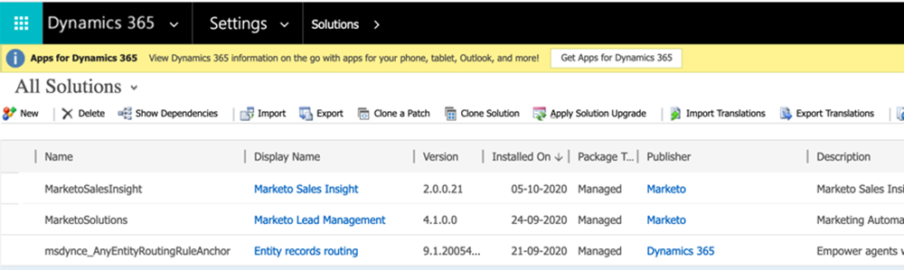

# Plug-in-Versionen für Microsoft Dynamics MSI {#plug-in-releases-for-microsoft-dynamics-msi}

Bei der ersten Synchronisierung mit Microsoft Dynamics laden Sie die neueste Version der Plug-ins für Marketo Sales Insight (MSI) herunter und installieren sie. Marketo aktualisiert diese Plug-ins regelmäßig, sodass Sie zum selben Speicherort zurückkehren und die neue Version herunterladen können.

Bitte [das neueste Plug-in herunterladen](/help/marketo/product-docs/marketo-sales-insight/msi-for-microsoft-dynamics/installing/download-the-marketo-sales-insight-solution-for-microsoft-dynamics.md) entspricht Ihrer Dynamics-Version.

>[!NOTE]
>
>Diese Versionen funktionieren sowohl für On-Premise- als auch für Online-Versionen von Dynamics.

## Upgrade Ihrer MSI-Lösung {#upgrading-your-msi-solution}

1. Importieren Sie die neueste Version der Lösung. _über die vorhandene Version_ Ihres Dynamics CRM durch Drücken der **Import** in Dynamics.

   

>[!NOTE]
>
>Beispiel: Wenn Ihr Dynamics CRM-System über Version 2.0.0.20 verfügt und die neueste Version 2.0.0.21 ist, würden Sie importieren _over_ Version 2.0.0.20.

1. Klicken **Nächste**.

   

1. Auswählen **Upgrade-Phase** und **Verwalten von Anpassungen** Klicken Sie auf **Import**.

   

1. Klicken **Nächste**.

   

1. Nach einem erfolgreichen Import werden Ihnen zwei MSI-Lösungen angezeigt: MarketoSalesInsight und MarketoSalesInsight_Upgrade. Wählen Sie die ältere Lösung aus und klicken Sie auf Lösungsaktualisierung anwenden.

   

Und das ist es! Nach dem Upgrade wird nur eine MSI-Lösung angezeigt.

## Versionsaktualisierungen {#version-updates}

<table> 
 <colgroup> 
  <col> 
  <col> 
  <col> 
 </colgroup> 
 <tbody> 
  <tr> 
   <th colspan="1">Veröffentlichungsdatum</th> 
   <th colspan="1">Version</th> 
   <th colspan="1">Hinweise</th> 
  </tr> 
  <tr> 
   <td colspan="1">03.02.22</td> 
   <td colspan="1">2.0.0.27</td> 
   <td colspan="1">Kontolayout für Insights: Interessante Momente, Bewertungsänderungen, Web-Aktivitäten, E-Mail-Aktivitäten</td> 
  </tr>
  <tr> 
   <td colspan="1">05.01.22</td> 
   <td colspan="1">2.0.0.26</td> 
   <td colspan="1">Programm-Adoptionsbewertung für E-Mail senden</td> 
  </tr>
  <tr> 
   <td colspan="1">28.10.21</td> 
   <td colspan="1">2.0.0.25</td> 
   <td colspan="1">Metriken zur Produktakzeptanz, neues globales Dashboard (Web-Aktivität, E-Mail, Best-Bets)</td> 
  </tr>
  <tr> 
   <td colspan="1">10.02.21</td> 
   <td colspan="1">2.0.0.22</td> 
   <td colspan="1">Entfernen Sie die automatische Prüfung aktiviert und Dokumentationsänderungen an der MSI-Lösung</td> 
  </tr>
  <tr> 
   <td colspan="1">01.10.20</td> 
   <td colspan="1">2.0.0.21</td> 
   <td colspan="1">Fehlerbehebung: Zuweisen des Zugriffs auf MSI API-Konfigurationsfelder für Benutzer mit der Rolle "Sales Insight"</td> 
  </tr> 
  <tr> 
   <td colspan="1">20.07.20</td> 
   <td colspan="1">2.0.0.20</td> 
   <td colspan="1">Fehlerbehebung: Überprüfungsmeldung für nicht synchronisierte Datensätze hinzufügen</td> 
  </tr> 
  <tr> 
   <td colspan="1">12.06.20</td> 
   <td colspan="1">2.0.0.19</td> 
   <td colspan="1">Fehlerbehebung: So blenden Sie das geheime MSI-Kennwort bei der MSD-API-Konfiguration aus</td> 
  </tr> 
  <tr> 
   <td colspan="1">26.05.20</td> 
   <td colspan="1">2.0.0.18</td> 
   <td colspan="1">Fehlerbehebung: So ändern Sie die Validierung der MSI-Rollen-ID für die Anzeige von MSI-Schaltflächen</td> 
  </tr> 
  <tr> 
   <td colspan="1">21.05.20</td> 
   <td colspan="1">2.0.0.17</td> 
   <td colspan="1">Fehlerbehebung: Einblenden des Eigentümerfelds und Nicht-Pflichtfelder</td> 
  </tr> 
  <tr> 
   <td colspan="1">28.04.20</td> 
   <td colspan="1">2.0.0.16</td> 
   <td colspan="1">Fehlerbehebung: Entfernung der MSD CRM-Sitemap-Einstellung der Link-Abhängigkeit</td> 
  </tr> 
 </tbody> 
</table>
