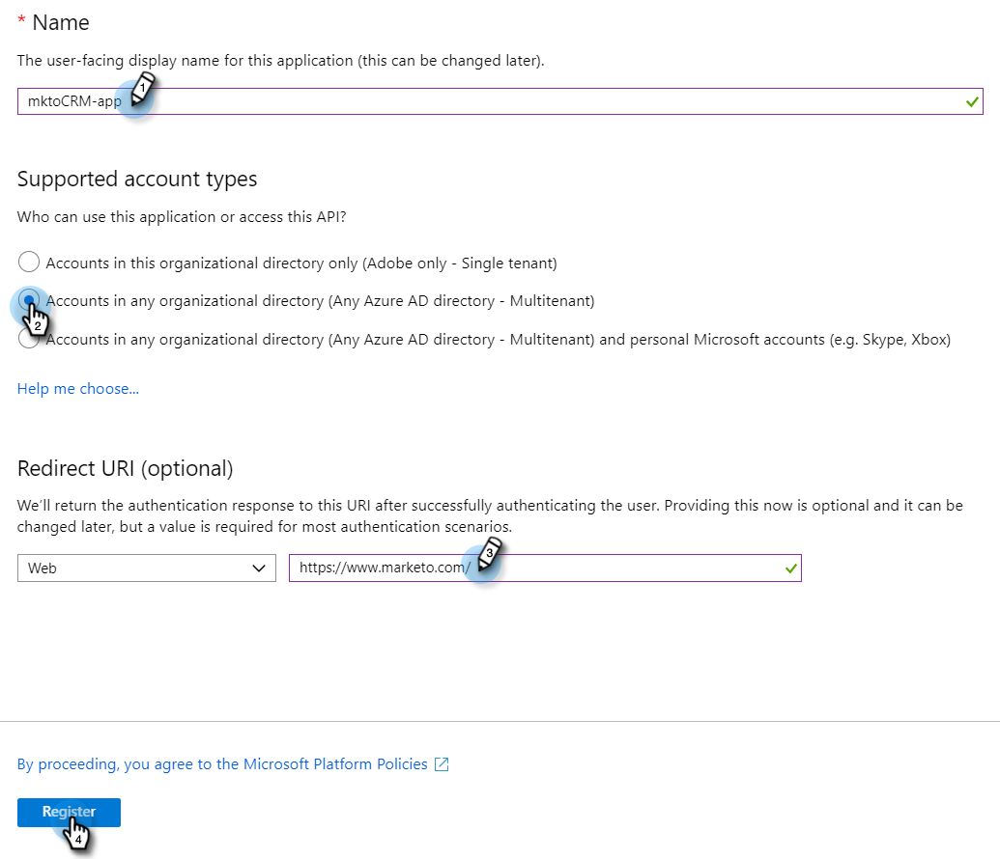

# Registrieren einer App bei Azure, um Ihre Client-ID/App-ID zu erhalten {#register-an-app-with-azure-to-acquire-your-client-id-app-id}

Azure Active Directory erweitert Ihre lokalen Ordner in die Cloud und unterstützt [!DNL MS Dynamics 365] CRM mit On-Premise-ADFS-Authentifizierung.

## Registrieren einer neuen App {#registering-a-new-app}

1. [Melden Sie ](https://login.microsoftonline.com/){target="_blank"} beim Verwaltungsportal von Microsoft Azure mit einem Konto mit Administratorberechtigungen an. Sie können auf das Microsoft Azure-Portal auch über das Office 365 Admin Center zugreifen, indem Sie das **[!UICONTROL Admin]**-Element im linken Navigationsbereich erweitern und **[!UICONTROL Azure AD]** auswählen.

   >[!CAUTION]
   >
   >Sie müssen ein Konto im selben [!DNL Office 365]-Abonnement verwenden, mit dem Sie die App registrieren möchten.

   >[!NOTE]
   >
   >Wenn Sie kein Azure-Konto haben, können Sie [ für eines ](https://azure.microsoft.com/en-us/free/){target="_blank"}. Weitere Informationen finden Sie in der Dokumentation von Microsoft oder bei Ihrem Microsoft-Support-Mitarbeiter. Nachdem Sie ein Azure-Konto erstellt haben, können Sie eine oder mehrere Apps wie unten beschrieben registrieren.
   >
   >
   >Wenn Sie ein Azure-Konto haben, Ihr [!DNL Office 365]-Abonnement mit [!DNL Microsoft Dynamics 365] jedoch nicht in Ihrem Azure-Abonnement verfügbar ist, befolgen Sie [diese Anweisungen](https://msdn.microsoft.com/office/office365/howto/setup-development-environment#bk_CreateAzureSubscription){target="_blank"} um die beiden Konten zu verknüpfen.

1. Suchen Sie nach **[!UICONTROL Azure Active Directory]** im linken Navigationsbereich und klicken Sie darauf.

   

1. Klicken [!UICONTROL &#x200B; unter &quot;]&quot; auf **[!UICONTROL App-Registrierungen]**.

   

1. Klicken Sie **[!UICONTROL oben]** der Seite auf „Neue Registrierung“.

   

1. Geben Sie einen Namen für Ihre App ein, wählen Sie Ihren entsprechenden Kontotyp aus und geben Sie eine Umleitungs-URL ein. Klicken Sie **[!UICONTROL unten]** der Seite auf „Registrieren“.

   

1. Ihre App sollte nun auf der Registerkarte **[!UICONTROL App-Registrierungen]** angezeigt werden.

   

## Konfigurieren von App-Berechtigungen {#configuring-app-permissions}

1. Klicken Sie auf **[!UICONTROL Registerkarte]** App-Registrierungen“ in Ihrem Active Directory auf die App, für die Sie Berechtigungen konfigurieren möchten.

   

1. Klicken [!UICONTROL &#x200B; unter &quot;]&quot; auf **[!UICONTROL API-Berechtigungen]**.

   

1. Klicken Sie auf **[!UICONTROL Schaltfläche „Berechtigung hinzufügen]**.

   

1. Wählen Sie **[!UICONTROL Dynamics CRM]**.

   

1. Aktivieren Sie das **[!UICONTROL Zugriff auf Common Data Service als Organisationsbenutzer]** und klicken Sie dann auf **[!UICONTROL Berechtigungen hinzufügen].**

   

1. Nachdem die Berechtigungen erfolgreich hinzugefügt wurden, mindestens 10 Sekunden warten.

   

1. Klicken Sie auf **[!UICONTROL Schaltfläche Administratorzustimmung]**.

   

1. Klicken Sie **[!UICONTROL Ja]** zur Bestätigung.

   

   Und du bist fertig!

   
