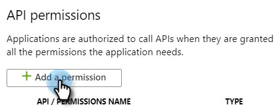
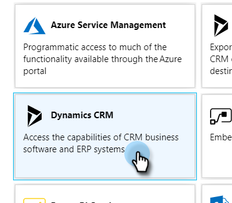

# Registrieren einer App bei Azure, um Ihre Client-ID/App-ID zu erhalten {#register-an-app-with-azure-to-acquire-your-client-id-app-id}

Azure Active Directory erweitert Ihre lokalen Verzeichnisse in die Cloud und unterstützt MS Dynamics 365 CRM mit On-Premise-ADFS-Authentifizierung.

## Registrieren einer neuen App {#registering-a-new-app}

1. [Melden Sie sich mit einem Konto mit Administratorberechtigungen beim Verwaltungsportal von Microsoft Azure an.](https://login.microsoftonline.com/){target="_blank"} Sie können auch über das Office 365 Admin Center auf das Microsoft Azure-Portal zugreifen, indem Sie das Element **[!UICONTROL Admin]** im linken Navigationsbereich erweitern und **[!UICONTROL Azure AD]** auswählen.

   >[!CAUTION]
   >
   >Sie müssen ein Konto im selben Office 365-Abonnement verwenden, mit dem Sie die App registrieren möchten.

   >[!NOTE]
   >
   >Wenn Sie kein Azure-Konto haben, können Sie {target="_blank"} für ein Konto anmelden. Weitere Informationen erhalten Sie in der Dokumentation zu Microsoft oder bei Ihrem Microsoft-Support-Mitarbeiter. Nachdem Sie ein Azure-Konto erstellt haben, können Sie eine oder mehrere Apps gemäß dem unten beschriebenen Verfahren registrieren.
   >
   >
   >Wenn Sie über ein Azure-Konto verfügen, Ihr Office 365-Abonnement mit Microsoft Dynamics 365 jedoch nicht in Ihrem Azure-Abonnement verfügbar ist, befolgen Sie [diese Anweisungen](https://msdn.microsoft.com/office/office365/howto/setup-development-environment#bk_CreateAzureSubscription){target="_blank"} , um die beiden Konten zuzuordnen.

1. Klicken Sie im linken Navigationsbereich auf **[!UICONTROL Azure Active Directory]** .

   

1. Klicken Sie unter &quot;Verwalten&quot;auf **[!UICONTROL App-Registrierungen]**.

   

1. Klicken Sie oben auf der Seite auf **[!UICONTROL Neue Registrierung]** .

   

1. Geben Sie einen Namen für Ihre App ein, wählen Sie den entsprechenden Kontotyp aus und geben Sie eine Umleitungs-URL ein. Klicken Sie dann unten auf der Seite auf **[!UICONTROL Registrieren]** .

   

1. Ihre App sollte jetzt auf der Registerkarte **[!UICONTROL App-Registrierungen]** angezeigt werden.

   

## Konfigurieren von App-Berechtigungen {#configuring-app-permissions}

1. Klicken Sie auf der Registerkarte **[!UICONTROL App-Registrierungen]** in Ihrem Active Directory auf die App, für die Sie Berechtigungen konfigurieren möchten.

   

1. Klicken Sie unter &quot;Verwalten&quot;auf **[!UICONTROL API permissions]**.

   

1. Klicken Sie auf die Schaltfläche **[!UICONTROL Berechtigung hinzufügen]** .

   

1. Wählen Sie **[!UICONTROL Dynamics CRM]** aus.

   

1. Aktivieren Sie das Kontrollkästchen **[!UICONTROL Zugriff auf den allgemeinen Datendienst als Organisationsbenutzer]** und klicken Sie dann auf **[!UICONTROL Berechtigungen hinzufügen]**.

   

1. Warten Sie mindestens 10 Sekunden, nachdem die Berechtigungen erfolgreich hinzugefügt wurden.

   

1. Klicken Sie auf die Schaltfläche **[!UICONTROL Administratorzustimmung erteilen]** .

   

1. Klicken Sie zur Bestätigung auf **[!UICONTROL Ja]** .

   

   Und du bist fertig!

   
