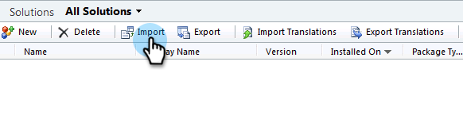
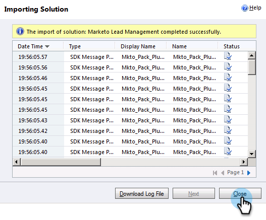

# Schritt 1 von 3: Installieren der Marketo-Lösung (On-Premises 2011) {#step-of-install-the-marketo-solution-on-premises}

Bevor Sie Microsoft Dynamics On-Premises und Marketo synchronisieren können, müssen Sie zunächst die Marketo-Lösung in Dynamics installieren.

>[!NOTE]
>
>Nachdem Sie Marketo mit einem CRM synchronisiert haben, können Sie keine neue Synchronisierung durchführen, ohne die Instanz zu ersetzen.

>[!PREREQUISITES]
>
>Sie müssen [Bereitstellung im Internet](https://www.microsoft.com/en-us/download/confirmation.aspx?id=41701) (IFD) mit [Active Directory Federation-Dienste](https://msdn.microsoft.com/en-us/library/bb897402.aspx) 2.0, 2.1 oder 3.0 (ADFS) konfiguriert. **Hinweis**: Das IFD-Dokument wird beim Klicken auf den Link automatisch heruntergeladen.
>
>[Marketo-Lead-Management-Lösung herunterladen](/help/marketo/product-docs/crm-sync/microsoft-dynamics-sync/sync-setup/download-the-marketo-lead-management-solution.md) bevor Sie beginnen.

>[!NOTE]
>
>**Dynamics-Administratorberechtigungen erforderlich.**
>
>Sie benötigen CRM-Administratorberechtigungen, um diese Synchronisierung durchzuführen.

1. Anmelden bei **Dynamics** auswählen **Einstellungen** im Menü unten links.

   

1. Auswählen **Lösungen** im Baum.

   

1. Klicks **Import**.

   

1. Klicks **Durchsuchen**. Wählen Sie die Marketo Lead Management-Lösung aus, die Sie verwenden [heruntergeladen](/help/marketo/product-docs/crm-sync/microsoft-dynamics-sync/sync-setup/download-the-marketo-lead-management-solution.md). Klicks **Nächste**.

   

1. Anzeigen der Lösungsinformationen und klicken Sie auf **Lösungspaketdetails anzeigen**.

   

1. Wenn Sie alle Details überprüft haben, klicken Sie auf **Schließen**.

   

1. Klicken Sie auf der Seite Lösungsinformationen auf **Nächste**.

   

1. Stellen Sie sicher, dass das Kontrollkästchen SDK-Nachrichtenoption aktiviert ist. Klicks **Nächste**.

   

   >[!TIP]
   >
   >Sie müssen Popups in Ihrem Browser aktivieren, um den Installationsprozess abzuschließen.

1. Warten Sie nun, bis der Import abgeschlossen ist. Steh auf und mach einige Strecken.

   

1. Klicken Sie auf **Schließen**.

   >[!NOTE]
   >
   >Möglicherweise wird eine Meldung mit der Meldung &quot;Marketo Lead Management wurde mit Warnung abgeschlossen&quot;angezeigt. Dies ist völlig zu erwarten.

   

1. Die Marketo-Lead-Verwaltung wird jetzt im **Alle Lösungen** Seite.

   

1. Wählen Sie Marketo Lead Management aus und klicken Sie auf **Alle Anpassungen veröffentlichen.**

   

War nicht zu schlecht? Komm schon, ich werde dich durch den Rest führen.

>[!CAUTION]
>
>Die Deaktivierung eines der Marketo SDK Messaging-Prozesse führt zu einer fehlerhaften Installation!

>[!MORELIKETHIS]
>
>[Schritt 2 von 3: Einrichten des Marketo Sync User in Dynamics (On-Premises 2011)](/help/marketo/product-docs/crm-sync/microsoft-dynamics-sync/sync-setup/connecting-to-legacy-versions/step-2-of-3-set-up-2011.md)
