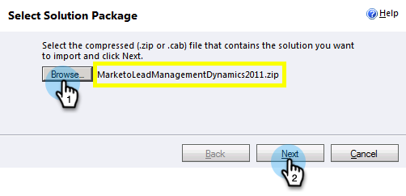

# Schritt 1 von 3: Marketo-Lösung installieren (2011 On-Premise) {#step-of-install-the-marketo-solution-on-premises}

Bevor Sie Microsoft Dynamics On-Premise und Marketo Engage synchronisieren können, müssen Sie zunächst die Marketo-Lösung in Dynamics installieren.

>[!NOTE]
>
>Nach dem Synchronisieren von Marketo mit einem CRM können Sie keine neue Synchronisierung durchführen, ohne die Instanz zu ersetzen.

>[!PREREQUISITES]
>
>Sie müssen [Internet Facing Deployment](https://learn.microsoft.com/en-us/dynamics365/customerengagement/on-premises/deploy/configure-an-internet-facing-deployment){target="_blank"} (IFD) mit [Active Directory Federation Services](https://msdn.microsoft.com/en-us/library/bb897402.aspx){target="_blank"} 2.0, 2.1 oder 3.0 (ADFS) konfiguriert haben. **Hinweis**: Das IFD-Dokument wird beim Klicken auf den Link automatisch heruntergeladen.
>
>[Laden Sie die Marketo-Lead-Management](/help/marketo/product-docs/crm-sync/microsoft-dynamics-sync/sync-setup/download-the-marketo-lead-management-solution.md){target="_blank"}Lösung herunter, bevor Sie beginnen.

>[!NOTE]
>
>**Dynamics-Administratorberechtigungen erforderlich**.
>
>Sie benötigen CRM-Administratorrechte, um diese Synchronisierung durchzuführen.

1. Melden Sie sich bei Dynamics an und **[!UICONTROL Sie]** Menü unten links auf „Einstellungen“.

   

1. Wählen **[!UICONTROL in]** Struktur „Lösungen“ aus.

   

1. Klicken Sie **[!UICONTROL Importieren]**.

   

1. Klicken Sie **[!UICONTROL Durchsuchen]**. Wählen Sie die Marketo-Lead-Management-Lösung aus[ die Sie heruntergeladen ](/help/marketo/product-docs/crm-sync/microsoft-dynamics-sync/sync-setup/download-the-marketo-lead-management-solution.md){target="_blank"}. Klicken Sie auf **[!UICONTROL Weiter]**.

   

1. Zeigen Sie die Lösungsinformationen an und klicken Sie auf **[!UICONTROL Details zum Lösungspaket anzeigen]**.

   

1. Wenn Sie alle Details überprüft haben, klicken Sie auf **[!UICONTROL Schließen]**.

   

1. Klicken Sie auf der Seite „Lösungsinformationen“ auf **[!UICONTROL Weiter]**.

   

1. Stellen Sie sicher, dass das Kontrollkästchen SDK-Nachrichtenoption aktiviert ist. Klicken Sie auf **[!UICONTROL Weiter]**.

   

   >[!TIP]
   >
   >Sie müssen Popups in Ihrem Browser aktivieren, um den Installationsprozess abzuschließen.

1. Warten Sie nun, bis der Import abgeschlossen ist. Steh auf und mach Dehnungen.

   

1. Klicken Sie auf **[!UICONTROL Schließen]**.

   >[!NOTE]
   >
   >Möglicherweise wird die Meldung &quot;Marketo-Lead-Verwaltung abgeschlossen mit Warnung“ angezeigt. Dies ist voll und ganz zu erwarten.

   

1. Marketo Lead Management wird jetzt auf der Seite **Alle Lösungen** angezeigt.

   

1. Wählen Sie Marketo Lead-Verwaltung aus und klicken Sie auf **[!UICONTROL Alle Anpassungen veröffentlichen]**.

   

>[!CAUTION]
>
>Die Deaktivierung eines der Marketo SDK Messaging-Prozesse führt zu einer fehlerhaften Installation!

>[!MORELIKETHIS]
>
>[Schritt 2 von 3: Einrichten des Marketo-Synchronisierungsbenutzers in Dynamics (2011 On-Premise)](/help/marketo/product-docs/crm-sync/microsoft-dynamics-sync/sync-setup/connecting-to-legacy-versions/step-2-of-3-set-up-2011.md){target="_blank"}
