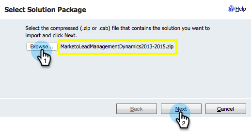

# Schritt 1 von 3: Synchronisierungsbenutzer für Marketo konfigurieren (2015 On-Premise) {#step-of-configure-sync-user-for-marketo-on-premises-2015}

Bevor Sie [!DNL Microsoft Dynamics] 2015 On-Premise mit Marketo synchronisieren können, müssen Sie zunächst die Marketo-Lösung in [!DNL Dynamics] installieren.

>[!NOTE]
>
>Nachdem Sie Marketo mit einem CRM synchronisiert haben, können Sie kein neues CRM mit der bestehenden Marketo-Instanz synchronisieren.

>[!PREREQUISITES]
>
>Wenn Sie [!DNL Microsoft Dynamics] On-Premise verwenden, müssen Sie [Internet Facing Deployment](https://www.microsoft.com/en-us/download/confirmation.aspx?id=41701) (IFD) mit [Active Directory Federation Services](https://msdn.microsoft.com/en-us/library/bb897402.aspx) 2.0+ (ADFS) konfiguriert haben. Hinweis: Das IFD-Dokument wird beim Klicken auf den Link automatisch heruntergeladen.
>
>[Laden Sie die Marketo-Lead-Management](/help/marketo/product-docs/crm-sync/microsoft-dynamics-sync/sync-setup/download-the-marketo-lead-management-solution.md){target="_blank"}Lösung herunter, bevor Sie beginnen.

>[!NOTE]
>
>**Dynamics-Administratorberechtigungen erforderlich**.
>
>Sie benötigen CRM-Administratorrechte, um diese Synchronisierung durchzuführen.

1. Melden Sie sich bei **[!DNL Dynamics]an.** Klicken Sie auf das Dropdown-**** Microsoft Dynamics CRM und wählen Sie **[!UICONTROL Einstellungen]**.

   

1. Wählen **[!UICONTROL unter]** die Option **[!UICONTROL Lösungen]** aus.

   

1. Klicken Sie **[!UICONTROL Importieren]**.

   

1. Klicken Sie **[!UICONTROL Durchsuchen]** und wählen Sie die Lösung aus, die Sie [heruntergeladen](/help/marketo/product-docs/crm-sync/microsoft-dynamics-sync/sync-setup/download-the-marketo-lead-management-solution.md). Klicken Sie auf **[!UICONTROL Weiter]**.

   

1. Zeigen Sie die [!UICONTROL Lösungsinformationen] an und klicken Sie auf **[!UICONTROL Details zum Lösungspaket anzeigen]**.

   

1. Wenn Sie alle Details überprüft haben, klicken Sie auf **[!UICONTROL Schließen]**.

   

1. Klicken Sie auf der Seite [!UICONTROL Lösungsinformationen] auf **[!UICONTROL Weiter]**.

   

1. Stellen Sie sicher, dass das Kontrollkästchen SDK-Option aktiviert ist. Klicken Sie **[!UICONTROL Importieren]**.

   

1. Warten Sie, bis der Import abgeschlossen ist.

   >[!TIP]
   >
   >Sie müssen Popups in Ihrem Browser aktivieren, um den Installationsprozess abzuschließen.

   

1. Laden Sie eine Protokolldatei herunter (falls gewünscht) und klicken Sie auf **[!UICONTROL Schließen]**.

   >[!NOTE]
   >
   >Möglicherweise wird die Meldung &quot;Marketo-Lead-Verwaltung abgeschlossen mit Warnung“ angezeigt. Dies ist voll und ganz zu erwarten.

   

1. Marketo Lead Management wird jetzt auf der Seite **[!UICONTROL Alle Lösungen]** angezeigt.

   

1. Wählen Sie die Marketo-Lösung aus und klicken Sie auf **[!UICONTROL Alle Anpassungen veröffentlichen]**.

   

   Gut gemacht! Die Installation ist abgeschlossen.

   >[!CAUTION]
   >
   >Die Deaktivierung eines der Marketo SDK Messaging-Prozesse führt zu einer fehlerhaften Installation!

   >[!MORELIKETHIS]
   >
   >[Installieren von Marketo for [!DNL Microsoft Dynamics] 2015 On-Premise - Schritt 2 von 3](/help/marketo/product-docs/crm-sync/microsoft-dynamics-sync/sync-setup/connecting-to-legacy-versions/step-2-of-3-set-up-2015.md)
