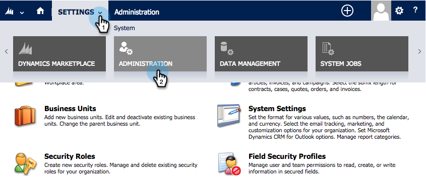

# Schritt 2 von 3: Konfigurieren der Synchronisierungsbenutzer für Marketo (On-Premises 2013) {#step-of-configure-sync-user-for-marketo-on-premises}

Gute Arbeit, die vorherigen Schritte abzuschließen, lassen Sie uns weiter durchgehen.

>[!PREREQUISITES]
>
>[Schritt 1 von 3: Installieren der Marketo-Lösung in Dynamics (On-Premises 2013)](/help/marketo/product-docs/crm-sync/microsoft-dynamics-sync/sync-setup/connecting-to-legacy-versions/step-1-of-3-install-2013.md)

## Benutzerrolle &quot;Synchronisierung zuweisen&quot; {#assign-sync-user-role}

Weisen Sie die Benutzerrolle &quot;Marketo Sync User&quot;nur dem Marketo-Synchronisierungsbenutzer zu. Sie müssen sie keinen anderen Benutzern zuweisen.

>[!NOTE]
>
>Dies gilt für das Marketo-Plug-in Version 4.0.0.14 und höher. Bei früheren Versionen müssen alle Benutzer über die Benutzerrolle &quot;Synchronisieren&quot;verfügen. Informationen zum Aktualisieren von Marketo finden Sie unter [Upgrade der Marketo-Lösung für Microsoft Dynamics](/help/marketo/product-docs/crm-sync/microsoft-dynamics-sync/sync-setup/update-the-marketo-solution-for-microsoft-dynamics.md).

>[!IMPORTANT]
>
>Die Spracheinstellung des Synchronisierungsbenutzers [sollte auf Englisch eingestellt sein](https://portal.dynamics365support.com/knowledgebase/article/KA-01201/en-us).

1. under **Einstellungen** klicken **Administration**.

   

1. Auswählen **Benutzer**.

   

1. Hier sehen Sie eine Liste der Benutzer. Wählen Sie den dedizierten Marketo Sync-Benutzer aus oder kontaktieren Sie Ihren [Active Directory Federation Services (AFDS)](https://msdn.microsoft.com/en-us/library/bb897402.aspx) [Administrator , um einen neuen Benutzer zu erstellen, der Marketo gewidmet ist.](https://blogs.technet.com/b/askpfeplat/archive/2014/04/21/introduction-to-active-directory-federation-services-ad-fs-alternateloginid-feature.aspx)

   

1. Wählen Sie den Synchronisierungsbenutzer aus. Klicks  und wählen **Rollen verwalten**

   

1. Überprüfen **Marketo Sync User** und klicken **OK**.

   

   >[!TIP]
   >
   >Wenn die Rolle nicht angezeigt wird, gehen Sie zurück zu [Schritt 1 von 3](/help/marketo/product-docs/crm-sync/microsoft-dynamics-sync/sync-setup/connecting-to-legacy-versions/step-1-of-3-install-2013.md) und importieren Sie die Lösung.

   >[!NOTE]
   >
   >Alle vom Synchronisierungsbenutzer in Ihrem CRM-System vorgenommenen Aktualisierungen werden **not** wieder mit Marketo synchronisiert werden.

## Konfigurieren der Marketo-Lösung {#configure-marketo-solution}

Fast fertig! Wir haben nur einige letzte Konfigurationsschritte, bevor wir zum nächsten Artikel übergehen.

1. under **Einstellungen** klicken **Marketo-Konfiguration**.

   

   >[!NOTE]
   >
   >Wenn **Marketo-Konfiguration** fehlt, versuchen Sie, die Seite zu aktualisieren. Wenn das Problem weiterhin besteht, [Marketo-Lösung veröffentlichen](/help/marketo/product-docs/crm-sync/microsoft-dynamics-sync/sync-setup/connecting-to-legacy-versions/step-1-of-3-install-2013.md) erneut oder versuchen Sie, sich ab- und wieder anzumelden.

1. Klicks **Standard**.

   

1. Klicken Sie auf **Marketo-Benutzer** und wählen Sie den Synchronisierungsbenutzer aus.

   

1. Klicks  in der rechten unteren Ecke, um die Änderungen zu speichern.

   

1. Klicks **Alle Anpassungen veröffentlichen**.

   

## Bevor Sie mit Schritt 3 fortfahren {#before-proceeding-to-step}

* Wenn Sie die Anzahl der zu synchronisierenden Datensätze einschränken möchten, [Einrichten eines benutzerdefinierten Synchronisierungsfilters](/help/marketo/product-docs/crm-sync/microsoft-dynamics-sync/create-a-custom-dynamics-sync-filter.md) jetzt.
* Führen Sie die [Überprüfen der Synchronisierung mit Microsoft Dynamics](/help/marketo/product-docs/crm-sync/microsoft-dynamics-sync/sync-setup/validate-microsoft-dynamics-sync.md) -Prozess. Es wird überprüft, ob Ihre ersten Setups ordnungsgemäß durchgeführt wurden.
* Melden Sie sich im Microsoft Dynamics CRM beim Marketo Sync User an.

Großartig gemacht!

>[!MORELIKETHIS]
>
>[3. Schritt: Marketo und Dynamics verbinden (On-Premises 2013)](/help/marketo/product-docs/crm-sync/microsoft-dynamics-sync/sync-setup/connecting-to-legacy-versions/step-3-of-3-connect-2013.md)
