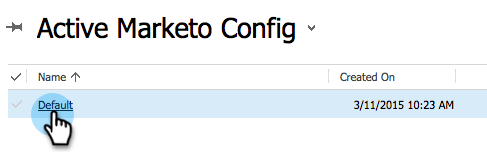

# Schritt 2 von 3 Einrichten von Marketo for [!DNL Dynamics] (2015 On-Premise){#step-of-set-up-for-marketo-on-premises-2015}

Gute Arbeit beim Abschließen der vorherigen Schritte. Lassen Sie uns das immer wieder durchgehen.

>[!PREREQUISITES]
>
>[Installieren von Marketo for [!DNL Microsoft Dynamics] 2015 On-Premise - Schritt 1 von 3](/help/marketo/product-docs/crm-sync/microsoft-dynamics-sync/sync-setup/connecting-to-legacy-versions/step-1-of-3-install-2015.md)

## Assign Sync User Role {#assign-sync-user-role}

Weisen Sie die Rolle Marketo-Synchronisierungsbenutzer nur dem Marketo-Synchronisierungsbenutzer zu. Sie müssen sie keinem anderen Benutzer zuweisen.

>[!NOTE]
>
>Dies gilt für die Marketo-Version 4.0.0.14 und höher. Bei früheren Versionen müssen alle Benutzer über die Rolle „Benutzer synchronisieren“ verfügen. Informationen zum Upgrade Ihrer Marketo finden Sie unter [Upgrade der Marketo-Lösung für [!DNL Microsoft Dynamics]](/help/marketo/product-docs/crm-sync/microsoft-dynamics-sync/sync-setup/update-the-marketo-solution-for-microsoft-dynamics.md).

>[!IMPORTANT]
>
>Die Spracheinstellung des Synchronisierungsbenutzers [sollte auf Englisch festgelegt werden](https://learn.microsoft.com/en-us/power-platform/admin/enable-languages){target="_blank"}.

1. Klicken **[!UICONTROL unter „Einstellungen]** auf **[!UICONTROL Sicherheit]**.

   

1. Klicken Sie auf **[!UICONTROL Benutzer]**.

   

1. Hier wird eine Liste der Benutzer angezeigt. Wählen Sie den dedizierten Marketo-Synchronisierungsbenutzer aus oder wenden Sie sich an den Administrator [Active Directory Federation Services](https://msdn.microsoft.com/en-us/library/bb897402.aspx){target="_blank"} (ADFS), um einen dedizierten Benutzer für Marketo zu erstellen.

   

1. Wählen Sie den Synchronisierungsbenutzer aus. Klicken Sie **[!UICONTROL Rollen verwalten]**.

   

1. Markieren Sie [!UICONTROL Marketo-Synchronisierungsbenutzer] und klicken Sie auf **[!UICONTROL OK]**.

   

   >[!IMPORTANT]
   >
   >Der Synchronisierungsbenutzer sollte über Leseberechtigungen für die Marketo-Konfiguration verfügen.

   >[!TIP]
   >
   >Wenn Sie die Rolle nicht sehen, gehen Sie zurück zu [Schritt 1 von 3](/help/marketo/product-docs/crm-sync/microsoft-dynamics-sync/sync-setup/connecting-to-legacy-versions/step-1-of-3-install-2015.md){target="_blank"} und importieren Sie die Lösung.

   >[!NOTE]
   >
   >Alle Aktualisierungen, die der Synchronisierungsbenutzer in Ihrem CRM vorgenommen hat, _nicht_ wieder mit Marketo synchronisiert.

## Marketo-Lösung konfigurieren {#configure-marketo-solution}

Fast fertig! Wir haben nur noch ein paar letzte Konfigurationsschritte, bevor wir zum nächsten Artikel übergehen.

1. Klicken **[!UICONTROL unter „Einstellungen]** auf **[!UICONTROL Marketo Config]**.

   

   >[!NOTE]
   >
   >Wenn die Marketo-Konfiguration fehlt, versuchen Sie, die Seite zu aktualisieren. Wenn das Problem weiterhin besteht[&#x200B; veröffentlichen Sie die Marketo](/help/marketo/product-docs/crm-sync/microsoft-dynamics-sync/sync-setup/connecting-to-legacy-versions/step-1-of-3-install-2015.md){target="_blank"}Lösung oder melden Sie sich ab und wieder an.

1. Klicken Sie auf **[!UICONTROL Standard]**.

   

1. Klicken Sie auf das Feld **[!UICONTROL Marketo-Benutzer]** und wählen Sie den Synchronisierungsbenutzer aus.

   

1. Klicken Sie auf das Symbol Speichern in der rechten unteren Ecke.

   

1. Klicken Sie **[!UICONTROL Alle Anpassungen veröffentlichen]**.

   

   >[!NOTE]
   >
   >Der Synchronisierungsbenutzer sollte über Leseberechtigungen für die Marketo-Konfiguration verfügen.

## Bevor Sie mit Schritt 3 fortfahren {#before-proceeding-to-step}

* Wenn Sie die Anzahl der zu synchronisierenden Datensätze einschränken möchten, richten [&#x200B; jetzt einen benutzerdefinierten Synchronisierungsfilter &#x200B;](/help/marketo/product-docs/crm-sync/microsoft-dynamics-sync/create-a-custom-dynamics-sync-filter.md).
* Führen Sie den Prozess [validate [!DNL Microsoft Dynamics] sync](/help/marketo/product-docs/crm-sync/microsoft-dynamics-sync/sync-setup/validate-microsoft-dynamics-sync.md) aus. Es stellt sicher, dass die anfänglichen Setups korrekt ausgeführt wurden.
* Melden Sie sich beim Marketo Sync User in [!DNL Microsoft Dynamics] CRM an.

>[!MORELIKETHIS]
>
>[Installieren von Marketo for [!DNL Microsoft Dynamics] 2015 On-Premise - Schritt 3 von 3](/help/marketo/product-docs/crm-sync/microsoft-dynamics-sync/sync-setup/connecting-to-legacy-versions/step-3-of-3-connect-2015.md)
