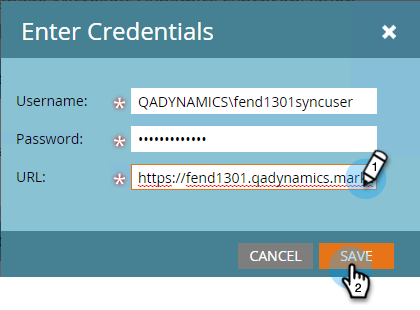
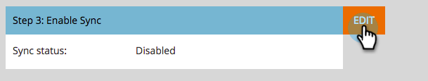

# 3. Schritt: Marketo und Dynamics verbinden (On-Premises 2013) {#step-of-connect-marketo-and-dynamics-on-premises}

Gut! Wir haben die Lösung installiert und den Synchronisierungsbenutzer konfiguriert. Als Nächstes müssen wir Marketo Engage und Dynamics verbinden.

>[!PREREQUISITES]
>
>* [Schritt 1 von 3: Installieren der Marketo-Lösung in Dynamics (On-Premises 2013)](/help/marketo/product-docs/crm-sync/microsoft-dynamics-sync/sync-setup/connecting-to-legacy-versions/step-1-of-3-install-2013.md){target="_blank"}
>* [Schritt 2 von 3: Konfigurieren der Synchronisierungsbenutzer für Marketo (On-Premises 2013)](/help/marketo/product-docs/crm-sync/microsoft-dynamics-sync/sync-setup/connecting-to-legacy-versions/step-2-of-3-configure-2013.md){target="_blank"}

>[!NOTE]
>
>**Erforderliche Administratorberechtigungen**

## Benutzerinformationen zur Dynamics Sync eingeben {#enter-dynamics-sync-user-information}

1. Melden Sie sich bei Marketo an und klicken Sie auf **[!UICONTROL Admin]**.

   

1. Klicken Sie auf **[!UICONTROL CRM]**.

   

1. Wählen Sie **[!DNL Microsoft]** aus.

   

1. Klicken Sie auf **[!UICONTROL Bearbeiten]** in **[!UICONTROL Anmeldedaten eingeben]**.

   

   >[!CAUTION]
   >
   >Stellen Sie sicher, dass Ihre Anmeldedaten korrekt sind, da wir die nachfolgenden Schemaänderungen nach der Übermittlung nicht rückgängig machen können. Wenn falsche Anmeldeinformationen gespeichert werden, müssen Sie ein neues Marketo-Abonnement erhalten.

1. Geben Sie den **[!UICONTROL Benutzernamen]**, das **[!UICONTROL Kennwort]** und die Microsoft Dynamics **[!UICONTROL URL]** ein und klicken Sie dann auf **[!UICONTROL Speichern]**.

   

   >[!NOTE]
   >
   >* Der Benutzername in Marketo muss mit dem Benutzernamen für den Synchronisierungsbenutzer im CRM übereinstimmen. Das Format kann &quot;`user@domain.com`&quot; oder &quot;DOMAIN\user&quot; lauten.
   >* Wenn Sie die URL nicht kennen, erfahren Sie [, wie Sie sie hier finden](/help/marketo/product-docs/crm-sync/microsoft-dynamics-sync/sync-setup/view-the-organization-service-url.md){target="_blank"}.

## Felder für Synchronisierung auswählen {#select-fields-to-sync}

Jetzt müssen wir die Felder auswählen, über die wir die Synchronisation durchführen möchten.

1. Klicken Sie auf **[!UICONTROL Bearbeiten]** in **[!UICONTROL Zu synchronisierende Felder auswählen]**.

   

1. Wählen Sie die Felder aus, die Sie mit Marketo synchronisieren möchten, damit sie vorausgewählt werden. Klicken Sie auf **[!UICONTROL Speichern]**.

   

   >[!NOTE]
   >
   >Marketo speichert einen Verweis auf die zu synchronisierenden Felder. Wenn Sie ein Feld in Dynamics löschen, wird empfohlen, dies mit der deaktivierten [Synchronisierung](/help/marketo/product-docs/crm-sync/salesforce-sync/enable-disable-the-salesforce-sync.md){target="_blank"} durchzuführen. Aktualisieren Sie dann das Schema in Marketo, indem Sie die [Zu synchronisierenden Felder auswählen](/help/marketo/product-docs/crm-sync/microsoft-dynamics-sync/microsoft-dynamics-sync-details/microsoft-dynamics-sync-field-sync/editing-fields-to-sync-before-deleting-them-in-dynamics.md){target="_blank"} bearbeiten und speichern.

## Synchronisieren von Feldern für einen benutzerdefinierten Filter {#sync-fields-for-a-custom-filter}

Wenn Sie einen benutzerdefinierten Filter erstellt haben, gehen Sie in und wählen Sie die neuen Felder aus, die mit Marketo synchronisiert werden sollen.

1. Wechseln Sie zu Admin und wählen Sie **[!UICONTROL Microsoft Dynamics]** aus.

   

1. Klicken Sie in den Details zur Feldsynchronisierung auf **[!UICONTROL Bearbeiten]** .

   

1. Scrollen Sie nach unten zum Feld und überprüfen Sie es. Der tatsächliche Name muss &quot;new_synctomkto&quot;lauten, der Anzeigename kann jedoch beliebig sein. Klicken Sie auf **[!UICONTROL Speichern]**.

   

## Synchronisierung aktivieren {#enable-sync}

1. Klicken Sie in **[!UICONTROL Synchronisation aktivieren]** auf **[!UICONTROL Bearbeiten]** .

   

   >[!CAUTION]
   >
   >Marketo deaktiviert die Duplizierung nicht automatisch für eine Microsoft Dynamics-Synchronisation oder wenn Sie Personen oder Leads manuell eingeben.

1. Lesen Sie alles im Popup-Fenster, geben Sie Ihre E-Mail ein und klicken Sie auf **[!UICONTROL Synchronisierung starten]**.

   

1. Die erste Synchronisation kann einige Stunden dauern. Nach Abschluss des Vorgangs erhalten Sie eine E-Mail-Benachrichtigung.

   

Exzellente Arbeit! Sie haben soeben die Leistung der bidirektionalen Synchronisation zwischen Marketo und Microsoft Dynamics freigesetzt. Wenn Sie Marketo Sales Insight erworben haben, bietet es mehr Spaß:

>[!MORELIKETHIS]
>
>[Installieren und Konfigurieren von Marketo Sales Insight in Microsoft Dynamics 2013](/help/marketo/product-docs/marketo-sales-insight/msi-for-microsoft-dynamics/installing/install-and-configure-marketo-sales-insight-in-microsoft-dynamics-2013.md){target="_blank"}
