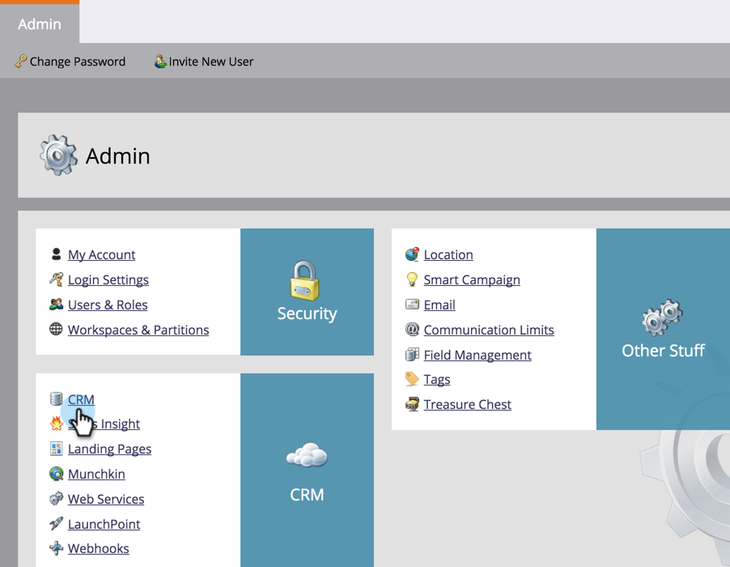

# Herunterladen der Marketo Lead Management-Lösung {#download-the-marketo-lead-management-solution}

>[!NOTE]
>
>**Admin-Berechtigungen erforderlich**

Sie müssen eine Marketo-Lösung herunterladen und in Ihrem [!DNL Microsoft Dynamics]-Konto installieren, um die Synchronisierung zu starten.

>[!CAUTION]
>
>Laden Sie unbedingt die neueste Marketo-Lösung herunter _bevor Sie_ Upgrade durchführen.

>[!NOTE]
>
>Marketo unterstützt derzeit nur SSL-Zertifikate, die mit Java 7 kompatibel sind.

1. Navigieren Sie zum Bereich **[!UICONTROL Admin]**.

   

1. Klicken Sie auf **[!UICONTROL CRM]**.

   

1. Wählen Sie **[!DNL Microsoft]** aus.

   

1. Wählen Sie **[!UICONTROL Marketo-Lösung herunterladen]** aus.

   

1. Wählen Sie die entsprechende Lösung für Ihre [!DNL Microsoft Dynamics] Version aus.

   

Eine ZIP-Datei der Lösung wird jetzt auf Ihr Gerät heruntergeladen.
