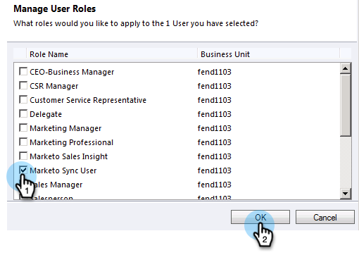

# Schritt 2 von 3: Einrichten von Marketo Sync User in Dynamics (On-Premises 2011) {#step-of-set-up-marketo-sync-user-in-dynamics-on-premises}

Gute Arbeit, die vorherigen Schritte zu vollenden, lassen Sie uns fortfahren.

>[!PREREQUISITES]
>
>[Schritt 1 von 3: Installieren Sie die Marketing Solution (On-Premises 2011)](/help/marketo/product-docs/crm-sync/microsoft-dynamics-sync/sync-setup/microsoft-dynamics-2011-on-premises/step-1-of-3-install.md)

## Synchronisierte Benutzerrolle zuweisen {#assign-sync-user-role}

Weisen Sie die Rolle &quot;Benutzer synchronisieren&quot;nur dem Synchronisierungsbenutzer von Marketing zu. Sie müssen sie keinem anderen Benutzer zuweisen.

>[!NOTE]
>
>Dies gilt für das Marketo-Zusatzmodul Version 4.0.0.14 und höher. Bei älteren Versionen müssen alle Benutzer die Rolle &quot;Synchronisierungsbenutzer&quot;haben. Informationen zum Aktualisieren von Marketo finden Sie unter [Aktualisieren der Marketing-Lösung für Microsoft Dynamics](/help/marketo/product-docs/crm-sync/microsoft-dynamics-sync/sync-setup/upgrade-the-marketo-solution-for-microsoft-dynamics.md).

1. Wählen Sie im Menü unten links **Einstellungen**.

   

1. Wählen Sie in der Struktur **Administration**.

   

1. Wählen Sie **Benutzer**.

   

1. Hier sehen Sie eine Liste von Benutzern. Wählen Sie Ihren dedizierten Marketo-Synchronisierungsbenutzer oder wenden Sie sich an Ihren [Active Directory Federation Services (AFDS)](https://msdn.microsoft.com/en-us/library/bb897402.aspx)-Administrator, um einen neuen Benutzer zu erstellen, der Marketo gewidmet ist. Klicken Sie auf **Rollen verwalten**.

   

1. Markieren Sie **Markieren Sie den Benutzer** und klicken Sie auf **OK**.

   

   >[!TIP]
   >
   >Wenn die Rolle nicht angezeigt wird, gehen Sie zurück zu [Schritt 1 von 3](/help/marketo/product-docs/crm-sync/microsoft-dynamics-sync/sync-setup/microsoft-dynamics-2011-on-premises/step-1-of-3-install.md) und importieren Sie die Lösung.

   >[!NOTE]
   >
   >Alle Aktualisierungen, die der Synchronisierungsbenutzer in Ihrem CRM-System vorgenommen hat, werden **nicht** wieder mit Marketo synchronisiert.

## Konfigurieren von Marketing Solution {#configure-marketo-solution}

Fast fertig! Wir haben nur ein paar letzte Konfigurationsschritte, bevor wir zum nächsten Artikel gehen.

1. Wählen Sie **Einstellungen**. Wählen Sie dann **Marketo Config** in der Struktur.

   

   >[!NOTE]
   >
   >Wenn die Marketo-Konfiguration fehlt, versuchen Sie, die Seite zu aktualisieren. Wenn das Problem weiterhin besteht, veröffentlichen Sie [die Marketing-Lösung erneut](/help/marketo/product-docs/crm-sync/microsoft-dynamics-sync/sync-setup/microsoft-dynamics-2011-on-premises/step-1-of-3-install.md) oder melden Sie sich ab und wieder an.

1. Klicken Sie auf **Default**.

   

1. Klicken Sie auf 

   

1. Wählen Sie im Popup den Synchronisierungsbenutzer aus. Klicken Sie dann auf **OK**.

   

1. Klicken Sie auf **Speichern**, um die Änderungen zu speichern.

   

1. Klicken Sie auf **Alle Anpassungen veröffentlichen**.

   

## Bevor Sie zu Schritt 3 fortfahren, {#before-proceeding-to-step}

    * Wenn Sie die Anzahl der synchronisierten Datensätze einschränken möchten, [richten Sie jetzt einen benutzerdefinierten Synchronisierungsfilter ein](/help/marketo/product-docs/crm-sync/microsoft-dynamics-sync/create-a-custom-dynamics-sync-filter.md).
    * Führen Sie den Vorgang &quot;[Validate Microsoft Dynamics Sync](/help/marketo/product-docs/crm-sync/microsoft-dynamics-sync/sync-setup/validate-microsoft-dynamics-sync.md)&quot;aus. Es wird überprüft, ob die ersten Setups ordnungsgemäß durchgeführt wurden.
    * Melden Sie sich beim Marketo Sync User in Microsoft Dynamics CRM an.

Gute Arbeit!

>[!MORELIKETHIS]
>
>[Schritt 3 von 3: Verbinden von Microsoft Dynamics mit Marketo (On-Premises 2011)](/help/marketo/product-docs/crm-sync/microsoft-dynamics-sync/sync-setup/microsoft-dynamics-2011-on-premises/step-3-of-3-connect.md)
