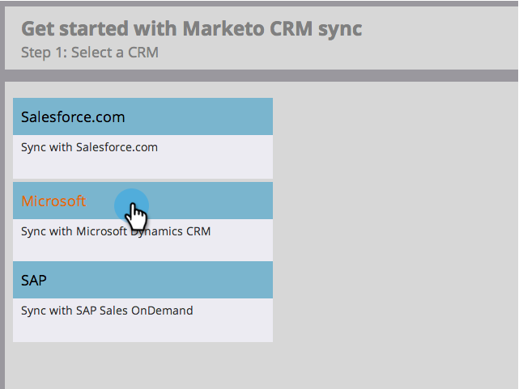
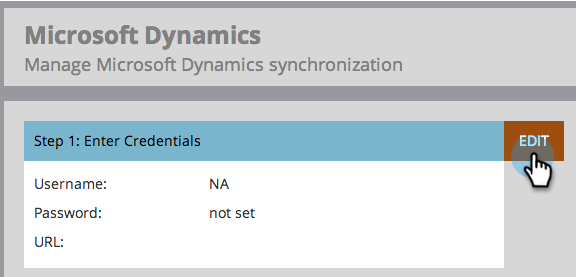

# Schritt 3 von 3: Verbinden von Microsoft Dynamics mit Marketo (On-Premises 2011) {#step-of-connect-microsoft-dynamics-with-marketo-on-premises}

>[!NOTE]
>
>**FYI**
>
>Marketo standardisiert nun die Sprache für alle Abonnements, sodass Sie möglicherweise Interessenten in Ihrem Abonnement und Personen/Personen in docs.marketo.com sehen können. Diese Begriffe bedeuten dasselbe. Es hat keine Auswirkungen auf die Artikelanweisungen. Es gibt auch noch einige andere Änderungen. [Weitere Informationen](http://docs.marketo.com/display/DOCS/Updates+to+Marketo+Terminology).

Gut! Wir haben die Lösung installiert und den Synchronisierungsbenutzer konfiguriert. Als Nächstes müssen wir Marketo und Dynamics verbinden.

>[!PREREQUISITES]
>
>* [Schritt 1 von 3: Installieren Sie die Marketing Solution (On-Premises 2011)](step-1-of-3-install.md)
>* [Schritt 2 von 3: Einrichten von Marketo Sync User in Dynamics (On-Premises 2011)](step-2-of-3-set-up.md)

>[!NOTE]
>
>**Administratorberechtigungen erforderlich**

## Dynamics Sync-Benutzerinformationen eingeben {#enter-dynamics-sync-user-information}

1. Melden Sie sich bei Marketing an und klicken Sie auf **Admin**.

   

1. Klicken Sie auf **CRM**.

   

1. Klicken Sie auf **Microsoft**.

   

1. Klicken Sie in **Schritt 1 auf** Bearbeiten **: Geben Sie Anmeldeinformationen ein.**

   

   >[!CAUTION]
   >
   >Vergewissern Sie sich bitte, dass Ihre Anmeldeinformationen korrekt sind, da wir die nachfolgenden Änderungen des Schemas nach der Übermittlung nicht wiederherstellen können. Wenn falsche Anmeldeinformationen gespeichert werden, müssen Sie ein neues Marketing-Abonnement erhalten.

1. Geben Sie den **Benutzernamen**, das **Kennwort** und die CRM- **URL** ein und klicken Sie auf **Speichern**.

   

   >[!NOTE]
   >
   >Der Benutzername in Marketing muss mit dem Benutzernamen für den Synchronisierungsbenutzer in CRM übereinstimmen. Das Format kann &quot; [`[email protected]`](http://docs.marketo.com/cdn-cgi/l/email-protection#a0d5d3c5d2e0c4cfcdc1c9ce8ec3cfcd) DOMÄNE\Benutzer&quot;lauten.

   >[!TIP]
   >
   >Kennst du die URL nicht? Wir zeigen Ihnen, wie Sie die [Dynamics Organisation Service URL](../../../../../product-docs/crm-sync/microsoft-dynamics-sync/sync-setup/view-the-organization-service-url.md) finden.

## Zu synchronisierende Felder auswählen {#select-fields-to-sync}

Jetzt müssen wir die Felder auswählen, über die wir synchronisieren möchten.

1. Klicken Sie auf **Bearbeiten** in **Schritt 2: Wählen Sie zu synchronisierende Felder aus.**

   

1. Es gibt vorab ausgewählte Felder, die synchronisiert werden. hinzufügen Sie weitere Informationen und klicken Sie auf **Speichern**.

   

## Synchronisieren von Feldern für einen benutzerspezifischen Filter {#sync-fields-for-a-custom-filter}

Wenn Sie einen benutzerspezifischen Filter erstellt haben, sollten Sie unbedingt einsteigen und die neuen Felder auswählen, die mit Marketo synchronisiert werden sollen.

1. Gehen Sie zu Admin und wählen Sie **Microsoft Dynamics**.

   

1. Klicken Sie unter &quot;Details zur Feldsynchronisierung&quot;auf **Bearbeiten** .

   

1. Blättern Sie nach unten zum Feld und überprüfen Sie es. Der tatsächliche Name muss new_synctomkto sein, der Anzeigename kann jedoch beliebig sein. Klicken Sie auf **Speichern**.

   

## Synchronisierung aktivieren {#enable-sync}

1. Klicken Sie in **Schritt 3 auf** Bearbeiten **: Aktivieren Sie die Synchronisierung**.

   

   >[!CAUTION]
   >
   >Marketo wird nicht automatisch deduplizieren gegen eine Microsoft Dynamics-Synchronisierung, oder wenn Sie manuell eingeben Personen oder Interessenten.

1. Lesen Sie alles im Popup, geben Sie Ihre E-Mail ein und klicken Sie auf **Beginn-Synchronisierung**.

   

1. Die erste Synchronisierung kann einige Stunden dauern. Nach Abschluss des Vorgangs erhalten Sie eine E-Mail-Benachrichtigung.

   

   Exzellente Arbeit!
