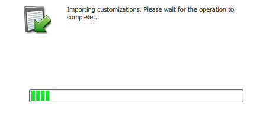

# Schritt 1 von 3: Installieren Sie die Marketo-Lösung in Dynamics (On-Premises 2013) {#step-of-install-the-marketo-solution-in-dynamics-on-premises}

Bevor Sie Microsoft Dynamics On-Premises und Marketo synchronisieren können, müssen Sie zunächst die Marketo-Lösung in Dynamics installieren.

>[!NOTE]
>
>Nach der Synchronisierung von Marketo mit einem CRM können Sie keine neue Synchronisierung durchführen, ohne die Instanz zu ersetzen.

>[!PREREQUISITES]
>
>Sie müssen [Internet Facing Deployment](https://www.microsoft.com/en-us/download/confirmation.aspx?id=41701) (IFD) mit [Active Directory Federation Services](https://msdn.microsoft.com/en-us/library/bb897402.aspx) 2.0, 2.1 oder 3.0 (ADFS) konfiguriert haben. Hinweis: Das IFD-Dokument wird automatisch heruntergeladen, wenn Sie auf den Link klicken.
>
>[Laden Sie die Marketo-](/help/marketo/product-docs/crm-sync/microsoft-dynamics-sync/sync-setup/download-the-marketo-lead-management-solution.md) Lösung vor dem Beginn herunter.

>[!NOTE]
>
>**Dynamics-Administratorberechtigungen erforderlich.**
>
>Sie benötigen CRM-Administratorrechte, um diese Synchronisierung durchzuführen.

1. Melden Sie sich bei **Dynamics** an. Klicken Sie auf das Dropdownmenü **Microsoft Dynamics CRM** und wählen Sie **Einstellungen**.

   

1. Wählen Sie unter **Einstellungen** **Lösungen**.

   

1. Klicken Sie auf **Import**.

   

1. Klicken Sie auf **Durchsuchen** und wählen Sie die [heruntergeladene Lösung](/help/marketo/product-docs/crm-sync/microsoft-dynamics-sync/sync-setup/download-the-marketo-lead-management-solution.md) aus. Klicken Sie auf **Weiter**.

   

1. Ansicht Sie die Lösungsinformationen und klicken Sie auf **Ansicht Solution Package details**.

   

1. Wenn Sie alle Details überprüft haben, klicken Sie auf **Schließen**.

   

1. Klicken Sie auf der Seite &quot;Lösungsinformationen&quot;auf **Weiter**.

   

1. Stellen Sie sicher, dass die Option SDK aktiviert ist. Klicken Sie auf **Import**.

   

1. Warten Sie, bis der Import abgeschlossen ist.

   >[!TIP]
   >
   >Sie müssen Popups in Ihrem Browser aktivieren, um den Installationsprozess abzuschließen.

   

1. Laden Sie eine Protokolldatei herunter (falls gewünscht) und klicken Sie auf **Schließen**.

   >[!NOTE]
   >
   >Es wird möglicherweise eine Meldung angezeigt, in der steht: &quot;Marketo Lead Management wurde mit Warnung abgeschlossen&quot;. Das ist völlig zu erwarten.

   

1. Marketo Lead Management wird jetzt auf der Seite **Alle Lösungen** angezeigt.

   

1. Wählen Sie die Marketo-Lösung und klicken Sie auf **Alle Anpassungen veröffentlichen**.

   

War das nicht zu schlecht? Los, ich werde dich durch den Rest führen.

>[!CAUTION]
>
>Die Deaktivierung eines der Marketo SDK Messaging-Prozesse führt zu einer fehlerhaften Installation!

>[!MORELIKETHIS]
>
>[Schritt 2 von 3: Synchronisierungsbenutzer für Marketo konfigurieren (On-Premises 2013)](/help/marketo/product-docs/crm-sync/microsoft-dynamics-sync/sync-setup/microsoft-dynamics-2013-on-premises/step-2-of-3-configure.md)
