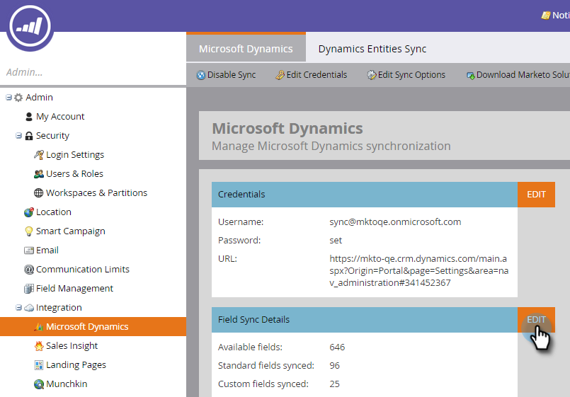

# Installieren Sie Marketo für Dynamics 2015 On-Prem und 2016 365 On-Prem Schritt 3 von 3 {#install-marketo-for-dynamics-on-prem-and-on-prem-step-of}

>[!NOTE]
>
>**Voraussetzungen**
>
>* [Installieren Sie Marketo für Dynamics 2015 On-Prem und 2016 365 On-Prem Schritt 1 von 3](step-1-of-3-install.md)
>* [Installieren Sie Marketo für Dynamics 2015 On-Prem und 2016 365 On-Prem Schritt 2 von 3](step-2-of-3-set-up.md)

>

>[!NOTE]
>
>**Administratorberechtigungen erforderlich**

## Dynamics Sync-Benutzerinformationen eingeben {#enter-dynamics-sync-user-information}

1. Melden Sie sich bei Marketing an und klicken Sie auf **Admin**.

   

1. Klicken Sie auf **CRM**.

   

1. Wählen Sie **Microsoft**.

   

1. Klicken Sie in **Schritt 1 auf** Bearbeiten **: Geben Sie Anmeldeinformationen** ein.

   

   >[!CAUTION]
   >
   >Vergewissern Sie sich bitte, dass Ihre Anmeldeinformationen korrekt sind, da wir die nachfolgenden Änderungen des Schemas nach der Übermittlung nicht wiederherstellen können. Wenn falsche Anmeldeinformationen gespeichert werden, müssen Sie ein neues Marketing-Abonnement erhalten.

1. Geben Sie den **Benutzernamen**, das **Kennwort** eine Microsoft Dynamics- **URL** und eine optionale **Client-ID** ein. Klicken Sie abschließend auf **Speichern** .

   

   >[!NOTE]
   >
   >Der Benutzername in Marketing muss mit dem Benutzernamen für den Synchronisierungsbenutzer in CRM übereinstimmen. Das Format kann &quot; [`[email protected]`](http://docs.marketo.com/cdn-cgi/l/email-protection#8cf9ffe9fecce8e3e1ede5e2a2efe3e1) DOMÄNE\Benutzer&quot;lauten.

   >[!TIP]
   >
   >Kennst du die URL nicht? Wir zeigen Ihnen, wie Sie Ihre [Dynamics Organisation Service URL](../../../../../product-docs/crm-sync/microsoft-dynamics-sync/sync-setup/view-the-organization-service-url.md) finden.

## Zu synchronisierende Felder auswählen {#select-fields-to-sync}

1. Klicken Sie in **Schritt 2 auf** Bearbeiten **: Wählen Sie zu synchronisierende** Felder aus.

   

1. Wählen Sie die Felder aus, die Sie mit Marketo synchronisieren möchten, damit sie vorausgewählt werden. Klicken Sie auf **Speichern**.

   

## Synchronisieren von Feldern für einen benutzerspezifischen Filter {#sync-fields-for-a-custom-filter}

Wenn Sie einen benutzerspezifischen Filter erstellt haben, sollten Sie unbedingt einsteigen und die neuen Felder auswählen, die mit Marketo synchronisiert werden sollen.

1. Gehen Sie zu Admin und wählen Sie **Microsoft Dynamics**.

   

1. Klicken Sie unter &quot;Details zur Feldsynchronisierung&quot;auf **Bearbeiten** .

   

1. Blättern Sie nach unten zum Feld und überprüfen Sie es. Der tatsächliche Name muss new_synctomkto sein, der Anzeigename kann jedoch beliebig sein. Klicken Sie auf **Speichern**.

   

## Synchronisierung aktivieren {#enable-sync}

1. Klicken Sie in **Schritt 3 auf** Bearbeiten **: Aktivieren Sie die Synchronisierung**.

   

   >[!CAUTION]
   >
   >Marketo wird nicht automatisch deduplizieren gegen eine Microsoft Dynamics-Synchronisierung, oder wenn Sie manuell eingeben Menschen.

1. Lesen Sie alles im Popup, geben Sie Ihre E-Mail ein und klicken Sie auf **Beginn-Synchronisierung**.

   

1. Die erste Synchronisierung kann einige Stunden dauern. Nach Abschluss des Vorgangs erhalten Sie eine E-Mail-Benachrichtigung.

   

Exzellente Arbeit!
