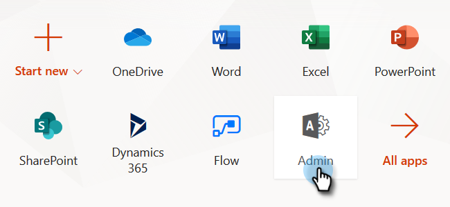

# Schritt 2 von 4: Einrichten der Marketo-Lösung mit Resource Owner Password Control Connection {#step-2-of-4-set-up-the-marketo-solution-ropc}

Beginnen wir mit der Erstellung eines Benutzerkontos.

>[!PREREQUISITES]
>
>[Schritt 1 von 4: Installieren der Marketo-Lösung mit Resource Owner Password Control Connection](/help/marketo/product-docs/crm-sync/microsoft-dynamics-sync/sync-setup/microsoft-dynamics-365-with-ropc-connection/step-1-of-4-install.md)

## Neuen Benutzer erstellen {#create-a-new-user}

1. Melden Sie sich bei Dynamics an. Klicken Sie auf das Symbol Einstellungen und wählen Sie **Erweiterte Einstellungen**.

   

1. Klicks **Einstellungen** und wählen **Sicherheit**.

   

1. Klicks **Benutzer**.

   

1. Klicks **Neu.**

   

1. Klicks **Hinzufügen und Lizenzieren von Benutzern** im neuen Fenster.

   

1. Eine neue Registerkarte wird geöffnet. Klicks **Admin** oben auf der Seite.

   

1. Eine weitere neue Registerkarte wird geöffnet. Klicks **Benutzer hinzufügen**.

   

   >[!IMPORTANT]
   >
   >Der Synchronisierungsbenutzer sollte über Leseberechtigungen für die Marketo-Konfiguration verfügen.

1. Geben Sie alle Ihre Informationen ein. Wenn Sie fertig sind, klicken Sie auf **Hinzufügen**.

   

   >[!NOTE]
   >
   >Dieser Name muss ein dedizierter Synchronisierungsbenutzer und nicht das Konto eines vorhandenen CRM-Benutzers sein. Es muss sich nicht um eine tatsächliche E-Mail-Adresse handeln.

1. Geben Sie die E-Mail zum Empfang der neuen Benutzeranmeldeinformationen ein und klicken Sie auf **E-Mail senden und schließen**.

   

## Benutzerrolle &quot;Synchronisierung zuweisen&quot; {#assign-sync-user-role}

Weisen Sie die Benutzerrolle &quot;Marketo Sync User&quot;nur dem Marketo-Synchronisierungsbenutzer zu. Sie müssen sie keinen anderen Benutzern zuweisen.

>[!NOTE]
>
>Dies gilt für die Marketo-Version 4.0.0.14 und höher. Bei früheren Versionen müssen alle Benutzer über die Benutzerrolle &quot;Synchronisieren&quot;verfügen. Informationen zum Aktualisieren von Marketo finden Sie unter [Upgrade der Marketo-Lösung für Microsoft Dynamics](/help/marketo/product-docs/crm-sync/microsoft-dynamics-sync/sync-setup/update-the-marketo-solution-for-microsoft-dynamics.md).

>[!IMPORTANT]
>
>Die Spracheinstellung des Synchronisierungsbenutzers [sollte auf Englisch eingestellt sein](https://portal.dynamics365support.com/knowledgebase/article/KA-01201/en-us).

1. Gehen Sie zurück zur Registerkarte Aktivierte Benutzer und aktualisieren Sie die Benutzerliste.

   

1. Bewegen Sie den Mauszeiger neben dem neu erstellten Marketo Sync-Benutzer und ein Kontrollkästchen wird angezeigt. Klicken Sie auf , um es auszuwählen.

   

1. Klicks **Rollen verwalten**.

   

1. Überprüfen **Marketo Sync User** und klicken **OK**.

   

   >[!NOTE]
   >
   >Alle vom Synchronisierungsbenutzer in Ihrem CRM-System vorgenommenen Aktualisierungen werden **not** wieder mit Marketo synchronisiert werden.

## Konfigurieren der Marketo-Lösung {#configure-marketo-solution}

Fast da! Wir haben nur noch die Möglichkeit, Marketo Solution über den neu erstellten Benutzer zu informieren.

1. Gehen Sie zurück zum Abschnitt Erweiterte Einstellungen und klicken Sie auf die Schaltfläche  Symbol neben Einstellungen und wählen Sie **Marketo-Konfiguration**.

   

   >[!NOTE]
   >
   >Wenn Sie nicht sehen **Marketo-Konfiguration** Aktualisieren Sie die Seite im Menü Einstellungen . Wenn das nicht funktioniert, versuchen Sie, [Marketo-Lösung veröffentlichen](/help/marketo/product-docs/crm-sync/microsoft-dynamics-sync/sync-setup/microsoft-dynamics-365-with-ropc-connection/step-1-of-4-install.md) erneut oder melden Sie sich ab und wieder an.

1. Klicks **Standard**.

   

1. Klicken Sie auf die Suchschaltfläche **Marketo-Benutzer** und wählen Sie den erstellten Synchronisierungsbenutzer aus.

   

1. Klicken Sie auf  in der rechten unteren Ecke, um die Änderungen zu speichern.

   

1. Klicken Sie auf **X** oben rechts, um den Bildschirm zu schließen.

   

1. Klicken Sie auf  Symbol neben Einstellungen und wählen Sie **Lösungen**.

   

1. Klicken Sie auf **Alle Anpassungen veröffentlichen** Schaltfläche.

   

>[!MORELIKETHIS]
>
>[Schritt 3 von 4: Verbinden der Marketo-Lösung mit der Resource Owner Password Control Connection](/help/marketo/product-docs/crm-sync/microsoft-dynamics-sync/sync-setup/microsoft-dynamics-365-with-ropc-connection/step-3-of-4-set-up.md)
