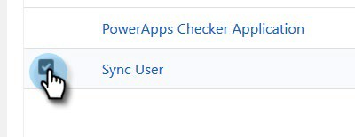
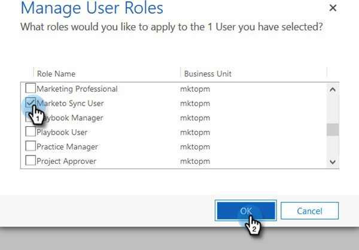

# Schritt 2 von 3: Einrichten der Marketo-Lösung mit Server-zu-Server-Verbindung {#step-2-of-3-set-up-marketo-sync-user-in-dynamics-s2s}

>[!PREREQUISITES]
>
>[Schritt 1 von 3: Installieren der Marketo-Lösung mit Server-zu-Server-Verbindung](/help/marketo/product-docs/crm-sync/microsoft-dynamics-sync/sync-setup/microsoft-dynamics-365-with-s2s-connection/step-1-of-3-install.md)

## Erstellen einer Client-Anwendung in Azure AD {#create-client-application-in-azure-ad}

1. Navigieren Sie zu [diesem Microsoft-Artikel](https://docs.microsoft.com/en-us/powerapps/developer/common-data-service/walkthrough-register-app-azure-active-directory#create-an-application-registration).

1. Führen Sie alle Schritte aus. Geben Sie für Schritt 3 einen relevanten Anwendungsnamen ein (z. B. &quot;Marketo Integration&quot;). Wählen Sie unter &quot;Unterstützte Kontotypen&quot;die Option **Nur Konto in diesem Organisationsverzeichnis**.

1. Notieren Sie sich die Anwendungs-ID (ClientId) und die Mandantenkennung. Sie müssen sie später in Marketo eingeben.

1. Erteilen Sie die Admin-Zustimmung durch Befolgen der Schritte [in diesem Artikel](/help/marketo/product-docs/crm-sync/microsoft-dynamics-sync/sync-setup/grant-consent-for-client-id-and-app-registration.md).

1. Erstellen Sie ein Client-Geheimnis im Admin Center durch Klicken auf **Zertifikate &amp; Geheimnisse**.

   

1. Klicken Sie auf **Neues Client-Geheimnis** Schaltfläche.

   

1. Geben Sie eine Client-Geheimbeschreibung ein und klicken Sie auf **Hinzufügen**.

   

>[!CAUTION]
>
>Beachten Sie den Wert Client Secret (siehe Screenshot unten), da Sie ihn später benötigen werden. Es wird nur einmal angezeigt und Sie werden es nicht erneut abrufen können.

1. Führen Sie die Schritte aus dem folgenden Link aus, um [Anwendungsbenutzer in Microsoft einrichten](https://docs.microsoft.com/en-us/powerapps/developer/common-data-service/use-single-tenant-server-server-authentication#application-user-creation). Weisen Sie dem Anwendungsbenutzer Berechtigungen zu und weisen Sie ihn &quot;Benutzerrolle für Marketo-Synchronisierung&quot;zu.

## Azure AD Federated mit AD FS On-Premise {#azure-ad-federated-with-ad-fs-on-prem}

Federated Azure AD to ADFS Onprem benötigt die Erstellung einer Home Realm Discovery-Richtlinie für die jeweilige Anwendung. Mit dieser Richtlinie leitet Azure AD die Authentifizierungsanforderung an den Föderierungsdienst weiter. Die Synchronisierung von Passwort-Hash muss hierfür in AD Connect aktiviert werden. Weitere Informationen finden Sie unter [OAuth mit ROPC](https://docs.microsoft.com/en-us/azure/active-directory/develop/v2-oauth-ropc) und [Festlegen einer Richtlinie für eine Anwendung](https://docs.microsoft.com/en-us/azure/active-directory/manage-apps/configure-authentication-for-federated-users-portal#example-set-an-hrd-policy-for-an-application).

Zusätzliche Verweise [finden Sie hier .](https://docs.microsoft.com/en-us/azure/active-directory/reports-monitoring/concept-all-sign-ins#:~:text=Interactive%20user%20sign%2Dins%20are,as%20the%20Microsoft%20Authenticator%20app.&amp;text=This%20report%20also%20include%20federated,are%20federated%20to%20Azure%20AD.).

## Benutzerrolle &quot;Synchronisierung zuweisen&quot; {#assign-sync-user-role}

1. Weisen Sie die Benutzerrolle &quot;Marketo Sync User&quot;nur dem Marketo-Synchronisierungsbenutzer zu.

>[!NOTE]
>
>Dies gilt für die Marketo-Version 4.0.0.14 und höher. Bei früheren Versionen müssen alle Benutzer über die Benutzerrolle &quot;Synchronisieren&quot;verfügen. So aktualisieren Sie Ihre Marketo-Lösung: [finden Sie diesen Artikel](/help/marketo/product-docs/crm-sync/microsoft-dynamics-sync/sync-setup/update-the-marketo-solution-for-microsoft-dynamics.md).

1. Gehen Sie zurück zur Registerkarte &quot;Anwendungsbenutzer&quot;und aktualisieren Sie die Benutzerliste.

   

1. Bewegen Sie den Mauszeiger neben dem neu erstellten Anwendungsbenutzer und ein Kontrollkästchen wird angezeigt. Klicken Sie auf , um es auszuwählen.

   

1. Klicken **Rollen verwalten**.

   

1. Überprüfen **Marketo Sync User** und klicken Sie auf **OK**.

   

## Konfigurieren der Marketo-Lösung {#configure-marketo-solution}

Fast da! Wir haben nur noch die Möglichkeit, Marketo Solution über den neu erstellten Benutzer zu informieren.

>[!IMPORTANT]
>
>Wenn Sie von der einfachen Authentifizierung auf OAuth aktualisieren, müssen Sie sich an [Marketo-Support](https://nation.marketo.com/t5/support/ct-p/Support) für Hilfe bei der Aktualisierung der zusätzlichen Parameter. Durch Aktivierung dieser Funktion wird die Synchronisierung vorübergehend angehalten, bis neue Anmeldeinformationen eingegeben und die Synchronisierung wieder aktiviert wird. Die Funktion kann (bis April 2022) deaktiviert werden, wenn Sie zum alten Authentifizierungsmodus zurückkehren möchten.

1. Gehen Sie zurück zum Abschnitt Erweiterte Einstellungen und klicken Sie auf die Schaltfläche  Symbol neben Einstellungen und wählen Sie **Marketo-Konfiguration**.

   

   >[!NOTE]
   >
   >Wenn Sie **Marketo-Konfiguration** Aktualisieren Sie die Seite im Menü Einstellungen . Wenn das nicht funktioniert, versuchen Sie, [Marketo-Lösung veröffentlichen](/help/marketo/product-docs/crm-sync/microsoft-dynamics-sync/sync-setup/microsoft-dynamics-365-with-s2s-connection/step-1-of-3-install.md) erneut oder melden Sie sich ab und wieder an.

1. Klicken **Standard**.

   

1. Klicken Sie auf die Suchschaltfläche **Marketo-Benutzer** und wählen Sie den erstellten Synchronisierungsbenutzer aus.

   

1. Klicken Sie auf  in der rechten unteren Ecke, um die Änderungen zu speichern.

   

1. Klicken Sie auf **X** oben rechts, um den Bildschirm zu schließen.

   

1. Klicken Sie auf  Symbol neben Einstellungen und wählen Sie **Lösungen**.

   

1. Klicken Sie auf **Alle Anpassungen veröffentlichen** Schaltfläche.

   

## Bevor Sie mit Schritt 3 fortfahren {#before-proceeding-to-step}

* Wenn Sie die Anzahl der zu synchronisierenden Datensätze einschränken möchten, [Einrichten eines benutzerdefinierten Synchronisierungsfilters](/help/marketo/product-docs/crm-sync/microsoft-dynamics-sync/create-a-custom-dynamics-sync-filter.md) jetzt.
* Führen Sie die [Überprüfen der Synchronisierung mit Microsoft Dynamics](/help/marketo/product-docs/crm-sync/microsoft-dynamics-sync/sync-setup/validate-microsoft-dynamics-sync.md) Prozess. Es wird überprüft, ob Ihre ersten Setups ordnungsgemäß durchgeführt wurden.
* Melden Sie sich beim Marketo Sync User in Microsoft Dynamics CRM an.

>[!MORELIKETHIS]
>
>[Schritt 3 von 3: Verbinden der Marketo-Lösung mit der Server-zu-Server-Verbindung](/help/marketo/product-docs/crm-sync/microsoft-dynamics-sync/sync-setup/microsoft-dynamics-365-with-s2s-connection/step-3-of-3-connect.md)
