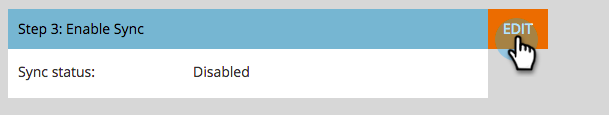

# Schritt 3 von 3: Marketo-Lösung mit Server-zu-Server-Verbindung verbinden {#step-3-of-3-connect-microsoft-dynamics-with-marketo-solution-s2s}

Dies ist der letzte Schritt der Synchronisierung. Wir sind fast da!

>[!PREREQUISITES]
>
>* [Schritt 1 von 3: Installieren Sie die Marketo-Lösung mit einer Server-zu-Server-Verbindung](/help/marketo/product-docs/crm-sync/microsoft-dynamics-sync/sync-setup/microsoft-dynamics-365-with-s2s-connection/step-1-of-3-install.md){target="_blank"}
>* [Schritt 2 von 3: Einrichten der Marketo-Lösung mit einer Server-zu-Server-Verbindung](/help/marketo/product-docs/crm-sync/microsoft-dynamics-sync/sync-setup/microsoft-dynamics-365-with-s2s-connection/step-2-of-3-set-up.md){target="_blank"}

>[!NOTE]
>
>**Administratorberechtigungen erforderlich**

>[!IMPORTANT]
>
>Wenn Sie ein Upgrade von der einfachen Authentifizierung auf [!DNL OAuth] durchführen, müssen Sie sich an den [Marketo-Support](https://nation.marketo.com/t5/support/ct-p/Support) wenden, um Hilfe beim Aktualisieren der zusätzlichen Parameter zu erhalten. Durch Aktivierung dieser Funktion wird die Synchronisierung vorübergehend angehalten, bis neue Anmeldeinformationen eingegeben werden und die Synchronisierung erneut aktiviert wird. Die Funktion kann deaktiviert werden (bis April 2022), wenn Sie zum alten Authentifizierungsmodus zurückkehren möchten.

>[!NOTE]
>
>Bevor Sie neue Anmeldeinformationen eingeben, können [ sie hier ](/help/marketo/product-docs/crm-sync/microsoft-dynamics-sync/sync-setup/validate-microsoft-dynamics-sync.md){target="_blank"}.

## Benutzerinformationen für [!DNL Dynamics] eingeben {#enter-dynamics-sync-user-information}

1. Melden Sie sich bei Marketo an und klicken Sie auf **[!UICONTROL Admin]**.

   

1. Klicken Sie auf **[!UICONTROL CRM]**.

   

1. **[!UICONTROL Microsoft]**.

   

1. Klicken Sie **[!UICONTROL Bearbeiten]** in **[!UICONTROL Schritt 1: Anmeldeinformationen eingeben]**.

   

   >[!CAUTION]
   >
   >Stellen Sie sicher, dass Ihre Organisations-URL korrekt ist, da wir die nachfolgenden Schemaänderungen nach der Übermittlung nicht rückgängig machen können. Wenn eine falsche Org-URL verwendet wird, müssen Sie ein neues Marketo-Abonnement erwerben. Wenn Sie die URL nicht kennen, ([ Sie hier, wie Sie sie finden](/help/marketo/product-docs/crm-sync/microsoft-dynamics-sync/sync-setup/view-the-organization-service-url.md){target="_blank"}.

1. Geben Sie die [!DNL Dynamics] Benutzerinformationen für die Synchronisierung ein und klicken **[!UICONTROL abschließend auf]** Speichern“.

   

   >[!NOTE]
   >
   >Der Benutzername in Marketo muss mit der [E-Mail-Adresse](https://docs.microsoft.com/en-us/power-platform/admin/manage-application-users#view-or-edit-the-details-of-an-application-user){target="_blank"} des Anwendungsbenutzers im CRM übereinstimmen. Das Format kann `user@domain.com` oder DOMAIN\user lauten.

## Felder für Synchronisierung auswählen {#select-fields-to-sync}

1. Klicken Sie **[!UICONTROL Bearbeiten]** in **[!UICONTROL Schritt 2: Auswahl der zu synchronisierenden Felder]**.

   

1. Wählen Sie die Felder aus, die mit Marketo synchronisiert werden sollen, sodass sie vorausgewählt sind. Klicken Sie auf **[!UICONTROL Speichern]**.

   

>[!NOTE]
>
>Marketo speichert einen Verweis auf die zu synchronisierenden Felder. Wenn Sie ein Feld in [!DNL Dynamics] löschen, wird empfohlen, dies mit [Synchronisierung deaktiviert](/help/marketo/product-docs/crm-sync/salesforce-sync/enable-disable-the-salesforce-sync.md) durchzuführen. Aktualisieren Sie dann das Schema in Marketo, indem Sie die Option [Zu synchronisierende Felder auswählen](/help/marketo/product-docs/crm-sync/microsoft-dynamics-sync/microsoft-dynamics-sync-details/microsoft-dynamics-sync-field-sync/editing-fields-to-sync-before-deleting-them-in-dynamics.md) bearbeiten und speichern.

## Synchronisieren von Feldern für einen benutzerdefinierten Filter {#sync-fields-for-a-custom-filter}

Wenn Sie einen benutzerdefinierten Filter erstellt haben, müssen Sie die neuen Felder auswählen, die mit Marketo synchronisiert werden sollen.

1. Wechseln Sie zu [!UICONTROL Admin] und wählen Sie **[!UICONTROL Microsoft Dynamics]**.

   

1. Klicken Sie **[!UICONTROL Bearbeiten]** auf [!UICONTROL Details zur Feldsynchronisierung].

   

1. Scrollen Sie nach unten zum Feld und überprüfen Sie es. Der tatsächliche Name muss new_synctomito lauten, der Anzeigename kann jedoch beliebig sein. Klicken Sie auf **[!UICONTROL Speichern]**.

   

## Synchronisierung aktivieren {#enable-sync}

1. Klicken Sie **[!UICONTROL Bearbeiten]** in **[!UICONTROL Schritt 3: Synchronisierung aktivieren]**.

   

   >[!CAUTION]
   >
   >Marketo wird nicht automatisch für eine [!DNL Microsoft Dynamics]-Synchronisierung dedupliziert oder wenn Sie Personen oder Leads manuell eingeben.

1. Lesen Sie alles im Popup, geben Sie Ihre E-Mail-Adresse ein und klicken Sie auf **[!UICONTROL Synchronisierung starten]**.

   

1. Je nach Anzahl der Datensätze kann die erste Synchronisierung einige Stunden bis zu einige Tage dauern. Nach Abschluss erhalten Sie eine E-Mail-Benachrichtigung.

   
