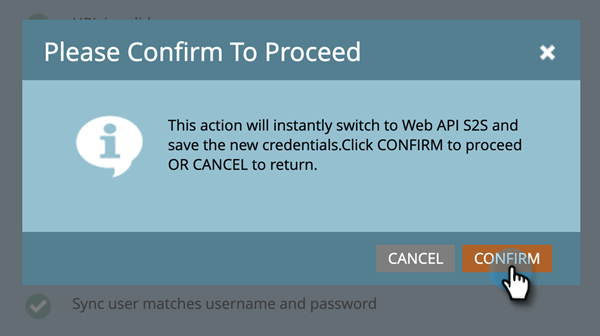

# Erneutes Konfigurieren der Dynamics-Authentifizierungsmethode {#reconfigure-dynamics-authentication-method}

Gehen Sie wie folgt vor, um Ihre [!DNL Dynamics] Authentifizierungsmethode zu aktualisieren.

>[!PREREQUISITES]
>
>Richten Sie die Anwendung in [!DNL Microsoft Dynamics] und Active Directory (Azure AD/ADFS) mit der gewünschten Authentifizierungsmethode aus einem der folgenden Artikel ein:
>
>* [Schritt 2 von 3: Einrichten der Marketo-Lösung mit einer Server-zu-Server-Verbindung](/help/marketo/product-docs/crm-sync/microsoft-dynamics-sync/sync-setup/microsoft-dynamics-365-with-s2s-connection/step-2-of-3-set-up.md){target="_blank"}
>* [Schritt 2 von 4: Richten Sie die Marketo-Lösung mit der Kennwortsteuerungsverbindung für Ressourcenbesitzer ein](/help/marketo/product-docs/crm-sync/microsoft-dynamics-sync/sync-setup/microsoft-dynamics-365-with-ropc-connection/step-2-of-4-set-up.md){target="_blank"}

1. Klicken Sie in Marketo **[!UICONTROL Admin]**.

   

1. Klicken Sie auf **Microsoft Dynamics** und dann auf **[!UICONTROL Synchronisierung deaktivieren]**.

   

   >[!NOTE]
   >
   >Sie müssen die globale Synchronisierung vorübergehend deaktivieren, um die Authentifizierungsmethode zu aktualisieren.

1. Klicken Sie auf **[!UICONTROL Registerkarte Neue Authentifizierungsmethode]**.

   

1. Wählen Sie die gewünschte neue Authentifizierungsmethode aus (in diesem Beispiel wählen wir Web-API aus).

   

1. Geben Sie die für die neue Authentifizierungsmethode erforderlichen Anmeldeinformationen ein und klicken Sie auf **[!UICONTROL Validieren]**.

   

   >[!NOTE]
   >
   >* Die spezifischen Felder variieren je nach ausgewählter Authentifizierungsmethode, und das Formular wird je nach vorheriger Authentifizierungsmethode automatisch aktualisiert.
   >* Wenn Sie zuvor bereits synchronisiert haben, werden die Daten im obigen Formular möglicherweise vorab ausgefüllt. Geben Sie alle Anmeldeinformationen erneut ein, um sicherzustellen, dass die richtigen Werte verwendet werden.

1. Wenn alles in Ordnung ist, generiert die Option Synchronisierung überprüfen alle grünen . Überprüfen Sie die Nachricht und klicken Sie auf **[!UICONTROL Umschalten]**, um die Authentifizierungsmethode zu aktualisieren.

   

   >[!NOTE]
   >
   >Wenn eine  angezeigt wird, weist dieser Schritt ein Problem auf. Siehe [Beheben  [!DNL Dynamics]  Validierungs-Synchronisierungsproblemen](/help/marketo/product-docs/crm-sync/microsoft-dynamics-sync/sync-setup/validate-microsoft-dynamics-sync/fix-dynamics-validation-sync-issues.md), um das/die Problem(e) zu identifizieren und zu beheben. Führen Sie dann die Synchronisierungsvalidierungsschritte erneut aus, bis das Ergebnis wie im Bild oben aussieht.

1. Klicken Sie **[!UICONTROL Bestätigen]** um fortzufahren.

   

1. Klicken **[!UICONTROL erneut]** Bestätigen“.

   

1. Klicken Sie auf **[!UICONTROL OK]**.

   >[!IMPORTANT]
   >
   >Das System benötigt 15 Minuten, um den neuen Authentifizierungsmodus zu akzeptieren. Bitte warten Sie 15 Minuten ab dem Zeitpunkt des Switches, bevor Sie die Synchronisierung erneut aktivieren.
