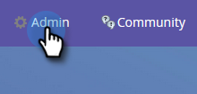

# Richten Sie MSD für die Blaue Anzeige mit AD FS On Prem, Tenant und Microsoft Online ein.{#set-up-msd-for-azure-ad-federated-with-ad-fs-on-prem-tenant-and-microsoft-online}

## Microsoft Dynamics CRM-App {#set-up-microsoft-dynamics-crm-app} einrichten

1. Navigieren Sie zu https://docs.microsoft.com/en-us/powerapps/developer/common-data-service/walkthrough-register-app-azure-active-directory#create-an-application-registration.

1. Befolgen Sie alle Schritte. Geben Sie für Schritt 3 einen relevanten Anwendungsnamen ein (z. B. &quot;Marketing-Integration&quot;). Wählen Sie unter &quot;Unterstützte Kontotypen&quot;nur in diesem Unternehmensverzeichnis die Option Konto.

1. Notieren Sie sich die Anwendungs-ID (ClientId). Sie müssen es später in Marketo eingeben.

1. Erteilen Sie die Admin-Zustimmung, indem Sie die Schritte in [diesem Artikel](/help/marketo/product-docs/crm-sync/microsoft-dynamics-sync/sync-setup/set-up-oauth-authentication-for-dynamics/grant-consent-for-client-id-and-app-registration.md) befolgen.

1. Erstellen Sie im Admin Center einen geheimen Clientschlüssel, indem Sie auf **Zertifikate und Geheimnisse** klicken.

   

1. Klicken Sie auf **Neues Clientgeheimnis**.

   

1. hinzufügen Sie eine Beschreibung zum geheimen Clientschlüssel und klicken Sie auf **Hinzufügen**.

   

   >[!CAUTION]
   >
   >Achten Sie darauf, den Wert für den geheimen Clientschlüssel (siehe Screenshot unten) zu beachten, da Sie ihn später benötigen. Es wird nur einmal angezeigt und Sie können es nicht erneut abrufen.

   

Marketo authentifiziert sich bei der Azurblauen Anzeige mit OAuth unter Verwendung von grant_type Resource Owner Password Credentials( ROPC). Dieses Szenario erfordert die Erstellung einer Home Realm Discovery-Richtlinie für die jeweilige Anwendung. Mit dieser Richtlinie wird Azurblaus AD die Authentifizierungsanfrage an den Föderationsdienst umleiten. Die Synchronisierung des Kennworts-Hashs muss hierfür in AD Connect aktiviert werden. Weitere Informationen finden Sie unter [OAuth mit ROPC](https://docs.microsoft.com/en-us/azure/active-directory/develop/v2-oauth-ropc) und [Festlegen einer hrd-Richtlinie für eine Anwendung](https://docs.microsoft.com/en-us/azure/active-directory/manage-apps/configure-authentication-for-federated-users-portal#example-set-an-hrd-policy-for-an-application).

Weitere Referenzen [finden Sie hier](https://docs.microsoft.com/en-us/azure/active-directory/reports-monitoring/concept-all-sign-ins#:~:text=Interactive%20user%20sign%2Dins%20are,as%20the%20Microsoft%20Authenticator%20app.&amp;text=This%20report%20also%20contains%20federated,are%20federated%20to%20aw%20AD.).

Wenn Sie fertig sind, ist es an der Zeit, **die Dynamics CRM generierte Client-ID und das Geheimnis in Marketo** einzugeben.

## Geben Sie die Dynamics CRM-generierte Client-ID und den geheimen Schlüssel in Marketo ein. {#enter-the-dynamics-crm-generated-client-id-and-secret-into-marketo}

1. Klicken Sie in Marketo auf **Admin**.

   

1. Klicken Sie auf **Microsoft Dynamics**.

   

1. Klicken Sie auf **Synchronisierung deaktivieren**.

   

1. Klicken Sie neben Berechtigungen auf **Bearbeiten**.

   

1. Geben Sie die zuvor abgerufenen **Client-ID** und **Client-geheim** ein und drücken Sie die Taste **Speichern**.

   

1. Klicken Sie auf **Synchronisierungseinstellungen überprüfen**.

   

1. Klicken Sie auf **Weiter**.

   

1. Sie sollten alle grünen Häkchen sehen. Klicken Sie auf **Schließen**.

   

   >[!NOTE]
   >
   >Wenn unter den grünen Häkchen ein rotes X angezeigt wird, finden Sie in [diesem Artikel](/help/marketo/product-docs/crm-sync/microsoft-dynamics-sync/sync-setup/validate-microsoft-dynamics-sync/fix-dynamics-validation-sync-issues.md) Korrekturoptionen.

1. Klicken Sie auf **Synchronisierung aktivieren**.

   

Und das ist es!
