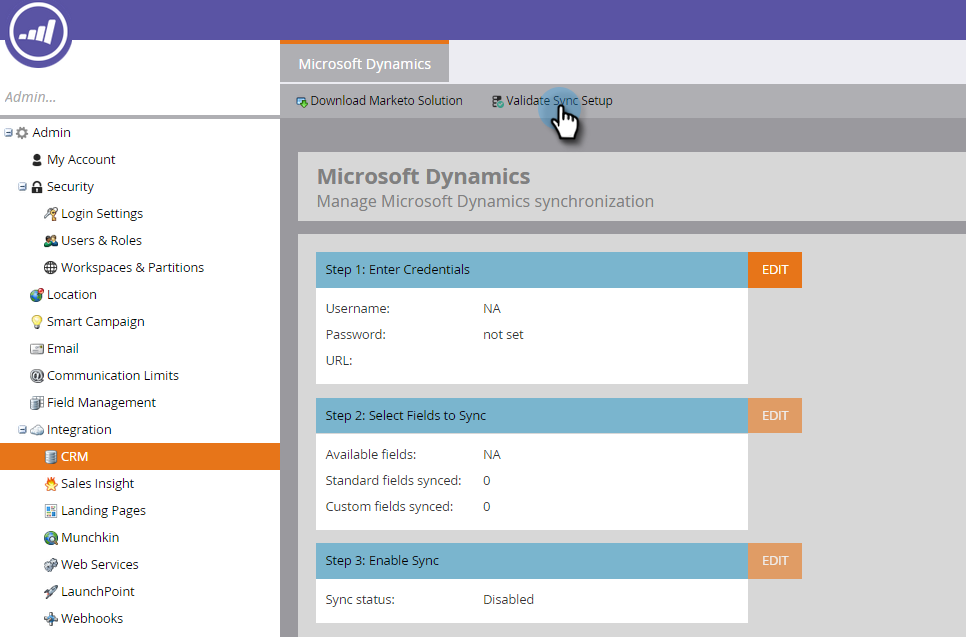

# Validieren [!DNL Microsoft Dynamics] Synchronisieren {#validate-microsoft-dynamics-sync}

>[!CAUTION]
>
>Wenn Sie die Multi-Factor Authentication (MFA) für Ihre [!DNL Dynamics]-Synchronisierung aktiviert haben, müssen Sie sie deaktivieren, damit [!DNL Dynamics] ordnungsgemäß mit Marketo synchronisieren können. Weitere Informationen erhalten Sie vom [Marketo-Support](https://nation.marketo.com/t5/Support/ct-p/Support).

## Ausführen von „Synchronisierung validieren“ in Marketo {#run-validate-sync-in-marketo}

Es ist sehr wichtig, das Tool zur Überprüfung der Synchronisierung auszuführen, um sicherzustellen, dass die [!DNL Microsoft Dynamics]-Synchronisierung mit Marketo korrekt eingerichtet ist, bevor Sie die endgültige Verbindung zwischen ihnen herstellen. Der Prozess generiert eine Checkliste mit sieben Einrichtungsschritten, die identifizieren, wo Probleme vorliegen. Wenn Sie überprüfen, ob diese korrekt durchgeführt wurden, können Sie später viel Zeit sparen.

1. Klicken Sie auf **[!UICONTROL Registerkarte]** Admin“ und dann auf den Link **[!DNL Microsoft Dynamics]** im Bereich Integration .

   

1. Wählen Sie **[!DNL Microsoft]** aus.

   

1. Klicken Sie auf **[!UICONTROL Registerkarte Synchronisierungseinstellungen]**.

   

1. Geben Sie Ihren Benutzernamen, Ihr Kennwort und Ihre URL ein (Client-ID und Client-Geheimnis sind optional). Klicken Sie abschließend **[!UICONTROL Weiter]**.

   

   >[!NOTE]
   >
   >Wenn Sie zuvor bereits eine Synchronisierung durchgeführt haben **liest** CRM) in der linken Struktur **[!DNL Microsoft Dynamics]** und die Daten im obigen Formular können vorab ausgefüllt werden.

1. Wenn alles in Ordnung ist, generiert die Überprüfungssynchronisierung eine Checkliste voller grüner Auswahlfelder .

   

1. Wenn ein , weist dieser Schritt ein Problem auf. Siehe [Beheben von  [!DNL Dynamics] -Überprüfungsproblemen](/help/marketo/product-docs/crm-sync/microsoft-dynamics-sync/sync-setup/validate-microsoft-dynamics-sync/fix-dynamics-validation-sync-issues.md), um das Problem zu identifizieren und zu beheben. Führen Sie dann die Synchronisierungsvalidierungsschritte erneut aus, bis das Ergebnis wie im Bild oben aussieht.

   >[!CAUTION]
   >
   >Wir unterstützen derzeit keine Sandbox-Aktualisierung für die [!DNL Marketo Dynamics]. Wenn Sie Ihre [!DNL Dynamics] CRM-Sandbox aktualisieren müssen, ist eine neue Marketo-Sandbox erforderlich. Weitere Informationen erhalten Sie von Ihrem Customer Success Manager.

>[!MORELIKETHIS]
>
>[Beheben  [!DNL Dynamics]  Synchronisierungsproblemen bei der Validierung](/help/marketo/product-docs/crm-sync/microsoft-dynamics-sync/sync-setup/validate-microsoft-dynamics-sync/fix-dynamics-validation-sync-issues.md)
