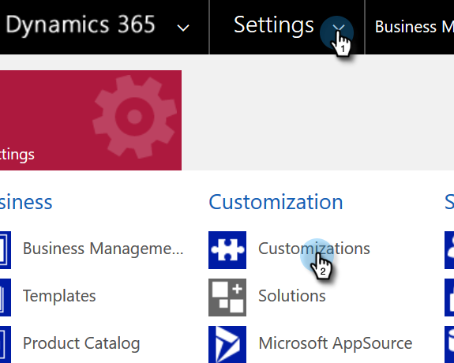
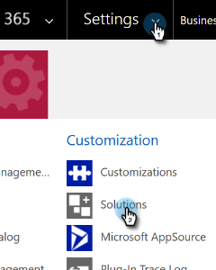

# Synchronisierungsprobleme bei der Dynamics-Überprüfung beheben {#fix-dynamics-validation-sync-issues}

## Überprüfen der Ergebnisse des Synchronisierungswerkzeugs {#validate-sync-tool-results}

Wenn Sie die Synchronisierung der Dynamics-Validierung ausführen, wird ein Bericht generiert. Wenn eine  neben einem Schritt sehen Sie die folgenden Optionen, um das Problem zu identifizieren und zu beheben. Führen Sie dann die Synchronisierungsvalidierungsschritte erneut aus, bis das Ergebnis nur grüne Häkchen anzeigt.

## URL ist gültig {#url-is-valid}

Wenn Sie  überprüfen Sie hier, ob die URL gültig ist. Finden Sie es hier in den Entwicklungsressourcen und sehen Sie sich den Organisationsdienst an. Die URL kann aus verschiedenen Gründen ungültig sein.

1. Melden Sie sich bei Dynamics an. Klicken Sie auf das Symbol Einstellungen und wählen Sie **Erweiterte Einstellungen**.

   

1. Klicken Sie auf Einstellungen und wählen Sie **Anpassungen**.

   

1. Klicks **Entwicklungsressourcen**.

   

1. Die Organisationsdienst-URL finden Sie unter Dienstendpunkte .

   

## Benutzername und Passwort sind gültig {#username-and-password-are-valid}

Wenn Sie  Überprüfen Sie hier, ob Ihre Microsoft Dynamics-Anmeldeinformationen gültig sind. Für die Web-API-S2S-Authentifizierung muss der Benutzername in Marketo mit dem [Email-Adresse](https://docs.microsoft.com/en-us/power-platform/admin/manage-application-users#view-or-edit-the-details-of-an-application-user) des Anwendungsbenutzers im CRM. Bei anderen Typen sollte sie mit dem Benutzernamen für den Synchronisierungsbenutzer übereinstimmen.

## Der Synchronisierungsbenutzer wird der Benutzerrolle &quot;Marketo Sync User&quot;zugewiesen. {#sync-user-is-assigned-to-the-marketo-sync-user-role}

Wenn Sie  Hier könnte es sich um eines der drei folgenden Probleme handeln.

**Option 1: Überprüfen, ob die Benutzerrolle &quot;Marketo Sync User&quot;in Microsoft Dynamics aktiviert ist**:

1. Klicken Sie in Dynamics auf das Symbol Einstellungen und wählen Sie **Erweiterte Einstellungen**.

   

1. Klicks **Einstellungen** und wählen **Sicherheit**.

   

1. Klicks **Benutzer.**

   

1. Klicken Sie auf den Link für den Synchronisierungsbenutzer.

   

1. Klicks **Rollen verwalten**.

   

1. Stellen Sie sicher, dass die Benutzerrolle &quot;Marketo Sync User&quot;aktiviert ist. Ist dies nicht der Fall, überprüfen Sie es und klicken Sie auf **OK.**

   

**Option 2: Genehmigung bestätigen**:

1. Überprüfen Sie die [Erteilen der Zustimmung für die Kunden-ID und App-Registrierung](/help/marketo/product-docs/crm-sync/microsoft-dynamics-sync/sync-setup/grant-consent-for-client-id-and-app-registration.md) , um zu bestätigen, dass die App über die Admin-Zustimmung zum Aufrufen von APIs verfügt.

**Option 3: Benutzer synchronisieren**:

1. Stellen Sie sicher, dass der Synchronisierungsbenutzer zur Marketo-Konfiguration hinzugefügt wird.

## Lösung von Marketo ist ordnungsgemäß installiert {#marketo-solution-is-properly-installed}

Wenn Sie  Wechseln Sie hier zu Microsoft Dynamics , um zu überprüfen, ob die Marketo-Installation vorhanden ist. Siehe Schritt 1 der Microsoft Dynamics-Setup-Dokumentation.

1. Klicken Sie in Dynamics auf das Symbol Einstellungen und wählen Sie **Erweiterte Einstellungen**.

   

1. Klicks **Einstellungen** und wählen **Lösungen.**

   

1. Überprüfen Sie, ob die Lösung aufgelistet ist.

   

## Alle Schritte in der Lösung sind aktiviert {#all-steps-in-the-solution-are-enabled}

Wenn Sie  überprüfen Sie hier, ob keiner der Standardschritte deaktiviert wurde. Alle Schritte werden bei der Installation automatisch aktiviert, können aber bei der Anpassung deaktiviert werden.

## Synchronisierter Benutzer ist der Lösung von Marketo zugeordnet {#sync-user-is-assigned-to-the-marketo-solution}

Wenn Sie  Stellen Sie hier sicher, dass der Synchronisierungsbenutzer auf der Marketo-Standardseite in Microsoft Dynamics zugewiesen ist.

1. Klicken Sie in Dynamics auf das Symbol Einstellungen und wählen Sie **Erweiterte Einstellungen**.

   

1. Klicks **Einstellungen** und wählen **Marketo-Konfiguration**.

   

1. Vergewissern Sie sich, dass der Synchronisierungsbenutzer als Standard zugewiesen ist.

   

## Synchronisierter Benutzer stimmt mit Benutzernamen und Passwort überein {#sync-user-matches-username-and-password}

Wenn Sie  Stellen Sie hier sicher, dass Sie im Setup-Schritt Marketo-Konfiguration in Microsoft Dynamics im Feld Marketo-Benutzer den richtigen Synchronisierungsbenutzer zuweisen.

>[!MORELIKETHIS]
>
>[Überprüfen der Synchronisierung mit Microsoft Dynamics](/help/marketo/product-docs/crm-sync/microsoft-dynamics-sync/sync-setup/validate-microsoft-dynamics-sync.md)
