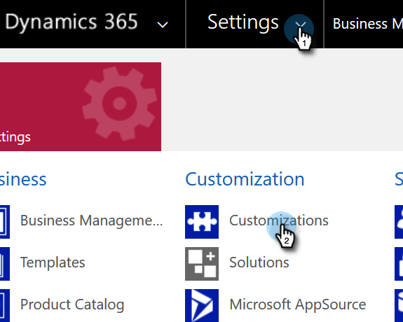
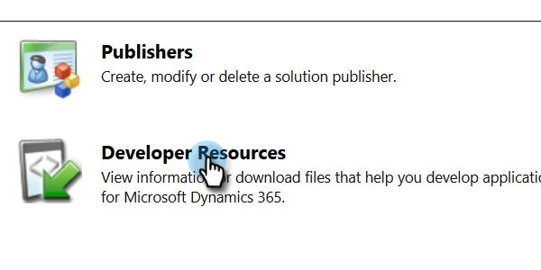

# Anzeigen der Organisations-Service-URL&#x200B; {#view-the-organization-service-url}

Marketo Engage benötigt die Organisations-Service-URL für die Synchronisierung mit MD-Instanzen. So finden Sie sie in Dynamics.

1. Melden Sie sich bei [!DNL Dynamics] an. Klicken Sie auf das Symbol Einstellungen und wählen Sie **[!UICONTROL Erweiterte Einstellungen]** aus.

   

1. Klicken Sie **[!UICONTROL Einstellungen]** und wählen Sie **[!UICONTROL Anpassungen]** aus.

   

1. Klicken Sie auf **[!UICONTROL Entwicklungsressourcen]**.

   

1. Die Organisations-Service-URL finden Sie unter **[!UICONTROL Service-Endpunkte]**.

   

1. Kopieren Sie diese URL, fügen Sie sie in Marketo ein und genießen Sie den Rest der Synchronisierung.
