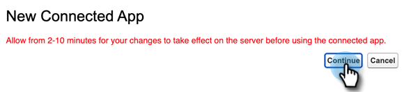

# Anmelden mit OAuth 2.0 {#log-in-using-oauth-2-0}

Salesforce verwendet das OAuth-Protokoll, um Benutzenden von Programmen einen sicheren Zugriff auf Daten zu ermöglichen (die Anwendung mithilfe von OAuth 2.0 zu authentifizieren), ohne Anmeldeinformationen einblenden zu müssen. Im Folgenden finden Sie die Schritte, die zum sicheren Verbinden und Synchronisieren von Marketo Engage mit Salesforce ausgeführt werden müssen.

>[!IMPORTANT]
>
>Um Marketo und Salesforce über OAuth zu verbinden, melden Sie sich über einen privaten Browser (Inkognito) bei Marketo an, um zu vermeiden, dass Sie mit einem falschen Benutzernamen eine Verbindung zu Salesforce herstellen.

## Einrichten der verbundenen App {#set-up-connected-app}

1. Navigieren Sie in Salesforce unter „Setup“ in den Platform Tools zu Apps, App Manager und klicken Sie auf **[!UICONTROL Neue verbundene App]**.

   

1. Füllen Sie die Details aus und klicken Sie auf **[!UICONTROL Speichern]**.

   

1. Aktivieren Sie **[!UICONTROL Kontrollkästchen OAuth]** Einstellungen aktivieren . Geben Sie als Callback-URL `https://app.marketo.com/salesforce/getSfdcOAuthTokensRedirect` ein. Wählen Sie alle verfügbaren OAuth-Bereiche aus und klicken Sie auf **[!UICONTROL Hinzufügen]**.

   

1. Klicken Sie auf **[!UICONTROL Speichern]**.

   

1. Klicken Sie auf **[!UICONTROL Weiter]**.

   

1. Kopieren Sie den Consumer Key und das Consumer Secret (Sie benötigen sie später zum Marketo Engage).

   

>[!CAUTION]
>
>Scrollen Sie auf der Seite Neue verbundene App nach unten und stellen Sie sicher, dass das Kontrollkästchen „Proof Key for Code Exchange (PKCE) anfordern“ _NICHT_ aktiviert ist, da dies das Setup beeinträchtigen würde.

## Einrichten von Marketo {#set-up-marketo}

>[!PREREQUISITES]
>
>* Der API-Zugriff muss für den Salesforce Sync-Benutzer aktiviert sein (wenn Sie Salesforce Professional Edition verwenden, ist dieser Zugriff standardmäßig nicht verfügbar. Wenden Sie sich an Ihren Salesforce-Kundenbetreuer).
* Marketo Sync-Benutzer muss in Salesforce erstellt werden.
* Für Bestandskunden ist die Funktion „OAuth für SFDC-Synchronisierung aktivieren“ im Abonnement des Kunden aktiviert.
* Popup-Blocker sind deaktiviert.
* Die verbundene App wird erstellt und wir haben den Consumer Key und das Consumer Secret zur Verwendung.

>[!CAUTION]
>
Stellen Sie sicher, dass Sie alle nicht benötigten Felder in Marketo vor dem Synchronisierungsbenutzer ausblenden, bevor Sie auf **[!UICONTROL Felder synchronisieren]** klicken. Nachdem Sie auf Felder synchronisieren geklickt haben, werden alle Felder, die der Benutzer in SFDC sehen kann, in Marketo erstellt und können nicht gelöscht werden.

1. Klicken Sie im Marketo Admin-Bereich auf **[!UICONTROL CRM]** und dann auf **[!UICONTROL Mit Salesforce synchronisieren]**.

   

1. Fügen Sie den Consumer Key und das Consumer Secret hinzu, die Sie zuvor aufgezeichnet haben, und klicken Sie auf **[!UICONTROL Speichern]**.

   

1. Klicken Sie auf der Synchronisierungsseite für Marketo Salesforce auf die Schaltfläche **[!UICONTROL Mit Salesforce anmelden]**.

   

   >[!CAUTION]
   >
   Wenn Sie Felder für Benutzernamen/Kennwort/Token sehen und nicht die Schaltfläche „Mit Salesforce anmelden“, ist Ihr Marketo-Abonnement für die Standardauthentifizierung aktiviert. Siehe [Einrichten von Marketo mit einfacher Authentifizierung](/help/marketo/product-docs/crm-sync/salesforce-sync/setup/enterprise-unlimited-edition/step-3-of-3-connect-marketo-and-salesforce-enterprise-unlimited.md){target="_blank"}. Sobald die Synchronisierung mit der Verwendung eines Satzes von Anmeldeinformationen beginnt, erfolgt kein Wechsel von Salesforce-Anmeldeinformationen oder -Abonnements. Wenn Sie OAuth 2.0 verwenden möchten, wenden Sie sich an das Adobe Account Team (Ihren Account Manager).

1. Es wird ein Popup mit der Salesforce-Anmeldeseite angezeigt. Geben Sie die Anmeldeinformationen für den &quot;Marketo Sync User“ ein und melden Sie sich an.

   

1. Geben Sie den Verifizierungs-Code ein, den Sie per E-Mail (von Salesforce gesendet) erhalten haben, und klicken Sie auf **[!UICONTROL Überprüfen]**.

   

1. Nach erfolgreicher Überprüfung wird die Zugriffsseite angezeigt, auf der der Zugriff angefordert wird. Klicken Sie **[!UICONTROL Zulassen]**.

   

1. In einigen Minuten wird in Marketo ein Popup angezeigt. Klicken Sie **[!UICONTROL Anmeldedaten bestätigen]**.

   

1. Klicken Sie nach Abschluss der Feldsynchronisierung auf **[!UICONTROL Salesforce-Synchronisierung]**.

   

1. Klicken Sie **[!UICONTROL Synchronisierung starten]**.

   

Ihre Synchronisierung zwischen Marketo und Salesforce wird jetzt ausgeführt.

>[!MORELIKETHIS]
>
* [Schritt 1 von 3: Marketo-Felder zu Salesforce hinzufügen (Enterprise/Unlimited)](/help/marketo/product-docs/crm-sync/salesforce-sync/setup/enterprise-unlimited-edition/step-1-of-3-add-marketo-fields-to-salesforce-enterprise-unlimited.md){target="_blank"}
* [Schritt 2 von 3: Erstellen eines Salesforce-Benutzers für Marketo (Enterprise/Unlimited)](/help/marketo/product-docs/crm-sync/salesforce-sync/setup/enterprise-unlimited-edition/step-2-of-3-create-a-salesforce-user-for-marketo-enterprise-unlimited.md){target="_blank"}
* [Installieren des Marketo Sales Insight-Pakets auf der Salesforce-AppExchange](/help/marketo/product-docs/marketo-sales-insight/msi-for-salesforce/installation/install-marketo-sales-insight-package-in-salesforce-appexchange.md){target="_blank"}
* [Konfigurieren von Marketo Sales Insight in Salesforce Enterprise/Unlimited](/help/marketo/product-docs/marketo-sales-insight/msi-for-salesforce/configuration/configure-marketo-sales-insight-in-salesforce-enterprise-unlimited.md){target="_blank"}
