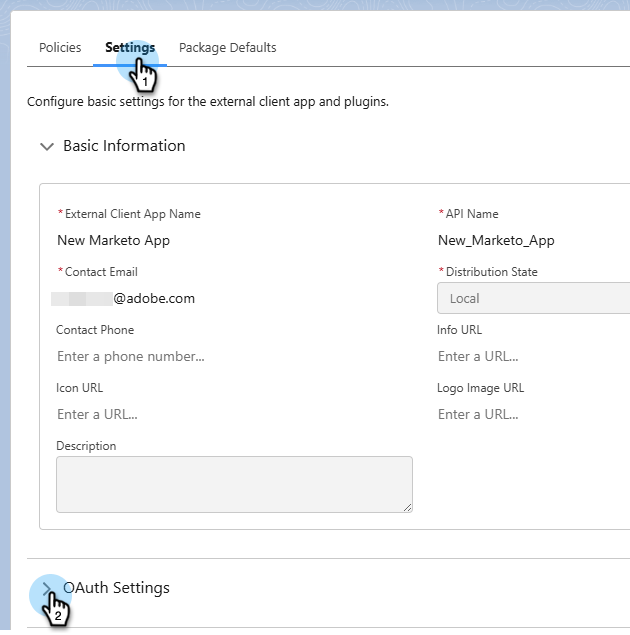

# Anmelden mit OAuth 2.0 {#log-in-using-oauth-2-0}

Salesforce verwendet das OAuth-Protokoll, um Benutzenden von Programmen einen sicheren Zugriff auf Daten zu ermöglichen (die Anwendung mithilfe von OAuth 2.0 zu authentifizieren), ohne Anmeldeinformationen einblenden zu müssen. Im Folgenden finden Sie die Schritte, die zum sicheren Verbinden und Synchronisieren von Marketo Engage mit Salesforce ausgeführt werden müssen.

>[!IMPORTANT]
>
>Um Marketo und [!DNL Salesforce] über OAuth zu verbinden, melden Sie sich über einen privaten Browser (Inkognito) bei Marketo an, um eine Verbindung mit [!DNL Salesforce] mit dem falschen Benutzernamen zu vermeiden.

## Externe Client-App einrichten {#set-up-external-client-app}

>[!NOTE]
>
>Seit September 2025 schränkt Salesforce die Verwendung von &quot;[&#x200B; Apps“ &#x200B;](https://help.salesforce.com/s/articleView?id=005132365&type=1){target="_blank"}. Bestehende Benutzende, die eine Connected App auf Grundlage unserer Dokumentation eingerichtet haben, können entweder die Berechtigung „Deinstallierte Connected Apps genehmigen“ zum Profil des Marketo Sync-Benutzenden hinzufügen oder eine neue externe Client-App erstellen, wie unten beschrieben.

1. Klicken Sie in Salesforce auf das Zahnradsymbol und wählen Sie **Setup**.

   

1. Geben Sie `App Manager` in das Feld „Schnellsuche“ ein und wählen Sie **App Manager**.

   

1. Klicken Sie auf **Neue externe Client-Anwendung**.

   

1. Füllen Sie die Details unter &quot;_&quot;_. Legen Sie _Verteilungsstatus_ auf &quot;**&quot;**.

   

1. Erweitern Sie den Abschnitt **API (OAuth-Einstellungen aktivieren** und aktivieren Sie das Kontrollkästchen **[!UICONTROL OAuth aktivieren]**. Geben Sie _Callback-_) `https://app.marketo.com/salesforce/getSfdcOAuthTokensRedirect` ein. Wählen Sie alle verfügbaren OAuth-Bereiche aus und klicken Sie auf den Pfeil, um sie hinzuzufügen.

   

1. Stellen _unter „Fluss-_&quot; sicher, dass keine Felder ausgewählt sind.

   

1. Stellen Sie unter _Sicherheit_ sicher, dass nur **Geheime Daten für Webserver-Fluss** und **Geheime Daten für Aktualisierungstoken-Fluss erfordern** ausgewählt sind.

   

1. Überspringen Sie die letzten vier Abschnitte und klicken Sie auf **Erstellen**.

   

1. Nachdem die neue externe Client-App erstellt wurde, klicken Sie auf die Registerkarte **Einstellungen** und erweitern Sie den Abschnitt **OAuth-Einstellungen**.

   

1. Klicken Sie auf **Schaltfläche „Consumer Key and Consumer Secret**, um eine neue Registerkarte zu öffnen. Kopieren Sie beide Nummern und speichern Sie sie (Sie benötigen sie später zur Verwendung in Marketo Engage).

   

## Einrichten von Marketo {#set-up-marketo}

>[!PREREQUISITES]
>
>* Der API-Zugriff muss für den Salesforce Sync-Benutzer aktiviert sein (wenn Sie Salesforce Professional Edition verwenden, ist dieser Zugriff standardmäßig nicht verfügbar. Wenden Sie sich an Ihren Salesforce-Kundenbetreuer).
>* Marketo Sync-Benutzer muss in Salesforce erstellt werden.
>* Für Bestandskunden ist die Funktion „OAuth für SFDC-Synchronisierung aktivieren“ im Abonnement des Kunden aktiviert.
>* Popup-Blocker sind deaktiviert.
>* Die verbundene App wird erstellt und wir haben den [!UICONTROL Consumer Key] und [!UICONTROL Consumer Secret] zur Verwendung.

>[!CAUTION]
>
>Stellen Sie sicher, dass Sie alle nicht benötigten Felder in Marketo vor dem Synchronisierungsbenutzer ausblenden, bevor Sie auf **[!UICONTROL Felder synchronisieren]** klicken. Nachdem Sie auf Felder synchronisieren geklickt haben, werden alle Felder, die der Benutzer in SFDC sehen kann, in Marketo erstellt und können nicht gelöscht werden.

1. Klicken Sie im Marketo Admin-Bereich auf **[!UICONTROL CRM]** und dann auf **[!UICONTROL Mit Salesforce synchronisieren]**.

   

1. Fügen Sie den Consumer Key und das Consumer Secret hinzu, die Sie zuvor aufgezeichnet haben, und klicken Sie auf **[!UICONTROL Speichern]**.

   

1. Klicken Sie auf der Synchronisierungsseite für Marketo Salesforce auf die Schaltfläche **[!UICONTROL Mit Salesforce anmelden]**.

   

   >[!CAUTION]
   >
   >Wenn Sie Felder für Benutzernamen/Kennwort/Token sehen und nicht die Schaltfläche „Mit Salesforce anmelden“, ist Ihr Marketo-Abonnement für die Standardauthentifizierung aktiviert. Siehe [Einrichten von Marketo mit einfacher Authentifizierung](/help/marketo/product-docs/crm-sync/salesforce-sync/setup/enterprise-unlimited-edition/step-3-of-3-connect-marketo-and-salesforce-enterprise-unlimited.md){target="_blank"}. Sobald die Synchronisierung mit der Verwendung eines Satzes von Anmeldeinformationen beginnt, erfolgt kein Wechsel von Salesforce-Anmeldeinformationen oder -Abonnements. Um OAuth 2.0 für Ihre Salesforce-Authentifizierung einrichten zu lassen, wenden Sie sich an den [Marketo-Support](https://nation.marketo.com/t5/support/ct-p/Support){target="_blank"}.

1. Es wird ein Popup mit der Salesforce-Anmeldeseite angezeigt. Geben Sie die Anmeldeinformationen für den &quot;Marketo Sync User“ ein und melden Sie sich an.

   

1. Geben Sie den Verifizierungs-Code ein, den Sie per E-Mail (von Salesforce gesendet) erhalten haben, und klicken Sie auf **[!UICONTROL Überprüfen]**.

   

1. Nach erfolgreicher Überprüfung wird die Zugriffsseite angezeigt, auf der der Zugriff angefordert wird. Klicken Sie **[!UICONTROL Zulassen]**.

   

1. In einigen Minuten wird in Marketo ein Popup angezeigt. Klicken Sie **[!UICONTROL Anmeldedaten bestätigen]**.

   

1. Klicken Sie nach Abschluss der Feldsynchronisierung auf **[!UICONTROL Salesforce-Synchronisierung]**.

   

1. Klicken Sie **[!UICONTROL Synchronisierung starten]**.

   

Ihre Synchronisierung zwischen Marketo und [!DNL Salesforce] wird jetzt ausgeführt.

>[!MORELIKETHIS]
>
>* [Schritt 1 von 3: Marketo-Felder zu Salesforce hinzufügen (Enterprise/Unlimited)](/help/marketo/product-docs/crm-sync/salesforce-sync/setup/enterprise-unlimited-edition/step-1-of-3-add-marketo-fields-to-salesforce-enterprise-unlimited.md){target="_blank"}
>* [Schritt 2 von 3: Erstellen eines Salesforce-Benutzers für Marketo (Enterprise/Unlimited)](/help/marketo/product-docs/crm-sync/salesforce-sync/setup/enterprise-unlimited-edition/step-2-of-3-create-a-salesforce-user-for-marketo-enterprise-unlimited.md){target="_blank"}
>* [Installieren des Marketo Sales Insight-Pakets in Salesforce AppExchange](/help/marketo/product-docs/marketo-sales-insight/msi-for-salesforce/installation/install-marketo-sales-insight-package-in-salesforce-appexchange.md){target="_blank"}
>* [Konfigurieren von Marketo Sales Insight in Salesforce Enterprise/Unlimited](/help/marketo/product-docs/marketo-sales-insight/msi-for-salesforce/configuration/configure-marketo-sales-insight-in-salesforce-enterprise-unlimited.md){target="_blank"}
