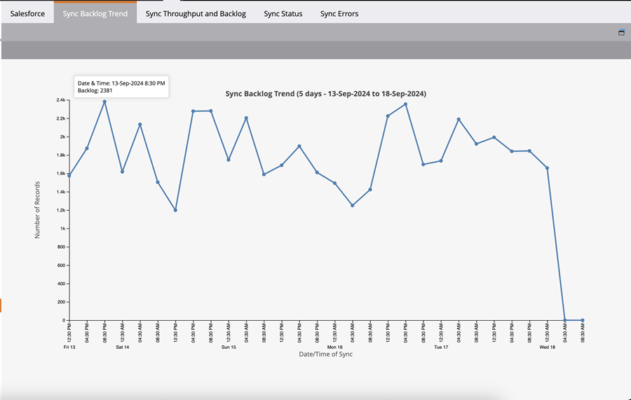

# Salesforce Sync Backlog-Metriken  {#salesforce-sync-backlog-metrics}

Der Synchronisierungsrückstand ist der Name, der für die Einträge mit ausstehender Synchronisierung verwendet wird. Dadurch werden Datensätze berücksichtigt, die von Salesforce auf Marketo Engage synchronisiert werden müssen, und umgekehrt. Indem Sie sicherstellen, dass der Rückstand unter Kontrolle bleibt, können Sie reibungslose und zeitnahe Synchronisierungen durchführen. Der Rückstand umfasst die Zahlen der ausstehenden Synchronisierungs-Post-Aktualisierungen auf beiden Seiten und nicht die Zahlen, die von Synchronisierungsflussschritten wie den Flussschritten „Lead zu SFDC synchronisieren“ vorgenommen werden.

## Zugriff {#how-to-access}

1. Gehen Sie in Marketo Engage zum Bereich **Admin**.

   

1. **Salesforce**.

   

## Trend des Synchronisierungsrückstands {#sync-backlog-trend}

Der Trend des Rückstands spiegelt Änderungen an den in den letzten 5 Tagen aufgezeichneten Rückständen wider. Der Rückstand wird in einem Zeitintervall von 4 Stunden angezeigt, das sich über 5 Tage erstreckt. Daher zeigt das Diagramm 6 Intervalle pro Tag mal 5 Tage an, was 30 Intervallen entspricht.

Der Rückstand wird in einem bestimmten Zeitintervall von 4 Stunden auf der X-Achse beobachtet. Dieser Wert gilt für alle Objekte, die synchronisiert werden. Dies ist der gesamte Rückstand in Salesforce und Marketo Engage, der auf die Synchronisierung wartet.

## Durchsatz und Rückstand synchronisieren {#sync-throughput-and-backlog}

Die Statistiken spiegeln den Durchsatz und den Rückstandsstatus für jeden Objekttyp wider, der in den letzten 24 Stunden synchronisiert wurde. Die Objekttypen umfassen alle Objekte, die synchronisiert werden, einschließlich: Lead-, Kontakt-, Konto-, Opportunity-, Kampagnen-, Benutzer- und benutzerdefinierte Objekte. Die Durchsatzstatistiken werden alle 15 Minuten automatisch aktualisiert. Sie können die Aktualisierung jedoch manuell über das Aktualisierungssymbol durchführen. Der Rückstand wird stündlich abgerufen.

>[!NOTE]
>
>Statistiken werden fortlaufend und nicht nach Kalendertagen aktualisiert.

<table><thead>
  <tr>
    <th>Feld</th>
    <th>Beschreibung</th>
  </tr></thead>
<tbody>
  <tr>
    <td>Max. synchronisierte Datensätze/Std.</td>
    <td>Die maximale Anzahl von Datensätzen, die pro Stunde synchronisiert werden (maximaler Durchsatz) und in den letzten 24 Stunden für den Objekttyp beobachtet wurden. Der 24-Stunden-Zeitraum hängt von der Zeit ab, nicht vom Kalendertag.</td>
  </tr>
  <tr>
    <td>Min. synchronisierte Datensätze/Std.</td>
    <td>Die Mindestanzahl der pro Stunde synchronisierten Datensätze (Mindestdurchsatz), die in den letzten 24 Stunden für den Objekttyp beobachtet wurde. Der 24-Stunden-Zeitraum hängt von der Zeit ab, nicht vom Kalendertag.</td>
  </tr>
  <tr>
    <td>Durchschnittliche synchronisierte Datensätze/Std.</td>
    <td>Die durchschnittliche Anzahl der pro Stunde synchronisierten Datensätze (minimaler Durchsatz), die in den letzten 24 Stunden für den Objekttyp beobachtet wurde. Der 24-Stunden-Zeitraum hängt von der Zeit ab, nicht vom Kalendertag. Dies wird als Gesamtzahl der in den letzten 24 Stunden synchronisierten Datensätze berechnet.</td>
  </tr>
  <tr>
    <td>Synchronisierungsrückstand</td>
    <td>Der Rückstand an Datensätzen, die für den Objekttyp noch nicht synchronisiert wurden. Dies ist die Summe der ausstehenden Synchronisierungsrückstände in beide Richtungen (von Salesforce zu Marketo Engage und umgekehrt). Der Rückstand von Salesforce wird mithilfe eines API-Aufrufs an Salesforce abgerufen und der Rückstand von Marketo Engage wird anhand der Statistiken aus dem Änderungsdatenprotokoll berechnet. Dieser wird stündlich berechnet. Die nächsten beiden Felder in dieser Tabelle geben an, wann der Rückstand zuletzt berechnet wurde, bzw. wann der nächste Zeitplan für die Berechnung gilt.</td>
  </tr>
  <tr>
    <td>Geschätzter Rückstand (Zeit)</td>
    <td>Geschätzte Dauer der Synchronisierung des Rückstands pro Objekttyp. Berechnet als „Synchronisierungsrückstand/Durchschnittliche pro Stunde synchronisierte Einträge“.</td>
  </tr>
  <tr>
    <td>Rückstand zuletzt abgerufen</td>
    <td>Der Zeitpunkt der letzten Rückstandsberechnung.</td>
  </tr>
  <tr>
    <td>Rückstand beim nächsten Abrufen</td>
    <td>Der Zeitpunkt der nächsten Rückstandsberechnung.</td>
  </tr>
  <tr>
    <td>Auftragsstatus</td>
    <td>Dies zeigt an, ob der Rückstand in den letzten 6 Stunden gewachsen ist. Sie wird als „wachsend“ abgeleitet, wenn der aktuelle Rückstand größer ist als der vor 6 Stunden aufgezeichnete Rückstand. Andernfalls wird sie als „Normal“ angezeigt. Dadurch soll angezeigt werden, ob der Synchronisierungsdurchsatz den Rückstand aufholt.</td>
  </tr>
</tbody></table>

## Ursachen für Synchronisierungsrückstände {#what-causes-sync-backlogs}

Unabhängig davon, ob die Aktualisierung auf der Marketo Engage- oder der CRM-Seite erfolgt, wird der neu zu synchronisierende Datensatz durch Trigger , um die Informationen auf der anderen Seite durch den regulären Synchronisierungszyklus von Marketo Engage zu CRM zu aktualisieren. Wenn ein Datensatz in Salesforce aktualisiert wird, wird ein Systemänderungszeitstempel generiert, der als „SysModStamp“ bezeichnet wird. Stellt eine Änderung in die Warteschlange zum Synchronisieren.

Wenn viele Aktualisierungen vorgenommen werden (z. B. durch Ändern eines Feldwerts), werden viele Datensätze geändert, was zu neuen SysModStamps führt. Eine große Anzahl von Aktualisierungen des Personendatensatzes muss dann zwischen Marketo Engage und dem CRM-System neu synchronisiert werden, wodurch manchmal ein kurzzeitiger Rückstand entsteht.

## Best Practices für die Verwaltung von Synchronisierungsrückständen {#best-practices}

**Für Synchronisierungsbenutzer sichtbare Felder**: Stellen Sie sicher, dass nur die für die Synchronisierung sichtbaren Felder synchronisiert werden müssen und für Marketing-Maßnahmen nützlich sind. Bei jeder Aktualisierung eines Datensatzes in Salesforce, der den zuletzt geänderten Zeitstempel aktualisiert, wird ein Datensatz in den Synchronisierungsrückstand eingereiht. Unnötige Felder zum Synchronisieren können bei der Synchronisierung wichtigere Felder verlangsamen. Wenn die unnötigen Felder für den Synchronisierungsbenutzer ausgeblendet werden, führen Aktualisierungen an diesen Feldern zu einem Überspringvorgang, der viel schneller ist als eine Aktualisierung. Wenden Sie sich an Ihren Salesforce-Administrator, um die Best Practices [hier](https://nation.marketo.com/t5/marketo-whisperer-blogs/best-practices-for-determining-which-fields-to-sync-with-marketo/ba-p/247449){target="_blank"} zu überprüfen und zu aktualisieren, welche Felder für den Marketo-Synchronisierungsbenutzer sichtbar sind.

**Unnötige Datensätze ausblenden oder filtern**: Wenn ein Datensatz nicht marktfähig ist, kann es eine Verschwendung von Synchronisierungsressourcen sein. Wenn der Synchronisierungsbenutzer sie nicht sehen kann, verschwendet er keine Ressourcen, um sie zu synchronisieren. Die [Marketo Engage-Unterstützung](https://nation.marketo.com/t5/support/ct-p/Support#_blank){target="_blank"} kann beim Einrichten eines Synchronisierungsfilters helfen, um das Synchronisieren von Datensätzen basierend auf zusätzlichen Kriterien zu verhindern. Weitere Informationen zum Einrichten eines benutzerdefinierten Synchronisierungsfilters [finden Sie hier](https://nation.marketo.com/t5/product-blogs/instructions-for-creating-a-custom-sync-rule/ba-p/242758){target="_blank"}. Es wird dringend empfohlen, Indexfelder in Salesforce zu verwenden (kontaktieren Sie Salesforce für weitere Informationen).

**Massenaktualisierungen in nicht kritischen Stunden planen**: Überprüfen Sie Ihre Datensynchronisierungsmuster, um nicht kritische Zeiträume zu identifizieren. Überprüfen Sie nach Möglichkeit, ob Massenaktualisierungen in diesen nicht kritischen Zeiträumen geplant werden können.

**Häufig aktualisierte Felder**: Einige Felder werden häufig aktualisiert. Zum Beispiel Währungsfelder, die Währungsänderungen unterliegen. Überprüfen Sie, ob diese synchronisiert werden müssen oder ob die Felder anders gestaltet werden sollen. Wenn Sie andere Felder haben, die häufig aktualisiert werden und nicht benötigt werden, blenden Sie diese aus dem Synchronisierungsbenutzer aus. Besprechen Sie dies unbedingt mit Ihren SFDC Admin-Integrationen, die Felder möglicherweise aktualisieren.

**Benutzerdefinierte Objekte**: Überprüfen Sie regelmäßig [benutzerdefinierte Objekte](https://experienceleague.adobe.com/de/docs/marketo/using/product-docs/crm-sync/salesforce-sync/sfdc-sync-details/sfdc-sync-custom-object-sync){target="_blank"}, die zum Synchronisieren und Deaktivieren nicht mehr synchronisierter Objekte aktiviert sind.

**Aktivitäten**: [Überprüfen Sie, ob Aktivitäten aktiviert ](https://experienceleague.adobe.com/de/docs/marketo/using/product-docs/crm-sync/salesforce-sync/setup/optional-steps/customize-activities-sync){target="_blank"}, die möglicherweise aus der Synchronisierung entfernt werden.  Diese Aktivitäten werden nur einmal pro Tag pro Lead synchronisiert.

**Synchronisierungsfehler überprüfen**: Die Ausnahmebehandlung kann die Synchronisierung verlangsamen. Die Überprüfung von Benutzerbenachrichtigungen und die Behebung von Fehlern können den Synchronisierungsstatus verbessern.

**Support kontaktieren**: Wenn Sie alle oben genannten Best Practices befolgen und immer noch erhebliche Rückstände auftreten, wenden Sie sich an den [Marketo Engage-Support](https://nation.marketo.com/t5/support/ct-p/Support#_blank){target="_blank"}.
