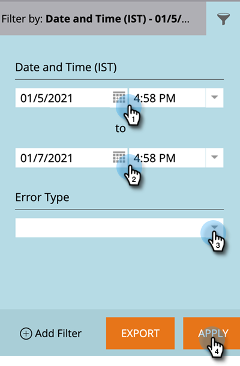

# Salesforce-Synchronisierungsfehler {#salesforce-sync-errors}

Zeigen Sie eine Zusammenfassung der Fehler an, die während des Synchronisierungsprozesses aufgetreten sind. Dies schließt Fehler ein, die durch Fehler bei der Synchronisierung inkompatibler Daten verursacht wurden.

>[!NOTE]
>
>**Erforderliche Administratorberechtigungen**

## Synchronisierungsfehler anzeigen {#view-sync-errors}

1. Klicks **Admin**.

   

1. Klicken Sie unter &quot;Integration&quot;auf **Salesforce**, dann die **Synchronisierungsfehler** Registerkarte.

   

>[!NOTE]
>
>Die aufgeführten Fehler reichen von der aktuellen Zeit bis zu fünf Tagen vor der aktuellen Synchronisierung.

| Feld | Beschreibung |
|---|---|
| Fehlgeschlagen an | Record Level _oder_ Job Level |
| Datum/Uhrzeit des Fehlschlagens | Fehlerdetails |
| Fehlertyp | SFDC-Rücksendenachricht |

>[!TIP]
>
>Durch Klicken auf den Datensatz auf Datensatzebene werden die Marketo- und Salesforce-IDs des zugehörigen Objekts angezeigt. In einigen Fällen stammen die Fehler auf Datensatz- und Auftragsebene direkt von Salesforce. Die Online-Suche kann zusätzliche Details liefern.

## Filtersynchronisierungsfehler {#filter-sync-errors}

1. Um die Daten zu filtern, klicken Sie auf das Filtersymbol ganz rechts auf der Seite.

   

1. Wählen Sie Datum und Zeitraum aus und filtern Sie dann nach Fehlertyp (Auftragsebene oder Datensatzebene). Klicks **Anwenden** wann geschehen.

   

**OPTIONALER SCHRITT**: Um Synchronisierungsfehler zu exportieren, klicken Sie auf **Export**. Die Daten werden als CSV exportiert.

