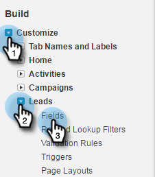
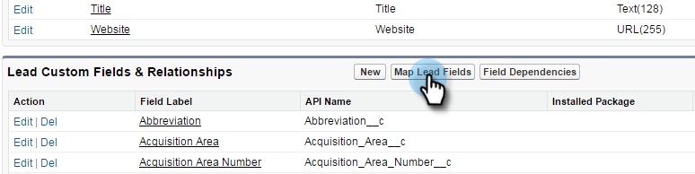

# Schritt 1 von 3: Hinzufügen von Marketo-Feldern zu Salesforce (Enterprise/Unlimited) {#step-of-add-marketo-fields-to-salesforce-enterprise-unlimited}

>[!PREREQUISITES]
>
>Sie müssen Zugriff auf Salesforce-APIs haben, um zwischen Marketo Engage und Salesforce zu synchronisieren.

Marketo verwendet eine Reihe von Feldern, um bestimmte Arten von Marketing-bezogenen Informationen zu erfassen. Wenn Sie diese Daten in Salesforce wünschen, folgen Sie bitte den unten stehenden Anweisungen.

1. Erstellen Sie in Salesforce drei benutzerdefinierte Felder für die Lead- und Kontaktobjekte: Score, Akquiseprogramm und Akquisedatum.
1. Ordnen Sie diese benutzerdefinierten Felder zwischen Leads und Kontakten zu, sodass die Werte bei der Konvertierung in Salesforce übernommen werden.
1. Sie können bei Bedarf weitere Felder erstellen (siehe Tabelle unten).

Alle diese benutzerdefinierten Felder sind optional und müssen nicht mit Marketo und Salesforce synchronisiert werden. Als Best Practice empfehlen wir, Felder für Score, Akquise-Programm und Akquise-Datum zu erstellen.

## Marketo-Felder zu Salesforce hinzufügen {#add-marketo-fields-to-salesforce}

Fügen Sie drei benutzerdefinierte Felder zu den oben aufgeführten Lead- und Kontaktobjekten in Salesforce hinzu. Weitere Informationen finden Sie in der Tabelle der verfügbaren Felder am Ende dieses Abschnitts.

Führen Sie die folgenden Schritte für jedes der drei benutzerdefinierten Felder aus, um sie hinzuzufügen. Beginnen Sie mit Score.

1. Melden Sie sich bei Salesforce an und klicken Sie auf **[!UICONTROL Einrichtung]**.

   

1. Im [!UICONTROL Build] Menü links, klicken Sie auf **[!UICONTROL Anpassen]** und wählen **[!UICONTROL Leads]**. Klicks **[!UICONTROL Felder]**.

   

1. Klicks **[!UICONTROL Neu]** im Abschnitt Benutzerdefinierte Felder und Beziehungen unten auf der Seite.

   

1. Wählen Sie den entsprechenden Feldtyp aus (für Score - Zahl; Akquise-Programm - Text; Akquise-Datum - Datum/Uhrzeit).

   

1. Klicken Sie auf **[!UICONTROL Weiter]**.

   

1. Geben Sie die [!UICONTROL Feldbezeichnung], [!UICONTROL Länge], und [!UICONTROL Feldname] für das Feld, wie in der folgenden Tabelle dargestellt.

<table> 
 <thead> 
  <tr> 
   <th> 
    

      Feldbezeichnung 
    
</th> 
   <th> 
    

      Feldname 
    
</th> 
   <th> 
    

      Datentyp 
    
</th> 
   <th> 
    

      Feldattribute 
    
</th> 
  </tr> 
 </thead> 
 <tbody> 
  <tr> 
   <td>Bewertung</td> 
   <td>mkto71_Lead_Score</td> 
   <td>Zahl</td> 
   <td>Länge 10 Dezimalstellen 0 </td> 
  </tr> 
  <tr> 
   <td>Akquirierungsdatum</td> 
   <td>mkto71_Acquisition_Date</td> 
   <td>Datum/Uhrzeit</td> 
   <td> </td> 
  </tr> 
  <tr> 
   <td>Akquirierungsprogramm</td> 
   <td>mkto71_acquisition_program</td> 
   <td>Text</td> 
   <td>Länge 255</td> 
  </tr> 
 </tbody> 
</table>

>[!NOTE]
>
>Salesforce hängt __c an Feldnamen an, wenn sie sie zum Erstellen von API-Namen verwendet.

>[!NOTE]
>
>Text- und Zahlenfelder erfordern eine Länge, Datums-/Uhrzeitfelder jedoch nicht. Eine Beschreibung ist optional.

1. Klicken Sie auf **[!UICONTROL Weiter]**.

   

1. Geben Sie die Zugriffseinstellungen an und klicken Sie auf **[!UICONTROL Nächste]**:

   * Legen Sie alle Rollen auf **[!UICONTROL Sichtbar]** und **[!UICONTROL Schreibgeschützt]**

   * Löschen Sie die **[!UICONTROL Schreibgeschützt]** Kontrollkästchen für das Profil Ihres Synchronisierungsbenutzers:

      * Wenn Sie einen Benutzer mit dem Profil eines _Systemadministrator_ als Synchronisierungsbenutzer verwenden, löschen Sie die **[!UICONTROL Schreibgeschützt]** Kontrollkästchen für das Profil &quot;Systemadministrator&quot;(wie unten dargestellt)
      * Wenn Sie eine _Benutzerdefiniertes Profil_ Löschen Sie für den Synchronisierungsbenutzer die **[!UICONTROL Schreibgeschützt]** Kontrollkästchen für dieses benutzerdefinierte Profil

   

1. Wählen Sie die Seitenlayouts aus, die das Feld anzeigen sollen.

   

1. Klicks **[!UICONTROL Speichern und Neu]** , um die beiden anderen benutzerdefinierten Felder zu erstellen. Klicks **[!UICONTROL Speichern]** mit Ihnen sind mit allen drei fertig.

   

1. Klicken Sie im Menü Erstellen auf der linken Seite auf **[!UICONTROL Anpassen]** und wählen Sie Kontakte aus. Klicken Sie auf Felder.
1. Führen Sie die Schritte 3 bis 10 für die Felder Score, Akquise-Datum und Akquise-Programm für das Kontaktobjekt aus, genau wie für das Lead-Objekt.
1. Optional können Sie das obige Verfahren für alle zusätzlichen benutzerdefinierten Felder aus dieser Tabelle verwenden.

<table> 
 <thead> 
  <tr> 
   <th> 
    

      Feldbezeichnung 
    
</th> 
   <th> 
    

      Feldname 
    
</th> 
   <th> 
    

      Datentyp 
    
</th> 
   <th> 
    

      Feldattribute 
    
</th> 
  </tr> 
 </thead> 
 <tbody> 
  <tr> 
   <td>Akquisitionsprogramm-ID</td> 
   <td>mkto71_acquisition_program_id</td> 
   <td>Zahl</td> 
   <td>Länge 18 Dezimalstellen 0 </td> 
  </tr> 
  <tr> 
   <td>Ursprünglicher Verweis</td> 
   <td>mkto71_Original_Referrer</td> 
   <td>Text</td> 
   <td>Länge 255</td> 
  </tr> 
  <tr> 
   <td>Ursprüngliche Such-Engine</td> 
   <td>mkto71_Original_Suchmaschine</td> 
   <td>Text</td> 
   <td>Länge 255</td> 
  </tr> 
  <tr> 
   <td>Ursprünglicher Suchausdruck</td> 
   <td>mkto71_Original_Search_Phrase</td> 
   <td>Text</td> 
   <td>Länge 255</td> 
  </tr> 
  <tr> 
   <td>Ursprüngliche Quelleninfo</td> 
   <td>mkto71_Original_Source_Info</td> 
   <td>Text</td> 
   <td>Länge 255</td> 
  </tr> 
  <tr> 
   <td>Ursprünglicher Quellentyp</td> 
   <td>mkto71_Original_Source_Type</td> 
   <td>Text</td> 
   <td>Länge 255</td> 
  </tr> 
  <tr> 
   <td>Abgeleiteter Ort</td> 
   <td>mkto71_inferred_city</td> 
   <td>Text</td> 
   <td>Länge 255</td> 
  </tr> 
  <tr> 
   <td>Abgeleitetes Unternehmen</td> 
   <td>mkto71_inferred_company</td> 
   <td>Text</td> 
   <td>Länge 255</td> 
  </tr> 
  <tr> 
   <td>Abgeleitetes Land</td> 
   <td>mkto71_intenred_country</td> 
   <td>Text</td> 
   <td>Länge 255</td> 
  </tr> 
  <tr> 
   <td>Abgeleiteter Stadtbereich</td> 
   <td>mkto71_inferred_Metropolitan_Area</td> 
   <td>Text</td> 
   <td>Länge 255</td> 
  </tr> 
  <tr> 
   <td>Abgeleitete Vorwahl</td> 
   <td>mkto71_inferred_Phone_Area_Code</td> 
   <td>Text</td> 
   <td>Länge 255</td> 
  </tr> 
  <tr> 
   <td>Abgeleitete Postleitzahl</td> 
   <td>mkto71_inferred_postal_code</td> 
   <td>Text</td> 
   <td>Länge 255</td> 
  </tr> 
  <tr> 
   <td>Abgeleitetes Bundesland/abgeleitete Region</td> 
   <td>mkto71_inferred_state_region</td> 
   <td>Text</td> 
   <td>Länge 255</td> 
  </tr> 
 </tbody> 
</table>

>[!NOTE]
>
>Werte in den von Marketo automatisch zugewiesenen Feldern sind in Salesforce nicht sofort verfügbar, wenn das neue Feld erstellt wurde. Marketo synchronisiert die Daten mit Salesforce bei der nächsten Aktualisierung des Datensatzes auf beiden Systemen (d. h. bei einer Aktualisierung auf eines der Felder, die zwischen Marketo und Salesforce synchronisiert werden).

## Benutzerdefinierte Felder für Konversionen zuordnen {#map-custom-fields-for-conversions}

Ein benutzerdefiniertes Feld für das Lead-Objekt in Salesforce sollte einem Kontaktfeld auf dem Kontaktobjekt zugeordnet werden, damit Daten bei einer Konvertierung übertragen werden.

1. Klicken Sie oben rechts auf **[!UICONTROL Einrichtung]**.

   

1. Geben Sie &quot;Felder&quot;in die Nav-Suche ein, ohne die Eingabetaste zu drücken. Felder werden unter verschiedenen Objekten angezeigt. Klicken Sie auf **[!UICONTROL Felder]** unter &quot;Leads&quot;.

   

1. Wechseln Sie zum Abschnitt Lead-benutzerdefinierte Felder und Beziehungen und klicken Sie auf **[!UICONTROL Lead-Felder zuordnen]**.

   

1. Klicken Sie auf das Dropdown-Menü neben dem Feld, das Sie zuordnen möchten.

   

1. Wählen Sie das entsprechende benutzerdefinierte Kontaktfeld aus.

   

1. Wiederholen Sie die obigen Schritte für alle anderen Felder, die Sie erstellt haben.

1. Klicks **[!UICONTROL Speichern]** wann geschehen.

>[!MORELIKETHIS]
>
>[Schritt 2 von 3: Erstellen eines Salesforce-Benutzers für Marketo (Enterprise/Unlimited)](/help/marketo/product-docs/crm-sync/salesforce-sync/setup/enterprise-unlimited-edition/step-2-of-3-create-a-salesforce-user-for-marketo-enterprise-unlimited.md){target="_blank"}
