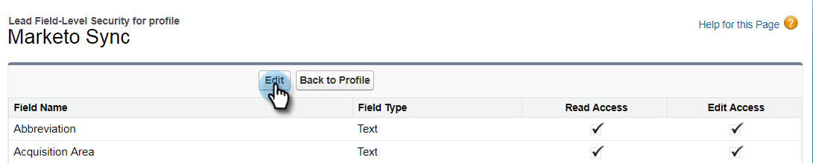

# Schritt 2 von 3: Erstellen eines Salesforce-Benutzers für Marketo (Enterprise/Unlimited) {#step-of-create-a-salesforce-user-for-marketo-enterprise-unlimited}

>[!NOTE]
>
>Diese Schritte müssen von einem Salesforce-Administrator ausgeführt werden

>[!PREREQUISITES]
>
>[Schritt 1 von 3: Marketo-Felder zu Salesforce hinzufügen (Enterprise/Unlimited)](/help/marketo/product-docs/crm-sync/salesforce-sync/setup/enterprise-unlimited-edition/step-1-of-3-add-marketo-fields-to-salesforce-enterprise-unlimited.md){target="_blank"}

In diesem Artikel richten Sie Benutzerberechtigungen im Salesforce-Profil ein und erstellen ein Marketo-Salesforce-Integrationskonto.

## Profil erstellen {#create-a-profile}

1. Klicken Sie auf **[!UICONTROL Einrichten]**.

   

1. Geben Sie &quot;profiles&quot;in die Navigationssuchleiste ein und klicken Sie auf den Link **[!UICONTROL Profile]** .

   

1. Klicken Sie auf **[!UICONTROL Neu]**.

   

1. Wählen Sie **[!UICONTROL Standardbenutzer]** aus, geben Sie dem Profil den Namen &quot;Marketo-Salesforce-Synchronisation&quot;und klicken Sie auf **[!UICONTROL Speichern]**.

   

## Profilberechtigungen festlegen {#set-profile-permissions}

1. Klicken Sie auf **[!UICONTROL Bearbeiten]** , um die Sicherheitsberechtigungen festzulegen.

   

1. Stellen Sie im Abschnitt **[!UICONTROL Administratorberechtigungen]** sicher, dass die folgenden Kontrollkästchen aktiviert sind:

   * API aktiviert
   * HTML-Vorlagen bearbeiten
   * Öffentliche Dokumente verwalten
   * Verwalten öffentlicher Vorlagen

   

   >[!TIP]
   >
   >Stellen Sie sicher, dass Sie das Kontrollkästchen **[!UICONTROL Kennwort läuft nie ab]** aktivieren.

1. Stellen Sie im Abschnitt &quot;Allgemeine Benutzerberechtigungen&quot;sicher, dass die folgenden Kontrollkästchen aktiviert sind:

   * Leads konvertieren
   * Ereignisse bearbeiten
   * Aufgaben bearbeiten

   

1. Stellen Sie im Abschnitt &quot;Standardobjektberechtigungen&quot;sicher, dass die Berechtigungen &quot;Lesen&quot;, &quot;Erstellen&quot;, &quot;Bearbeiten&quot;und &quot;Löschen&quot;für Folgendes aktiviert sind:

   * Konten
   * Kampagnen
   * Kontakte
   * Leads
   * Opportunitys

   >[!NOTE]
   >
   >Gewähren Sie den Kampagnen Berechtigungen, wenn Sie die Kampagnensynchronisierung verwenden möchten.

   

1. Klicken Sie abschließend unten auf der Seite auf **[!UICONTROL Speichern]** .

   

## Feldberechtigungen festlegen {#set-field-permissions}

1. Diskutieren Sie mit Ihren Marketingexperten, um herauszufinden, welche benutzerdefinierten Felder synchronisiert werden müssen.

   >[!NOTE]
   >
   >Dadurch wird verhindert, dass nicht benötigte Felder in Marketo angezeigt werden, was die Übersichtlichkeit verringert und die Synchronisierung beschleunigt.

1. Wechseln Sie auf der Seite mit den Profildetails zum Abschnitt **[!UICONTROL Sicherheit auf Feldebene]** . Klicken Sie auf **[!UICONTROL Anzeigen]** , um die Barrierefreiheit für die Objekte zu bearbeiten:

   * Lead
   * Kontakt
   * Konto
   * Opportunity

   >[!TIP]
   >
   >Sie können entsprechend den Anforderungen Ihres Unternehmens weitere Objekte konfigurieren.

   

1. Klicken Sie für jedes Objekt auf **[!UICONTROL Bearbeiten]**.

   

1. Suchen Sie die nicht erforderlichen Felder und stellen Sie sicher, dass die Optionen **[!UICONTROL Lesezugriff]** und **[!UICONTROL Zugriff bearbeiten]** deaktiviert sind. Klicken Sie auf **[!UICONTROL Speichern]**, wenn Sie fertig sind.

   >[!NOTE]
   >
   >Bearbeiten Sie nur die Barrierefreiheit für die benutzerdefinierten Felder.

   

1. Nachdem Sie alle nicht erforderlichen Felder deaktiviert haben, müssen Sie für die folgenden Objektfelder die Option **[!UICONTROL Lesezugriff und Zugriff bearbeiten]** aktivieren. Klicken Sie auf **[!UICONTROL Speichern]**, wenn Sie fertig sind.

<table> 
 <tbody> 
  <tr> 
   <th colspan="1" rowspan="1">
Objekt
</th> 
   <th colspan="1" rowspan="1">
Felder
</th> 
  </tr> 
  <tr> 
   <td colspan="1" rowspan="1">
Konto
</td> 
   <td colspan="1" rowspan="1">
Feld Typ
</td> 
  </tr> 
  <tr> 
   <td colspan="1" rowspan="1">
Veranstaltung
</td> 
   <td colspan="1" rowspan="1">
Alle Felder
</td> 
  </tr> 
  <tr> 
   <td colspan="1" rowspan="1">
Aufgabe
</td> 
   <td colspan="1" rowspan="1">
Alle Felder
</td> 
  </tr> 
 </tbody> 
</table>

## Marketo-Salesforce-Synchronisierungskonto erstellen {#create-marketo-salesforce-sync-account}

>[!TIP]
>
>Erstellen Sie ein dediziertes Salesforce-Konto (z. B. `marketo@yourcompany.com`), um zwischen den von Marketo vorgenommenen Änderungen und anderen Salesforce-Benutzern zu unterscheiden.

1. Geben Sie &quot;Benutzer verwalten&quot;in die Navigationssuchleiste ein und klicken Sie dann auf **[!UICONTROL Benutzer]**. Klicken Sie auf **[!UICONTROL Neuer Benutzer]**.

   

1. Füllen Sie die erforderlichen Felder aus. Wählen Sie dann die **[!UICONTROL Anwenderlizenz: Salesforce]** und das zuvor von Ihnen erstellte Profil aus. Klicken Sie auf **[!UICONTROL Speichern]** , wenn Sie fertig sind.

   

Schritt 2 von 2 ist abgeschlossen.

>[!NOTE]
>
>[Schritt 3 von 3: Verbinden von Marketo und Salesforce (Enterprise/Unlimited)](/help/marketo/product-docs/crm-sync/salesforce-sync/setup/enterprise-unlimited-edition/step-3-of-3-connect-marketo-and-salesforce-enterprise-unlimited.md){target="_blank"}
