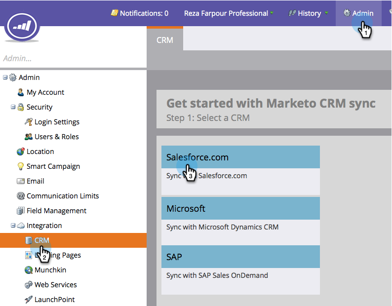
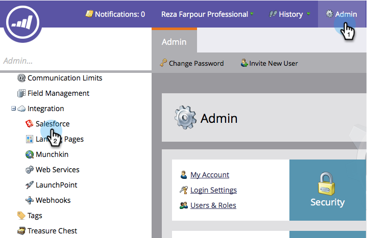

# Schritt 3 von 3: Verbinden von Marketo und Salesforce (Enterprise/Unlimited) {#step-of-connect-marketo-and-salesforce-enterprise-unlimited}

In diesem Artikel konfigurieren Sie Marketo für die Synchronisierung mit Ihrer konfigurierten Salesforce-Instanz.

>[!PREREQUISITES]
>
>* [Schritt 1 von 3: Marketo-Felder zu Salesforce hinzufügen (Enterprise/Unlimited)](/help/marketo/product-docs/crm-sync/salesforce-sync/setup/enterprise-unlimited-edition/step-1-of-3-add-marketo-fields-to-salesforce-enterprise-unlimited.md)
>* [Schritt 2 von 3: Salesforce-Benutzer für Marketo erstellen (Enterprise/Unlimited)](/help/marketo/product-docs/crm-sync/salesforce-sync/setup/enterprise-unlimited-edition/step-2-of-3-create-a-salesforce-user-for-marketo-enterprise-unlimited.md)

## Sync User Security Token abrufen {#retrieve-sync-user-security-token}

>[!TIP]
>
>Wenn Sie bereits über das Sicherheits-Token verfügen, fahren Sie zur Vorbereitung direkt mit Festlegen von Sync User Credentials and kudos fort!

1. Melden Sie sich mit dem Marketo Sync User bei Salesforce an, klicken Sie auf den Namen des Synchronisierungsbenutzers und dann auf **Meine Einstellungen**.

   

1. Geben Sie in der Schnellsuche &quot;reset&quot;ein und klicken Sie auf **Mein Sicherheitstoken zurücksetzen**.

   

1. Klicken Sie auf **Sicherheitstoken zurücksetzen**.

   

   Das Sicherheits-Token wird Ihnen per E-Mail zugestellt.

## Festlegen von Sync User Credentials {#set-sync-user-credentials}

1. Gehen Sie in Marketo zu **Admin**, wählen Sie **CRM** aus und klicken Sie auf **Mit [Salesforce.com](https://Salesforce.com)** synchronisieren

   

   >[!NOTE]
   >
   >Stellen Sie sicher, dass Sie [alle Felder, die Sie nicht benötigen](/help/marketo/product-docs/crm-sync/salesforce-sync/sfdc-sync-details/hide-a-salesforce-field-from-the-marketo-sync.md) in Marketo vor dem Synchronisierungsbenutzer ausblenden, bevor Sie auf **Felder synchronisieren** klicken. Wenn Sie auf Felder synchronisieren klicken, werden alle Felder, die dem Benutzer angezeigt werden, dauerhaft in Marketo erstellt und können nicht gelöscht werden.

1. Geben Sie die Salesforce Sync User-Anmeldeinformationen ein, die in Teil 2 der Salesforce-Konfiguration ([Professional](/help/marketo/product-docs/crm-sync/salesforce-sync/setup/professional-edition/step-2-of-3-create-a-salesforce-user-for-marketo-professional.md) oder [Enterprise](/help/marketo/product-docs/crm-sync/salesforce-sync/setup/enterprise-unlimited-edition/step-2-of-3-create-a-salesforce-user-for-marketo-enterprise-unlimited.md)) erstellt wurden, und klicken Sie auf **Sync Fields** (aktivieren Sie **Sandbox** nur, wenn Sie eine Marketo-Sandbox mit einer Salesforce-Sandbox synchronisieren).

   

   >[!CAUTION]
   >
   >Wenn anstelle der Felder &quot;Benutzername/Kennwort/Token&quot;die Schaltfläche &quot;Bei Salesforce anmelden&quot;angezeigt wird, ist Ihr Marketo-Abonnement für OAuth aktiviert. Bitte [siehe diesen Artikel](/help/marketo/product-docs/crm-sync/salesforce-sync/log-in-using-oauth-2-0.md). Sobald die Synchronisation mit einer Reihe von Anmeldeinformationen beginnt, **gibt es keinen Wechsel von Salesforce-Anmeldeinformationen oder -Abonnements**. Wenn Sie die Standardauthentifizierung verwenden möchten, wenden Sie sich an Ihren Customer Success Manager.

1. Lesen Sie die Warnung und klicken Sie dann auf **Anmeldedaten bestätigen**.

   

   >[!CAUTION]
   >
   >Wenn Sie die [Zuordnungen betrachten und anpassen möchten](/help/marketo/product-docs/crm-sync/salesforce-sync/setup/optional-steps/edit-initial-field-mappings.md), ist dies Ihre einzige Chance! Nachdem Sie auf Salesforce Sync starten geklickt haben, ist es fertig.

## Salesforce-Synchronisierung starten {#start-salesforce-sync}

1. Klicken Sie auf **Salesforce Sync** starten , um die beständige Marketo-Salesforce-Synchronisation zu starten.

   

   >[!CAUTION]
   >
   >Marketo deaktiviert das Duplizieren nicht automatisch für eine Salesforce-Synchronisation oder wenn Sie Leads manuell eingeben.

1. Klicken Sie auf **Synchronisation starten**.

   

   >[!NOTE]
   >
   >Die Dauer der Erstsynchronisierung hängt von der Größe und Komplexität Ihrer Datenbank ab.

## Synchronisierung überprüfen {#verify-sync}

Marketo stellt Statusmeldungen für die Salesforce-Synchronisation im Admin-Bereich bereit. Sie können überprüfen, ob die Synchronisierung ordnungsgemäß funktioniert, indem Sie die folgenden Schritte ausführen.

1. Klicken Sie in Marketo auf **Admin** und dann auf **Salesforce**.

   

1. Der Synchronisierungsstatus wird oben rechts angezeigt. Es wird eine von drei Nachrichten angezeigt: **Zuletzt synchronisiert**, **Synchronisation läuft** oder **Fehlgeschlagen**.

   

   

   

Wow, Sie haben gerade mit der Konfiguration einer der leistungsstärksten Funktionen von Marketo fertig, gehen Sie!

>[!MORELIKETHIS]
>
>* [Schritt 1 von 3: Marketo-Felder zu Salesforce hinzufügen (Enterprise/Unlimited)](/help/marketo/product-docs/crm-sync/salesforce-sync/setup/enterprise-unlimited-edition/step-1-of-3-add-marketo-fields-to-salesforce-enterprise-unlimited.md)
>* [Schritt 2 von 3: Salesforce-Benutzer für Marketo erstellen (Enterprise/Unlimited)](/help/marketo/product-docs/crm-sync/salesforce-sync/setup/enterprise-unlimited-edition/step-2-of-3-create-a-salesforce-user-for-marketo-enterprise-unlimited.md)
>* [Installieren des Marketo Sales Insight-Pakets in Salesforce AppExchange](/help/marketo/product-docs/marketo-sales-insight/msi-for-salesforce/installation/install-marketo-sales-insight-package-in-salesforce-appexchange.md)
>* [Konfigurieren von Marketo Sales Insight in Salesforce Enterprise/Unlimited](/help/marketo/product-docs/marketo-sales-insight/msi-for-salesforce/configuration/configure-marketo-sales-insight-in-salesforce-enterprise-unlimited.md)

