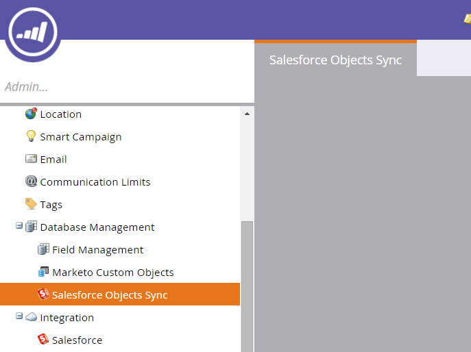

# Hinzufügen/Entfernen von benutzerdefinierten Objektfeldern als Einschränkung für intelligente Liste/Auslöser {#add-remove-custom-object-field-as-smart-list-trigger-constraints}

Marketo Engage bietet eine präzise Kontrolle über die Synchronisierung benutzerdefinierter Salesforce-Objekte. Auf diese Weise können Sie die Felder auswählen, die als Einschränkungen in benutzerdefinierten Objektfiltern verfügbar sind, und sie als Trigger in Smart-Kampagnen verwenden.

>[!NOTE]
>
>**Administratorberechtigungen erforderlich**

1. Klicken Sie auf **[!UICONTROL admin].**

   

1. Klicken Sie auf **[!UICONTROL Admin]** und dann auf **[!UICONTROL Salesforce-Objekte synchronisieren].**

   

1. **[!UICONTROL Salesforce-Objekte synchronisieren]** wird in der linken Spalte angezeigt.

   

1. Wählen Sie das Objekt aus, das Sie ändern möchten.

   

1. Klicken Sie **[!UICONTROL Sichtbare Felder bearbeiten]**.

   >[!TIP]
   >
   >Wenn die Schaltfläche **[!UICONTROL Sichtbare Felder bearbeiten]** ausgegraut ist, wird das Objekt derzeit in einer Smart-Liste oder Smart-Kampagne verwendet. Alle Verknüpfungen entfernen, um fortzufahren.

   

1. Wenn die globale Synchronisierung aktiviert ist, klicken Sie auf **[!UICONTROL Globale Synchronisierung deaktivieren]**.

   

1. Aktivieren Sie die Kontrollkästchen neben den erforderlichen Filter-/Trigger-Einschränkungen und klicken Sie auf **[!UICONTROL Speichern]**.

   

   >[!NOTE]
   >
   >Alle Felder sind standardmäßig als Einschränkungen für Filter ausgewählt.

1. Klicken Sie auf die **[!UICONTROL Felder]**, um Ihre Änderungen zu bestätigen.

   

   >[!NOTE]
   >
   >Vergessen Sie nicht, die globale Synchronisierung erneut zu aktivieren!

Jetzt haben Ihre Smart Lists und Smart Campaign noch mehr Leistung.

>[!MORELIKETHIS]
>
>[Benutzerdefinierte Objektsynchronisierung aktivieren/deaktivieren](/help/marketo/product-docs/crm-sync/salesforce-sync/setup/optional-steps/enable-disable-custom-object-sync.md){target="_blank"}
