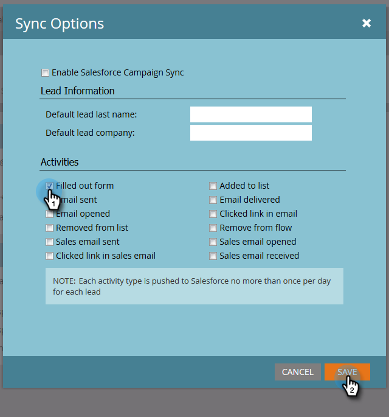

# Aktivitätensynchronisierung anpassen {#customize-activities-sync}

Wenn Sie Marketo Sales Insight nicht verwenden, kann Marketo Engage für bestimmte Ereignisse Salesforce Activity History Records erstellen. So können sie aktiviert werden.

1. Navigieren Sie zu **[!UICONTROL Admin]**.

   

1. Klicks **[!DNL Salesforce]** Klicken Sie auf **[!UICONTROL Synchronisierungsoptionen bearbeiten]**.

   

1. Aktivieren Sie die Kontrollkästchen neben den Aktivitäten, die Marketo an Salesforce senden soll, und klicken Sie auf **[!UICONTROL Speichern]**.

   

   >[!NOTE]
   >
   >Nach der Aktivierung wird Marketo den Aktivitätsverlauf über einen Zeitraum von drei Monaten nachverfolgen. Je nach Datenmenge _Dies kann mehrere Tage dauern_. Aktualisierungen, die während der ersten Aktivitäts-Push-Benachrichtigung auftreten, können bis zum Abschluss der ersten Aktivitätensynchronisierung verzögert sein.

<table> 
 <colgroup> 
  <col> 
  <col> 
 </colgroup> 
 <thead> 
  <tr> 
   <th>Aktivitätstyp</th> 
   <th>Beschreibung</th> 
  </tr> 
 </thead> 
 <tbody> 
  <tr> 
   <td>Hat Formular ausgefüllt</td> 
   <td>Marketo-Formular ausfüllen</td> 
  </tr> 
  <tr> 
   <td>Der Liste hinzugefügt</td> 
   <td>
Flussschritt: Wurde einer statischen Liste hinzugefügt
</td> 
  </tr> 
  <tr> 
   <td>E-Mail gesendet</td> 
   <td>Flussschritt: Wurde eine E-Mail gesendet</td> 
  </tr> 
  <tr> 
   <td>E-Mail übermittelt</td> 
   <td>Eine E-Mail erhalten (nicht abgeschnitten)</td> 
  </tr> 
  <tr> 
   <td>E-Mail geöffnet</td> 
   <td>Öffnen einer E-Mail (ohne Bilder zu blockieren)</td> 
  </tr> 
  <tr> 
   <td>Link in E-Mail angeklickt</td> 
   <td>Auf einen Link in einer von Marketo gesendeten E-Mail geklickt</td> 
  </tr> 
  <tr> 
   <td>Aus Liste entfernt</td> 
   <td>Flussschritt: wurde aus einer statischen Liste entfernt</td> 
  </tr> 
  <tr> 
   <td>Aus Fluss entfernen</td> 
   <td>Flussschritt: Aus Fluss entfernen</td> 
  </tr> 
  <tr> 
   <td>Vertriebs-E-Mail gesendet</td> 
   <td>Wurde über Marketo Sales Insight per E-Mail versendet</td> 
  </tr> 
  <tr> 
   <td>Vertriebs-E-Mail geöffnet</td> 
   <td>Öffnen einer E-Mail, die über Marketo Sales Insight gesendet wurde</td> 
  </tr> 
  <tr> 
   <td>Link in Verkaufs-E-Mail</td> 
   <td>Auf einen Link in einer E-Mail geklickt, die über Marketo Sales Insight gesendet wurde</td> 
  </tr> 
  <tr> 
   <td>Vertriebs-E-Mail empfangen</td> 
   <td>Eine E-Mail wurde vom Vertriebsmitarbeiter im MSI Outlook-Plugin empfangen und protokolliert</td> 
  </tr> 
 </tbody> 
</table>

>[!NOTE]
>
>&quot;E-Mail-Empfang für Vertrieb&quot; _not_ Mittelwert bereitgestellt. Der Status Zugestellt wird nicht für E-Mails erfasst, die über Sales Insight gesendet werden.

>[!TIP]
>
>Wenn Sie mehr Marketo-Informationen in Salesforce erhalten möchten, besuchen Sie unsere [Marketo Sales Insight](/help/marketo/product-docs/marketo-sales-insight/msi-for-salesforce/installation/install-marketo-sales-insight-package-in-salesforce-appexchange.md){target="_blank"} Produkt.
